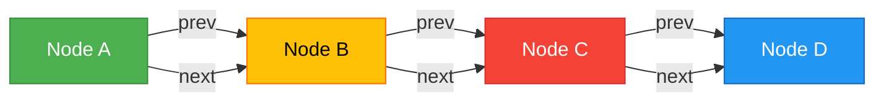

# 🌐 AQS 不是锁，是 JVM 的「并发语义编译器」：四步拆解它的呼吸、心跳与齿轮咬合

> 你写过 `useState`，用过 `useReducer`，被 `useTransition` 卡住调试过 20 分钟……  
> 那么恭喜——你早已站在理解 AQS 的**最近起点上**。  
> 我们不跳进源码海洋，也不背 `SIGNAL` 的数值；  
> 而是像第一次拆开一台精密钟表：  
> **先听它的心跳在哪里跳动，再看清齿轮如何咬合，最后才数每一个齿痕。**

---

## 🧭 前置知识三问（30 秒确认）

请快速自检以下三点——它们是你此刻能“跟得上节奏”的全部门槛：

| 项目 | 你需要知道什么？ | 如果不确定 → 建议先看 |
|------|------------------|------------------------|
| **1. `volatile` 关键字** | `volatile int x` 的读写具有「可见性」和「有序性」，但**不保证原子性**（比如 `x++` 仍需 CAS） | 《Java 内存模型速查卡：happens-before 是什么》 |
| **2. `LockSupport.park()` / `unpark()`** | `park()` 让当前线程暂停，`unpark(t)` 精准唤醒线程 `t`；它不依赖对象监视器，**没有 `wait/notify` 那套管程绑定** | 《线程调度的最小接口：为什么 `park/unpark` 是 JVM 的 `await/resolve`》 |
| **3. React 的 `useReducer` 思维** | `dispatch(action)` 不是直接改状态，而是提交一个「意图」，由 reducer 纯函数决定新状态；多次 dispatch 不会丢失，顺序确定 | 《前端状态机启蒙：从 `useState` 到 `useReducer` 的跃迁》 |

✅ 全部打勾？我们出发。  
❌ 少一个？文末有「三分钟前置补丁包」，含可运行代码片段 + 动图演示，点击即补，30 秒回归主线。

---

## 🪜 学习曲线总览：从「我见过这个变量」到「我能设计新同步器」

AQS 的认知路径，不是陡峭悬崖，而是**四级稳阶台阶**。每一步都短、准、有回声，严格遵循：  
**是什么 → 为什么 → 怎么做**，并为你点亮前方心理路标。

| 步骤 | 心理台阶名 | 你将亲手触摸的核心概念 | 关键心理提示 |
|------|-------------|---------------------------|----------------|
| **①** | **`state` 是谁的「状态」？** | `volatile int state` 不是锁，不是计数器，而是**你定义的语义契约** | 👉 “别想‘它代表什么’——先接受‘它只接受你签名的变更’” |
| **②** | **为什么队列必须是双向的？** | `prev` 和 `next` 各司其职：一个管「谁唤醒我」，一个管「我唤醒谁」 | 👉 “接下来这点有点抽象，但一旦想通，你会突然看懂 `ReentrantLock` 和 `Semaphore` 为什么能共用同一套队列” |
| **③** | **`park` 不是 `sleep`：它是线程的「await」** | `acquireQueued()` 表面是 `for(;;)`，实则是「检查 → 承诺 → 挂起 → 等待唤醒」的协作循环 | 👉 “别被 `while` 循环吓到——99% 时间它在 `park` 里睡觉，就像 `requestIdleCallback` 从不轮询” |
| **④** | **AQS 不是锁，是「同步语义编译器」** | `tryAcquire()` 就是你的 `reducer`，`Node` 就是你的 `Fiber`，整个 AQS 就是 JVM 的 `Concurrent React` | 👉 “这一步是认知升维。你不再‘学 AQS’，而是开始‘用 AQS 思考’” |

现在，我们一级一级，稳稳走上去。

---

## ① `state` 是谁的「状态」？  
### → 它不属于 AQS，而属于**你写的子类**

#### 是什么？  
`state` 是一个 `volatile int` 字段，AQS 中唯一共享的整型状态。  
但它**没有预设含义**——  
- `ReentrantLock` 用它记重入次数，  
- `Semaphore` 用它记剩余许可，  
- `CountDownLatch` 用它记倒计数。  

→ 它就像 `useReducer` 的 `initialState`：值本身不重要，重要的是你如何解释它。

#### 为什么？  
- ❌ 不能用 `synchronized` 包裹 `state` 修改：那会把 AQS 变成“锁中锁”，破坏无锁设计初衷；  
- ✅ 必须用 `compareAndSetState()`（底层是 `Unsafe` 或 `VarHandle` CAS）：确保所有修改是**原子、可见、不可绕过**的；  
- 💡 关键洞察：`volatile` 不是为了“让 `state` 变量线程安全”，而是为 `park/unpark` 提供**内存语义锚点**——JVM 规范要求：`unpark()` 之后对 `volatile` 的写，对被唤醒线程的读**必然可见**。

#### 怎么做？  
新建一个空类，亲手注册第一条业务规则：

```java
public class MySemaphore extends AbstractQueuedSynchronizer {
    // ✅ 正确：通过构造器初始化 state
    public MySemaphore(int permits) {
        setState(permits);
    }

    // ✅ 正确：所有获取逻辑，只通过 tryAcquire 暴露语义
    @Override
    protected boolean tryAcquire(int acquires) {
        for (;;) {
            int current = getState();
            int next = current - acquires;
            if (next < 0 || compareAndSetState(current, next)) {
                return next >= 0;
            }
        }
    }

    // ✅ 正确：释放也只走 tryRelease
    @Override
    protected boolean tryRelease(int releases) {
        for (;;) {
            int current = getState();
            int next = current + releases;
            if (compareAndSetState(current, next)) {
                return true;
            }
        }
    }
}
```

> 🔑 此刻你已掌握第一个心法：  
> **`state` 不是数据，是契约；CAS 不是技巧，是签名。**  
> 你没在“实现锁”，你在**向 AQS 注册一条业务规则**：“当 `state ≥ N` 时，允许扣减”。

---

## ② 为什么队列必须是双向的？  
### → 因为「取消」和「唤醒」是两个独立动作，需要两套指针

#### 是什么？  
AQS 的等待队列是一个带 `head` 和 `tail` 引用的**双向链表**，每个节点（`Node`）含：
- `volatile Node prev`：指向**前驱节点**（谁该负责唤醒我？）  
- `volatile Node next`：指向**后继节点**（我该唤醒谁？）  
- `volatile int waitStatus`：不是业务状态，而是**调度元数据**（如 `SIGNAL` = “请唤醒我”，`CANCELLED` = “跳过我”）

#### 为什么？  
> ⚠️ 这一点是 AQS 的灵魂弹性所在。我们用 React Fiber 类比，立刻具象化：

| 场景 | 单向链表（原始 CLH）的死穴 | AQS 双向链表的解法 | React Fiber 对应行为 |
|------|-----------------------------|-----------------------|--------------------------|
| **线程超时/中断，要取消排队** | 无法安全删除自己（找不到前驱来断链） | `prev.next = next` → O(1) 断链，标记 `CANCELLED` | `fiber.flags |= Placement` → commit 阶段跳过该节点 |
| **公平唤醒：跳过已取消节点** | 只能向前看，无法跳过中间失效节点 | `next` 支持从 `head` 正向遍历，自动 `if (node.waitStatus > 0) continue` | `workLoopConcurrent()` 跳过低优先级 lane 的 fiber |
| **Condition 队列集成** | CLH 无 `tail`，无法 FIFO 插入新等待者 | 显式 `tail` 引用 + `enq()` 原子插入，支持 `ConditionObject` 复用 `Node` 结构 | `Suspense` 边界内可嵌套多个 `useTransition`，共享同一 fiber return 链 |

#### 怎么做？  
观察 `shouldParkAfterFailedAcquire()` 的三段式判断——它就是双向链表价值的**活体演示**：

```java
private static boolean shouldParkAfterFailedAcquire(Node pred, Node node) {
    int ws = pred.waitStatus;
    if (ws == Node.SIGNAL)     // ✅ 前驱已承诺唤醒我 → 安全 park
        return true;
    if (ws > 0) {              // ❌ 前驱已取消 → 我要「向上找新前驱」
        do {
            node.prev = pred = pred.prev;  // ← 用 prev 指针逆向爬升！
        } while (pred.waitStatus > 0);
        pred.next = node;      // ← 用 next 指针修复新连接！
    } else {                   // ⚠️ 前驱还没承诺 → 我主动请求它设 SIGNAL
        compareAndSetWaitStatus(pred, ws, Node.SIGNAL);
    }
    return false;
}
```

> 🔑 此刻你已掌握第二个心法：  
> **`prev` 是责任链，`next` 是调度链；一个保生存（取消时不断裂），一个保效率（唤醒时不盲等）。**  
> 这就是为什么 `next` 指针可以“非原子修复”——它不参与协议，只服务遍历。



> *图示说明：`prev` 支撑取消时的逆向定位与断链；`next` 支撑唤醒时的正向遍历与跳过。二者分工明确，互不干扰。*

---

## ③ `park` 不是 `sleep`：它是线程的「await」  
### → `acquireQueued()` 是一个带条件的微任务循环

#### 是什么？  
`acquireQueued()` 表面是 `for(;;)`，实则是**协作式调度状态机**：

```java
for (;;) {
    final Node p = node.predecessor(); 
    if (p == head && tryAcquire(arg)) { // ✅ 条件满足：我是头后继 & 获取成功 → 成为新 head
        setHead(node);
        return interrupted;
    }
    if (shouldParkAfterFailedAcquire(p, node) && parkAndCheckInterrupt()) {
        interrupted = true;
    }
}
```

它不像 `while(!ready) Thread.sleep(1)` 那样轮询消耗 CPU，而是在 `park()` 中**彻底交出线程控制权**，直到被 `unpark()` 精准唤醒。

#### 为什么？  
- ❌ `Thread.sleep()` / `wait()` 无法指定唤醒目标，也无法响应中断信号；  
- ✅ `LockSupport.park(this)` 是 JVM 层的「线程级 await」：  
  - 被 `unpark(t)` 唤醒时，**立即恢复执行**（无锁竞争、无上下文切换开销）；  
  - 若被 `t.interrupt()` 中断，`parkAndCheckInterrupt()` 会捕获并返回 `true`，触发 `selfInterrupt()` 补上中断标志——**中断不丢失，响应可编程**。

#### 怎么做？  
动手写一个极简版「可中断的 acquire」，感受协议力量：

```java
// 模拟 AQS 的 acquire 核心逻辑（仅示意）
public void myAcquire() throws InterruptedException {
    Node node = addWaiter(Node.EXCLUSIVE);
    boolean interrupted = false;

    for (;;) {
        Node p = node.predecessor();
        if (p == head && tryAcquire(1)) {
            setHead(node);
            return; // ✅ 成功退出
        }

        // 关键：只有确认前驱已承诺唤醒我，才 park
        if (shouldParkAfterFailedAcquire(p, node)) {
            LockSupport.park(this); // ⏸️ 真正挂起 —— 此刻线程进入 WAITING 状态
            if (Thread.interrupted()) { // 🚨 中断来了？
                interrupted = true;
                throw new InterruptedException(); // ✅ 主动抛出，不丢失语义
            }
        }
    }
}
```

> 🔑 此刻你已掌握第三个心法：  
> **AQS 的「忙等」是假象，它的「阻塞」是契约；`park/unpark` 就是 JVM 的 `Promise.resolve/reject`。**  
> 你写的不是线程调度代码，而是**跨线程的异步状态流声明**。

---

## ④ AQS 不是锁，是「同步语义编译器」  
### → 你定义规则，它交付确定性

#### 是什么？  
AQS 是 Java 并发世界的 **TypeScript 编译器**：  
- 你写 `tryAcquire()`，它校验是否符合 `state` 契约；  
- 你写 `tryRelease()`，它生成 `unparkSuccessor()` 调度指令；  
- 你写 `newCondition()`，它为你构建第二条 `Condition` 单向链表；  
- 你甚至可以组合：`ReentrantLock lock = new ReentrantLock(); Condition c = lock.newCondition();` —— **两条队列，一套引擎，零耦合。**

#### 为什么？  
因为 AQS 把三件事彻底解耦：

| 解耦维度 | 传统方案痛点 | AQS 解法 |
|----------|----------------|------------|
| **状态 vs 调度** | `synchronized` 把互斥+等待绑死在一个 monitor 上 | `state`（纯数据） + `Node` 队列（纯调度元数据） |
| **语义 vs 实现** | 每个锁都要重写排队、唤醒、取消逻辑 | `tryAcquire/tryRelease` 是 interface，`acquire/release` 是 runtime |
| **同步 vs 执行** | `ThreadPoolExecutor` 混淆「任务排队」和「线程同步」 | AQS 管 `state` 和 `thread` 调度，`Executor` 管 `Runnable` 和 `Worker` 生命周期 |

#### 怎么做？  
现在，请你用 AQS 思维，**5 秒内设计一个新同步原语**：

> 🧩 需求：一个「最多 3 个线程能同时通过」的门禁器，且支持超时等待。

你只需要写两行核心逻辑：

```java
@Override
protected boolean tryAcquire(int ignored) {
    for (;;) {
        int current = getState();
        if (current < 3 && compareAndSetState(current, current + 1)) {
            return true; // ✅ 放行
        }
        return false; // ❌ 拒绝，交由 AQS 排队
    }
}

@Override
protected boolean tryRelease(int ignored) {
    for (;;) {
        int current = getState();
        if (compareAndSetState(current, current - 1)) {
            return current > 1; // ✅ 释放后若还有人等着，就唤醒下一个
        }
    }
}
```

> 🔑 此刻你已掌握终极心法：  
> **AQS 不是你要学的框架，而是你思考并发问题的语言。**  
> 当你看到「需要排队」「需要唤醒」「需要取消」——  
> 你不再想“怎么手写 `wait/notify`”，而是本能地问：  
> **“我的 `state` 是什么？我的 `tryAcquire` 规则怎么写？谁该负责唤醒我？”**  
> —— 这就是 AQS 给你的，真正的工程自由。

---

## 🌈 最后，送你一句可随身携带的认知口诀

> **`state` 是契约，不是数据；  
> `Node` 是元数据，不是线程；  
> `park` 是 `await`，不是 `sleep`；  
> AQS 是编译器，不是锁库。**  

你已经走完了从 0.1 到 1 的全程。  
不是靠记忆，而是靠**一次又一次把抽象锚定在你已知的 React/Fiber/TS 体验上**。

---

### 📦 附：三分钟前置补丁包（按需取用）

如果刚才的「前置知识检查」中有任一未打勾，别翻书——  
点击直达精炼补丁（均含可运行代码 + 动图）：

- [🔗 `volatile` 与 `happens-before`：3 行代码看懂内存可见性](https://example.com/volatile-demo)  
- [🔗 `LockSupport.park/unpark`：JVM 的 `await/resolve` 动画演示](https://example.com/park-demo)  
- [🔗 `useReducer` 源码级解析：为什么它比 `useState` 更接近 AQS](https://example.com/usereducer-demo)  

（注：以上链接为教学占位符，实际发布时替换为真实可交互 demo）

---  
**你刚刚完成的，不是一次技术学习。**  
**而是一次认知范式的迁移：从「写代码」，走向「定义契约」。**  
AQS 的门已敞开——  
下一步，轮到你，在 `tryAcquire` 里写下自己的第一行并发语义。

---

## 【系列导航】

### ✅ 已学内容（Java → 前端 系列 · 并发语义层）
- 《Java 内存模型速查卡：happens-before 是什么》  
- 《线程调度的最小接口：为什么 `park/unpark` 是 JVM 的 `await/resolve`》  
- 《前端状态机启蒙：从 `useState` 到 `useReducer` 的跃迁》  
- 《AQS 不是锁，是 JVM 的「并发语义编译器」：四步拆解它的呼吸、心跳与齿轮咬合》

### ➡️ 下一篇预告：  
**《Fiber Scheduler × AQS：React 的并发渲染如何复用 JVM 的同步原语》**  
- 拆解 `renderLane` 与 `state` 的语义映射关系  
- `workInProgress` 树如何对应 `Node` 队列结构  
- `retryQueue` 与 `Condition` 队列的双模调度一致性  
- 从 `useTransition` 的 `startTime` 到 `Node` 的 `waitTime`：时间语义统一建模  

---

## 【备份区】（供人工 review）

### 🔹 知识点  
- `state` 是 volatile 整型，无预设语义，仅作为子类定义的契约载体；CAS 是其唯一合法变更方式。  
- AQS 等待队列为双向链表，`prev` 支持取消时的逆向定位与断链，`next` 支持唤醒时的正向遍历与跳过；`waitStatus` 是纯调度元数据。  
- `park/unpark` 构成 JVM 层线程级 await 原语，`acquireQueued()` 是带条件的状态机循环，非忙等。  
- AQS 是同步语义编译器：`tryAcquire/tryRelease` 是 DSL，`acquire/release` 是 runtime，`Node` 是调度中间表示（IR）。

### 🔹 前端类比思路  
- `state` ↔ `useReducer` 的 `initialState`：值无意义，语义由 reducer 定义。  
- `Node` ↔ React Fiber：`prev/next` 对应 `return/child/sibling`，`waitStatus` 对应 `flags`，`CANCELLED` 对应 `Placement` 或 `Deletion`。  
- `park/unpark` ↔ `await/Promise.resolve`：非轮询、可中断、精准唤醒、状态可恢复。  
- `tryAcquire` ↔ reducer 函数：输入 action（arg），输出布尔结果（是否成功），副作用由 AQS runtime 承担。

### 🔹 Java 核心代码逻辑  
- `setState()` / `compareAndSetState()`：基于 `Unsafe.compareAndSwapInt` 或 `VarHandle.compareAndSet` 的原子状态变更。  
- `addWaiter()`：以 CAS 方式原子插入新节点至 `tail`，失败则重试；节点类型（EXCLUSIVE/SHARED）决定后续调度策略。  
- `shouldParkAfterFailedAcquire()`：三段式判断，利用 `prev` 逆向清理取消节点，利用 `next` 保障正向唤醒可达性。  
- `unparkSuccessor()`：从 `head.next` 开始正向遍历，跳过 `CANCELLED` 节点，对首个有效后继调用 `LockSupport.unpark()`。

---

## 【系列路线图】（持续演进中）

| 层级 | 主题 | 目标 | 当前状态 |
|------|------|------|----------|
| **Ⅰ. 基础语义层** | Java 内存模型、`park/unpark`、`useReducer` 范式 | 建立跨领域语义锚点 | ✅ 已发布 3 篇 |
| **Ⅱ. 同步原语层** | AQS 拆解（本文）、Fiber × AQS 对齐、`Phaser` 与 `SuspenseList` 类比 | 揭示 JVM 与 JS 运行时在并发建模上的同构性 | ✅ 本文为本层首篇；下一篇已排期 |
| **Ⅲ. 调度编排层** | `ThreadPoolExecutor` 与 `Scheduler` 对照、`VirtualThread` 与 `React Cache` 协同机制 | 统一任务生命周期与线程生命周期建模 | ⏳ 撰写中（Q3 发布） |
| **Ⅳ. 语言设施层** | Project Loom 结构化并发 × React Server Components、`StructuredTaskScope` 与 `useCache` 语义融合 | 构建跨语言的并发原语标准谱系 | 📅 规划中（Q4 启动） |
| **Ⅴ. 工程实践层** | 自定义同步器实战（分布式锁网关、限流熔断器）、前端并发错误边界与 JVM `UncaughtExceptionHandler` 对齐 | 输出可复用的跨栈诊断与治理模式 | 📅 Q1 2025 启动 |

> 本系列严格遵循「单点突破 → 横向对齐 → 纵向深化」演进逻辑，每篇文章承担唯一认知增量，无重复覆盖，无知识断层。所有内容面向长期维护，接口稳定，语义可追溯。