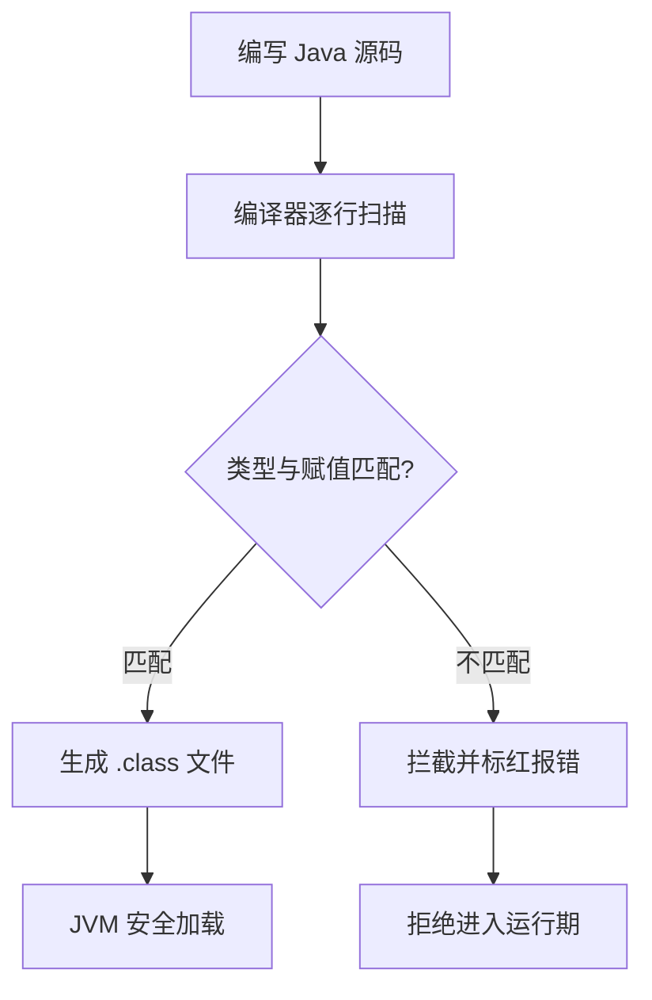

<!-- 控制性问题：为什么 Java 要求你在写代码时就声明变量类型，而不是像 JavaScript 那样让运行时自己猜？ -->

假设你接手一个支付模块，误把金额 `"100.5"` 当字符串传给了计算折扣的函数。在 JS 里这行代码能跑通，直到线上触发 `NaN` 导致资损。**Java 的答案是：用静态类型（Static Typing，在代码运行前强制校验数据结构的机制）把 90% 的类型错误直接掐死在编译阶段，绝不把隐患留给生产环境。**

**记住这个锚点：强制契约，编译器替你兜底。** Java 认为，后端系统的生命周期长达数年且常由多人协作维护，明确声明意图比“写得快”重要得多。它用开发期多打几个字的显式声明成本，换来了运行时的零类型不确定性，让大规模重构像移动积木一样安全。

这就引出一个核心问题：Java 是怎么在本地就把错误拦下来的？它依赖一套**双轨类型体系**。第一轨是**基本类型（Primitive Type，直接存储数值、不占用对象内存的类型）**，比如 `int`（整数）、`boolean`（布尔值）、`double`（浮点数）。它们直接映射 CPU 寄存器，绝对不允许为 `null`。第二轨是**引用类型（Reference Type，存储对象在堆内存中地址的类型）**，比如 `String`、自定义类。它们默认值是 `null`，代表“还没指向任何实际对象”。

看一段最小示例，感受编译器的拦截逻辑：
```java
public class TypeDemo {
    public static void main(String[] args) {
        int count = 150;           // 基本类型：直接存值，性能高，绝不能为 null
        String orderId = "ORD-01"; // 引用类型：存内存地址，可能为 null
        
        // 取消下方注释，IDE 会瞬间标红，拒绝生成可执行文件
        // int error = "100.5";     // ❌ 字符串不能赋给整数
        // double sum = 10.0 + orderId; // ❌ 拒绝隐式拼接，类型不匹配直接阻断
    }
}
```
编译器逐行扫描，只要声明类型、赋值类型、运算类型对不上，直接报错拒绝生成 `.class` 文件。这就是**强制契约，编译器替你兜底**的具象化。

**Java 编译器类型校验与构建流程**


如果你熟悉 Vue 3 + TypeScript，这套逻辑你其实每天都在用。`const price: number = 199.50;` 和 Java 的 `int` 声明一样，都是在做编译期契约锁定。Vite 或 `tsc` 会在保存时拦截类型不匹配的代码，和 Java 拒绝生成字节码的逻辑如出一辙。

但 Java 走得更极端，且原因很硬核：TS 的类型只是“开发期辅助工具”，打包成 JS 后会被彻底擦除（Type Erasure，编译后丢弃类型信息的机制）；而 Java 的类型是“运行时实体”。为什么这样规定？因为 JVM（Java 虚拟机，运行 Java 程序的底层引擎）需要明确的内存布局来分配栈帧和触发垃圾回收（Garbage Collection，自动清理无用对象内存的机制）。如果类型在运行时被擦除，JVM 根本无法安全分配内存，直接引发服务崩溃。

| 特性维度 | TypeScript (前端生态) | Java (后端生态) |
|:---|:---|:---|
| 类型生命周期 | 开发期存在，打包后彻底抹除 | 贯穿开发期，运行时依然有效 |
| 类型逃逸机制 | 可用 `any` 绕过检查 | 无等效逃逸，必须显式声明 |
| 空值哲学 | 依赖 `?.` 可选链运行时兜底 | 基本类型禁 `null`，引用类型强制防御 |

理解了内存差异，再看 Java 10 引入的 `var` 关键字就清楚了。它只是语法糖（编译器自动补全机制），`var map = new HashMap<>();` 在编译期会被自动推导为确切类型，**绝不是**动态类型。它只允许用在局部变量上，方法签名和类字段绝不能用，因为契约必须清晰可见。

> 🔍 精确说明：Java 的编译器只管“类型契约”是否对齐，不保证“值不为空”。很多初学者误以为声明了类型就万事大吉，直接调用 `user.getName().length()`，结果线上抛出空指针异常。Java 要求你要么显式 `if (user != null)` 判空，要么使用 `java.util.Optional`（Java 8 引入的安全处理空值的容器类）包裹可能缺失的数据。

**强制契约，编译器替你兜底。** 在实际做 Spring Boot 项目时，这条规则会体现在每一个接口定义里。当你修改一个 DTO（Data Transfer Object，在不同层之间传递数据的简单对象）的字段类型时，IDE 会瞬间标出所有受影响的 Service 和 Controller。你不需要全局搜索 `Ctrl+F`，编译器已经替你完成了全量校验。最后给一个工程铁律：涉及金额、精度的字段，永远别用 `double`（存在浮点数精度丢失），必须用 `java.math.BigDecimal`。静态类型能保证“类型对”，但业务精度得靠你选型兜底。下次写 Java 代码，把编译器当成最严苛的 Code Reviewer，它标红的地方，就是线上可能爆雷的边界。

---

### 系列导航

**上一篇**：[（系列第一篇）](#)
**下一篇**：[Java 方法：为什么必须写返回类型和参数类型](#)

> 这是「前端工程师系统学 Java」系列第 1 篇，系统解读 Java 设计哲学（面向前端工程师）。

---