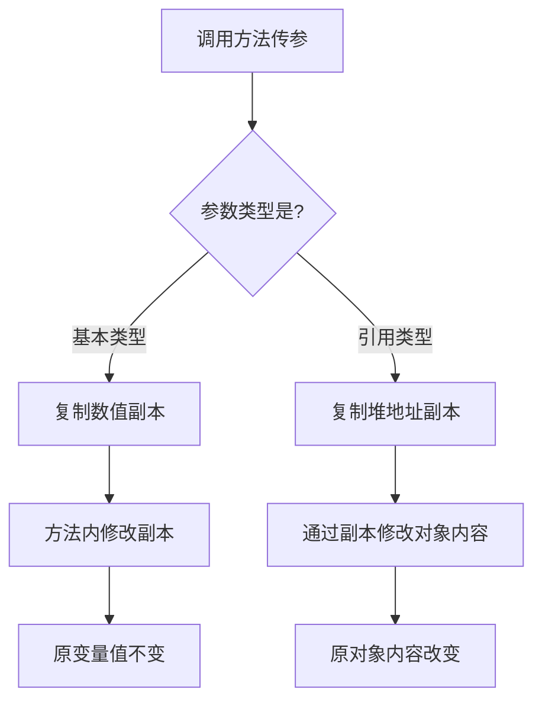

<!-- 控制性问题：为什么 Java 强制要求显式声明方法的参数和返回类型，而不是像 JavaScript 那样随意传参？ -->

前端写函数 `function calc(a, b)` 传什么都能跑，换成 Java 如果不写类型直接编译失败。**Java 强制显式声明参数与返回类型，核心是用编译期的“笨重”换取团队协作的绝对安全。**

记住这个记忆锚点：**类型声明就是不可违约的契约，编译器替你兜底。** 在几十人维护、迭代数年的企业项目里，前端那种“靠注释约定”的隐式契约极易引发线上崩溃。Java 选择在代码合并前就卡死类型不匹配，宁可编译报错，也不让错误流到生产环境。

这就引出一个问题：Java 的方法到底由什么构成？它由四块固定拼成：**访问修饰符**（控制谁能调用，如 `public` 表示任何位置都能访问）、**返回值类型**（方法执行完吐出什么数据，不吐必须写 `void` 表示空返回）、**方法名**（小驼峰命名）和**参数列表**（括号内必须写明类型+变量名）。

```java
// 1. 标准方法：访问控制 + 返回类型 + 方法名 + 参数列表
public double calculatePrice(String productName, int quantity) {
    if (quantity <= 0) throw new IllegalArgumentException("数量必须大于0");
    return 99.9 * quantity;
}

// 2. 纯副作用方法：用 void 表示不返回任何数据
public void logOrder(String orderId) {
    System.out.println("订单 " + orderId + " 已记录");
}
```

理解了结构，再看底层设计逻辑。Java 采用**静态绑定**（编译期就锁定具体调用哪个方法），这意味着编译器必须在跑代码前，确切知道每个参数的类型和数量。这直接牺牲了 JS 那种“传 `undefined` 或混着传”的灵活，但换来的是 IDE 的精准自动补全、重构时的全局安全扫描。再次强调：**类型声明就是不可违约的契约，编译器替你兜底。** 签名本身就是最准确的调用说明书，新人接手代码不需要翻文档。

但很多刚接触 Java 的前端同学会在这里踩大坑，尤其是参数传递机制。Java 只有**值传递**（Pass by Value，传递的是数据的独立副本）。

> 🔍 精确说明：基本类型（如 `int`）传的是数值副本；引用类型（如 `List`、自定义对象）传的是“堆内存地址的副本”。你能通过副本修改对象内部的字段，但绝对不能改变原变量指向的内存地址。

看这段代码，直接暴露前端思维盲区：
```java
public static void main(String[] args) {
    int count = 10;
    modifyCount(count);
    System.out.println(count); // 输出 10，方法内改的是副本，原值不变

    java.util.List<String> list = new java.util.ArrayList<>();
    list.add("A");
    modifyList(list);
    System.out.println(list); // 输出 [A, B]，通过地址副本修改了原对象内容
}

static void modifyCount(int c) { c = 20; } // 改副本，对外无效
static void modifyList(java.util.List<String> l) { l.add("B"); } // 改内容，对外有效
```

**Java 方法参数传递机制**


如果你误以为 Java 传对象是“引用传递”（类似 JS 直接传指针引用），就会在调试时陷入死循环：为什么我在方法里写 `list = new ArrayList<>()` 重新赋值，外部变量却纹丝不动？因为 `=` 操作符改的只是局部变量手里的那个“地址副本”，原变量手里的地址根本没变。理解了这一点，再看方法重载（Overloading，同名但参数类型或数量不同）就清楚了：Java 靠参数列表区分方法，**返回类型不同不构成重载**，因为调用时编译器无法仅凭返回值推断该执行哪段逻辑。记住：**类型声明就是不可违约的契约，编译器替你兜底。**

如果你熟悉 Vue/React 的 TypeScript 写法，这套逻辑你会觉得极其眼熟，但底层有本质差异。

```typescript
// Vue3/React + TS：开发期强类型检查，但运行时会擦除类型信息
function calculatePrice(productName: string, quantity: number): number {
    if (quantity <= 0) throw new Error("Invalid");
    return 99.9 * quantity;
}
```

前端用 TS 声明类型，是为了在开发阶段拦截错误，但代码编译成 JS 后，类型注解会被彻底抹除，浏览器运行时依然是动态类型，传错依然可能抛 `undefined is not a function`。Java 则不同，它的类型契约是 JVM 运行时的底层基石，`public/private` 权限控制和方法签名检查是语言强制执行的，不依赖任何外部工具链。前端函数没有原生的“重载”语法（TS 的重载只是编译期分发，底层仍是同一个函数体），而 Java 的方法重载会在编译后生成字节码层面完全独立的方法。

最后提醒一个真实高频坑：`void` 不是返回 `undefined`。前端函数不写 `return` 默认返回 `undefined`，但 Java 的 `void` 表示彻底不吐数据。方法里只能写 `return;` 用于提前跳出逻辑，绝对不能写 `return 值;`，否则编译器直接拦截。

实际写业务时，如果方法参数超过 5 个，别继续往括号里堆。封装成一个**数据传输对象（DTO，Data Transfer Object，专门用于在方法或层级间传递结构化数据的类）**，比如把 `createUser(name, age, email, phone)` 改为 `createUser(UserDTO dto)`。类型声明从来不是束缚，而是你深夜排查线上问题时，唯一能信任的护身符。

---

### 系列导航

**上一篇**：[Java 静态类型：为什么每个变量必须声明类型](#)
**下一篇**：[Java 控制流：if/for/while 为什么不能省略花括号](#)

> 这是「前端工程师系统学 Java」系列第 2 篇，系统解读 Java 设计哲学（面向前端工程师）。