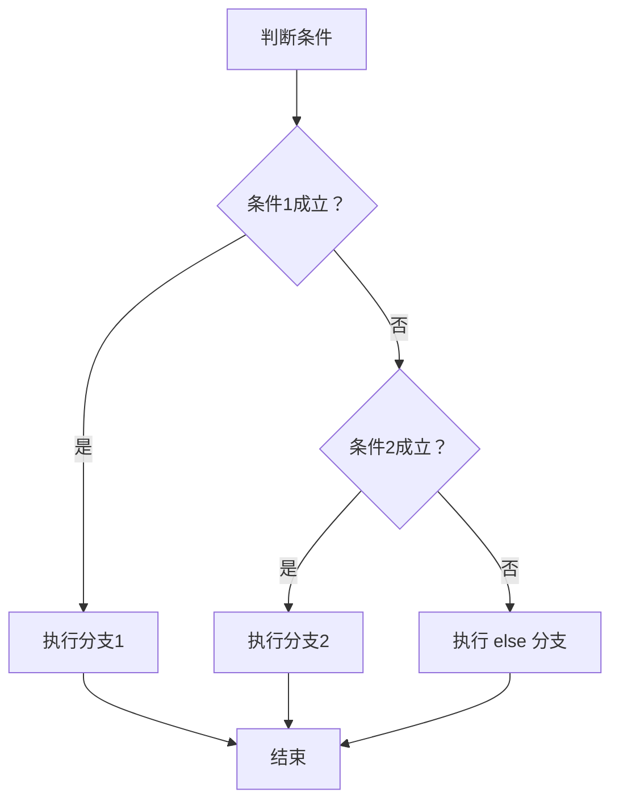

<!-- 控制性问题：为什么 Java 强制控制流语句必须使用花括号？ -->

你写 Vue 时，一定写过这样的代码：  
```javascript
if (user.role === 'admin')
  console.log('执行权限校验');  // 只有这行受 if 控制
  grantAdminAccess();          // 这行总会被执行——缩进骗了你
```  
这种 bug 在 Code Review 里极难发现，因为缩进和逻辑不一致。**Java 的解法是：语法强制每个分支必须用 `{}` 包围，编译器替你兜底。** 这就相当于 ESLint 的 `curly: all` 规则，但 Java 直接把它写进了语言规范——不写花括号？编译报错。

---

## 为什么 Java 要这么“霸道”？

**防止因缩进歧义或格式修改导致条件体意外执行。**  
在团队协作中，代码会被多人修改。如果花括号可省略，那么：

- 在 Git diff 中，缩进变化可能被忽略，导致新增的行意外地不属于条件体。
- 重构时，某行代码从条件体内移到体外，但忘记调整缩进，编译器不会报错，运行时行为却变了。
- 经典的“dangling else”问题：`if (a) if (b) x; else y;` —— 这个 `else` 属于哪个 `if`？不同语言解释不同，容易产生 bug。

Java 的设计目标是**大型团队、长期维护、可读可推导**。它吸取了 C 和 C++ 的教训：C 允许省略花括号，但缩进歧义导致了大量难以追踪的 bug（例如著名的苹果 SSL 漏洞“goto fail”就是因缩进误导导致的）。Java 的设计者决定：**用语法强制消除歧义，而不是依赖程序员的自律**。所有控制流语句（`if`、`for`、`while`、`switch`）的每个分支必须用花括号包围，即使只有一行。

> 🔍 记忆锚点：**强制边界，编译器替你兜底**——花括号不是可选项，是安全网。

---

## Java 控制流三件套

### 1. 条件分支：`if` / `else if` / `else`

**必须使用花括号**，哪怕只有一行。下面的代码在 Java 中会报错：

```java
int score = 85;
if (score >= 90)
    System.out.println("优秀"); // 编译器允许吗？允许，但所有主流规范都禁止！
// 实际上 Java 编译器允许单行省略花括号（语法上合法），
// 但所有编码规范（如阿里 Java 手册、Google Java Style）都强制要求加花括号。
// 所以正确的写法是：
if (score >= 90) {
    System.out.println("优秀");
} else if (score >= 60) {
    System.out.println("及格");
} else {
    System.out.println("不及格");
}
```

**踩坑提示**：如果你从前端转过来，可能会习惯性地不写花括号。在 Java 中，即使单行也**必须**加花括号——不是语法必须，而是规范必须。否则 Code Review 会被打回，而且 IDE（如 IntelliJ IDEA）会自动帮你加上。

**条件分支的执行流程**（以 if-else if-else 为例）：

**图：条件分支的判断与执行路径**


---

### 2. 循环：`for`、`while`、`do-while`

循环体同样强制花括号。这里重点介绍**增强 for 循环**（for-each），它是 Java 5 引入的，专门遍历数组或集合（如 `List`、`Set`），比传统 for 循环更简洁，避免索引越界。

```java
String[] fruits = {"苹果", "香蕉", "橙子"};
// 增强 for 循环（for-each）：冒号读作“in”
for (String fruit : fruits) {
    System.out.println("水果：" + fruit);
}

// 传统 for 循环（需要索引，容易出错）
for (int i = 0; i < fruits.length; i++) {
    System.out.println("水果：" + fruits[i]);
}
```

**常见误解**：增强 for 循环**不能修改集合元素**（比如 `fruit = "新水果"` 无效），只能读取。如果需要修改，请用传统 for 循环或迭代器。

---

### 3. 跳转：`break` / `continue` + 标签（label）

Java 允许在循环前面加一个标签（label），然后 `break` 或 `continue` 可以指定跳出或继续哪一层循环。这在处理多层嵌套时非常有用。

```java
outer:  // 标签，名字任意（通常用 outer）
for (int i = 0; i < 3; i++) {
    for (int j = 0; j < 3; j++) {
        if (i == 1 && j == 1) {
            System.out.println("遇到 (1,1)，跳出外层循环");
            break outer;  // 跳出标签 outer 所在的循环
        }
        System.out.println("(" + i + "," + j + ")");
    }
}
// 输出：
// (0,0) (0,1) (0,2) (1,0) 遇到 (1,1)，跳出外层循环
```

**注意**：标签只能放在循环前面（`for`、`while`、`do-while`），不能放在任意语句前。`continue` 也可以使用标签：`continue outer;` 会跳过当前迭代，直接进入外层循环的下一次迭代。

---

## 如果你熟悉 Vue / React —— 这很像 ESLint 的 `curly` 规则

前端开发者写 JavaScript 时，习惯省略花括号。但 ESLint 的 `"curly": "all"` 规则会强制你加花括号，否则报错。Java 把这个规则直接写进了语言规范——编译器就是你的 ESLint，而且更严格（连单行都要求花括号）。

**Vue 3 示例**（和 Java 一样推荐加花括号）：

```vue
<script setup>
const score = 85;
// ✅ 推荐：花括号明确包裹条件体
if (score >= 90) {
  console.log('优秀');
} else if (score >= 60) {
  console.log('及格');
} else {
  console.log('不及格');
}

// ❌ 危险：省略花括号，后续行意外执行
if (score >= 90)
  console.log('优秀');  // 只有这行受 if 控制
  console.log('额外操作');  // 这行总会被执行（缩进误导）
</script>
```

**React 示例**（JSX 中同样危险）：

```tsx
function Greeting({ isLoggedIn }: { isLoggedIn: boolean }) {
  // ✅ 推荐：花括号明确包裹条件体
  if (isLoggedIn) {
    return <h1>Welcome back!</h1>;
  } else {
    return <h1>Please sign in.</h1>;
  }

  // ❌ 危险：省略花括号，后续 return 不受 if 控制
  // if (isLoggedIn)
  //   return <h1>Welcome back!</h1>;   // 只有这行受 if 控制
  //   return <h1>Please sign in.</h1>; // 这行总会被执行
}
```

> ☕ **Java 回扣**：Java 的设计哲学是“语法即契约”，花括号不是可选项，而是安全网。即使你只写一行 `if (x) y;`，编译器也会警告（规范强制），而前端需要靠 eslint `curly` 规则来模拟这一效果。

---

## 设计权衡：花括号的代价与收益

| 得到了什么 | 付出了什么 |
|-----------|-----------|
| 无歧义的条件体，代码意图清晰 | 多写两个花括号字符 |
| 便于自动格式化（IDE 一键整理） | 不能像 Python 那样用缩进表示块 |
| 代码审查时只需看花括号位置 | 初学者可能觉得冗余 |
| 避免因缩进错误导致的运行时 bug | 无（这是净收益） |

在 Java 中，你**没有选择**——必须使用花括号。这是语言规范强制要求的（即使只有一行，编译器允许省略花括号，但所有主流编码规范都强制要求必须加花括号）。**永远不要省略花括号**，哪怕只有一行。

**与其他方案对比**：
- JavaScript/TypeScript：允许省略花括号，但容易出错，常靠 ESLint 规则强制要求。
- Python：完全靠缩进，没有花括号，但缩进在 Git diff 中容易丢失，且不能自动格式化（虽然有 Black）。
- C/C++：允许省略花括号，但同样有歧义问题，靠编码规范约束。

Java 选择了最保守、最安全的方式：**语法强制**。

---

## 实践建议（入门级）

1. **IDE 配置**：在 IntelliJ IDEA 中，设置 `Code Style → Java → Wrapping and Braces → Braces placement: End of line`（推荐）。确保 `Force braces` 选项为 `Always`（在 `Code Style → Java → Code Generation → Force braces` 中勾选）。
2. **编码规范**：遵循《阿里巴巴 Java 开发手册》第 1.6 条：“if/for/while/do 语句必须使用花括号”。
3. **静态检查**：使用 Checkstyle 的 `NeedBraces` 规则，或直接在 Git 钩子中配置自动格式化（如 `git pre-commit` 运行 `mvn spotless:apply`）。

---

**最终记忆锚点**：**强制边界，编译器替你兜底**。下次你写 Java 的 `if` 时，不假思索地加上花括号——这不是麻烦，是安全。

---

### 系列导航

**上一篇**：[Java 方法：为什么必须写返回类型和参数类型](#)
**下一篇**：[Java 类：为什么public类名必须匹配文件名](#)

> 这是「前端工程师系统学 Java」系列第3篇，系统解读 Java 设计哲学（面向前端工程师）。