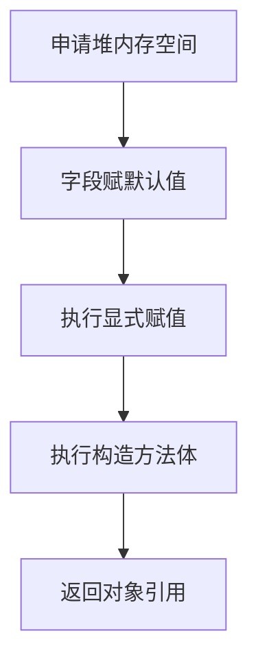

<!-- 控制性问题：为什么 Java 用 class 和 new 就能让多人协作的工程不再乱套？ -->

A 同学编写了订单处理逻辑，B 同学跨模块调用时直接篡改了内部状态字段，导致线上数据错乱。**Java 的类与对象机制通过“物理文件绑定+编译期门禁+确定性初始化”，强行划清了代码归属边界。** 记住这句话：**强制边界，编译器替你兜底**。

在多人并行开发中，最头疼的不是算法多难，而是“代码归谁管”和“构建路径找得到吗”。Java 第一条硬规则就是**class**（定义对象模板的结构蓝图）声明必须与物理文件强绑定。一个 `.java` 源文件只能包含一个 `public`（允许任何包下的代码访问）类，且文件名必须与类名完全一致。这就好比给每个逻辑单元发了唯一身份证，构建系统和 IDE 无需猜测即可精准定位。如果你熟悉 Vue 3，它的 `<script setup>`（组合式 API 组件模板）同样把响应式数据和函数打包在一个文件里形成职责边界。但类比止步于此：Vue 实例由框架在运行时隐式创建，依赖约定规范；而 Java 把这份契约前置到编译期，文件名不匹配直接 `mvn compile` 报错，从源头掐断路径混乱。

```java
// 文件名必须严格命名为 Order.java，且只能有一个 public 类
public class Order { 
    private String orderId; // private：仅限本类内部可见，外部无法直接触碰
    int amount;             // 默认修饰符：仅同一包内的类可以访问
    public String status = "PENDING"; // public：对外暴露的状态契约

    public Order(String orderId, int amount) { // 构造方法：对象诞生时的唯一初始化入口
        this.orderId = orderId; // this：指向当前正在创建的那个具体对象实例
        this.amount = amount;
    }

    public void confirm() { // 成员方法：对象对外提供的安全行为接口
        if ("PENDING".equals(this.status)) {
            this.status = "CONFIRMED";
        } else {
            throw new IllegalStateException("状态不允许重复确认");
        }
    }
}

public class OrderDemo {
    public static void main(String[] args) {
        Order order = new Order("ORD-2024001", 3); // new：向内存申请空间并触发初始化流程
        // 🚨 初学者高频踩坑：试图绕过 getter/setter 直接赋值私有字段
        // order.orderId = "HACK"; // 编译期直接报错：orderId 在 Order 中是 private 的
        // ✅ 正确做法：只能通过公开的 confirm() 等方法间接变更，让类自己控制条件
    }
}
```

有了文件归属，接下来要解决的是“状态污染”。Java 用访问修饰符充当门禁系统。除了上面的 `private` 和 `public`，还有 `protected`（本类、同包子类及不同包子类可见）和无关键字的默认修饰符（仅同包可见）。这些修饰符不是摆设，而是编译器的硬性拦截网。很多前端转 Java 的开发者会误以为 JavaScript 的 `const` 模块作用域保护等同于 Java 的封装，其实 `const` 只是防止变量引用被重新赋值，内部属性依然可改；而 Java 的 `private` 连跨包调用的权限都不给，直接编译失败。这里有个细节大多数教程会跳过：**你越觉得字段应该公开方便传参，项目后期维护的连锁反应就越恐怖。** 每次看到直写操作，都要立刻改成受控方法。**强制边界，编译器替你兜底**，编译期的红色波浪线就是在替你挡住未来的逻辑雪崩。

> 🔍 精确说明：访问修饰符并非操作系统层面的权限控制，而是编译期静态检查与运行期字节码指令校验的结合，确保外部无法非法读写该内存偏移地址。

理解了权限隔离，再看对象怎么诞生。Java 拒绝魔法，`new` 是一个分步执行的确定性动作。JVM 先在堆内存中分配连续空间存放对象头和数据字段 → 为所有字段赋予类型对应的默认值（如 `int` 为 `0`，引用为 `null`） → 执行显式字段赋值 → 按照继承链从父到子依次执行构造方法体 → 最后将内存地址包装成引用返回给调用方。这个过程彻底杜绝了“半初始化对象”被意外调用的隐患。对比动态脚本语言随意拼接属性的做法，Java 靠构造方法强制要求必填参数一次性到位。

**图：Java `new` 对象确定性初始化流程**


这就引出一个实际工程问题：一旦你手写了带参构造方法，Java 就不再自动生成无参构造。如果下游同事习惯用 `new Order()` 初始化，编译会直接报错。解决办法是显式补充无参构造，或者为可选字段引入 Builder 模式。

| 实践动作 | 目的 | 避坑提示 |
|----------|------|----------|
| IDE 交叉验证 (`Ctrl+N` / `Ctrl+Shift+N`) | 确认类与文件映射无误 | 文件名大小写不一致会导致 IDE 标红，排查构建失败的第一个动作 |
| 构造方法防御性编程 | 保证对象创建原子性 | 避免使用无参构造 + setter 链导致的“半成品对象”流传到业务层 |
| 访问修饰符审计 | 切断不必要的暴露面 | 评审时发现 `public` 字段直接下线，替换为只读属性或受控 setter |

回到协作场景，类与对象不是语法糖，而是工程防波堤。它牺牲了早期快速原型的灵活性，换取了百人团队三年维度的构建稳定与状态可溯。在日常 Spring Boot 项目中，你一定会遇到实体类映射数据库表的场景，此时配合 Lombok 的 `@Data` 注解能减少样板代码，但底层依然是这套 class 与 new 的边界机制在保驾护航。**强制边界，编译器替你兜底**——当你面对满屏飘红的编译错误时，不要抱怨繁琐，那是系统在替你拦截即将蔓延的数据污染。养成上述验证习惯，你的代码库自然会呈现出工业级的整洁度。

---

### 系列导航

**上一篇**：[Java 控制流：if/for/while 为什么不能省略花括号](#)
**下一篇**：[Java 继承：为什么子类重写方法必须保持签名一致](#)

> 这是「前端工程师系统学 Java」系列第 4 篇，系统解读 Java 设计哲学（面向前端工程师）。
