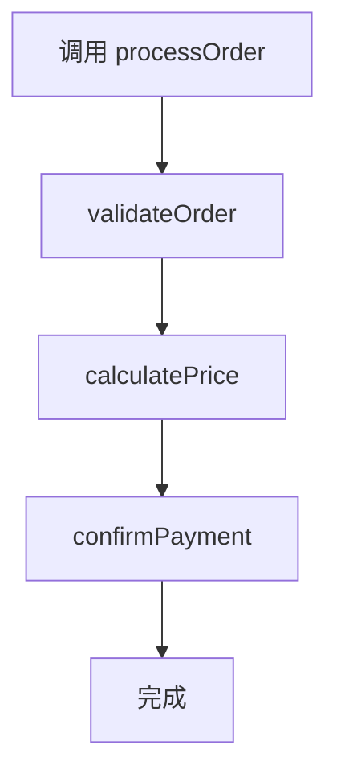

```markdown
<!-- 控制性问题：Java 如何保证子类在任何使用父类的地方都能正常工作？ -->

你在一个大型电商项目里，基础团队定义了 `AbstractOrderService`，多个业务线继承它实现 `validateOrder()`、`calculatePrice()`。突然有一天，基础团队在基类中修改了 `cancelOrder()` 的方法签名（比如增加了一个 `String reason` 参数），结果所有子类的 `cancelOrder()` 不再被调用，线上订单取消逻辑全部失效。更隐蔽的是，某个子类本意是重写 `cancelOrder()`，但开发者写成了 `cancleOrder()`（拼写错误），编译器一声不吭，代码运行结果完全不符合预期。

**Java 通过编译期契约和运行时动态绑定，保证子类在任何使用父类的地方都能正常工作。** 这个“契约”由方法签名一致性、访问权限约束、`@Override` 注解和 Liskov 替换原则共同构成。它不是玄学，是语言规范层面的强制规则。

---

## 继承与多态：解决的是“代码复用”与“扩展性”的矛盾

**继承**让子类自动获得父类的非私有成员和方法，避免了重复编写相同逻辑。**多态**则让调用方能够针对抽象（父类或接口）编程，而不依赖具体子类。当系统需要扩展新功能时，只需新增子类实现，调用方代码无需修改。

这就引出一个问题——为什么 Java 不直接让你复制粘贴代码，非要搞一套复杂的继承体系？因为大型项目里，**代码复用不是目的，可维护性和可扩展性才是**。继承+多态的组合，让你能在不修改已有调用方代码的前提下，引入新的行为。这正是 Spring AOP 能通过动态代理替换目标对象、Mockito 能通过继承创建 mock 对象的基础：只要代理对象符合父类或接口的契约，调用方就无需感知实现的变化。

> 🔍 **精确说明**：Liskov 替换原则（LSP）——子类必须能够完全替代父类使用，且调用方不需要知道子类的具体类型。这是继承的“黄金法则”，违反它会导致系统脆弱。

---

## Java 的设计选择：单继承 + 多接口，类型安全优先

Java 从 C++ 中吸取了教训。C++ 的多继承带来了菱形继承问题（Diamond Problem），导致继承体系复杂且容易出错。Java 选择了**单继承 + 接口的多实现**：一个类只能有一个直接父类，但可以同时实现多个接口。这既保留了“is-a”关系的清晰性，又通过接口提供了灵活的契约扩展。

同时，Java 语言规范从设计之初就强调**类型安全**和**可维护性**，因此对方法重写施加了严格的规则：

- 方法签名必须完全一致（方法名、参数列表、返回类型在 Java 5 后允许协变返回类型——即子类重写时可以返回父类返回类型的子类型）
- 访问权限不能更严格（比如父类方法为 `protected`，子类重写不能是 `private`）
- 抛出的受检异常不能比父类更宽泛

这些规则确保了子类在任何使用父类的地方都能正常工作，不会因为签名不匹配或访问限制而破坏调用链。**这就是编译期契约——它在代码运行之前就替你兜底。**

---

## 核心机制：重写 vs 重载，构造器链，`@Override`

### 方法重写（Override）与方法重载（Overload）的本质区别

- **重写**是子类对父类方法提供新的实现，发生在**运行时**（动态绑定）。JVM 根据对象的实际类型来决定调用哪个方法。调用方持有父类引用，调用的是子类重写后的逻辑。
- **重载**是在同一个类中定义多个同名但参数列表不同的方法，发生在**编译时**（静态绑定）。编译器根据调用时传入的参数类型和数量决定调用哪个版本。

一个常见的误解是：重载和重写容易混淆。实际上，重载是**编译期多态**，重写是**运行期多态**。在代码中，重载的方法名相同但参数不同；重写的方法签名必须完全相同。

```java
class Parent {
    void doSomething(int x) { }
}
class Child extends Parent {
    // 本意是重写，但参数类型不同，变成了重载
    void doSomething(String x) { }
    // 如果加上 @Override，编译器会报错
}
```

**这正是编译期契约的体现**：`@Override` 注解让编译器检查该方法是否真的覆盖了父类或接口中的方法。如果方法签名不匹配（比如参数类型或个数不同，或者方法名拼写错误），编译器会直接报错。这防止了开发者“本想重写却变成了重载”的陷阱。

### 父类构造器调用规则

子类构造器必须调用父类构造器，且调用必须作为子类构造器的第一条语句。如果子类构造器没有显式调用，编译器会自动插入 `super()`（调用父类无参构造器）。如果父类没有无参构造器，则子类构造器必须显式调用 `super(参数)`，否则编译报错。

这个设计保证了父类的初始化在先，子类的初始化在后，避免子类在父类未初始化完成时访问父类成员。**这个规则也是编译期契约的一部分**——它强制子类遵循父类的初始化顺序，确保子类替换父类时状态一致。

```java
abstract class AbstractOrderService {
    private String orderId;

    public AbstractOrderService(String orderId) {
        this.orderId = orderId;
        System.out.println("AbstractOrderService constructor: orderId = " + orderId);
    }

    public final void processOrder() {
        validateOrder();
        calculatePrice();
        confirmPayment();
    }

    protected abstract void validateOrder();
    protected abstract void calculatePrice();

    protected void confirmPayment() {
        System.out.println("Default payment confirmation");
    }

    public String getOrderId() {
        return orderId;
    }
}

class NormalOrderService extends AbstractOrderService {
    public NormalOrderService(String orderId) {
        super(orderId);  // 必须调用父类构造器
        System.out.println("NormalOrderService constructor");
    }

    @Override
    protected void validateOrder() {
        System.out.println("NormalOrder: validating stock and price");
    }

    @Override
    protected void calculatePrice() {
        System.out.println("NormalOrder: calculating price with tax");
    }
}
```

**模板方法模式中的调用流程**：父类定义骨架，子类实现钩子方法。以下流程图展示了 `processOrder()` 的执行顺序：


---

## 设计权衡：何时该用继承，何时该用组合？

| 场景 | 推荐方案 | 原因 |
|------|----------|------|
| 多个类共享相同的行为和状态，且存在明确的“is-a”关系 | 继承（抽象类） | 代码复用 + 多态能力，父类可提供默认实现 |
| 需要定义契约（方法签名），但不涉及状态共享 | 接口 | 更灵活，一个类可实现多个接口，避免单继承限制 |
| 需要复用行为，但子类可能改变父类行为导致脆弱基类问题 | 组合（委托） | 组合降低耦合，父类修改不会自动影响子类 |
| 需要强制子类遵循特定方法签名，且子类不能随意改变行为 | 模板方法模式（继承 + final 方法） | 父类控制骨架，子类只实现钩子 |

**何时该用继承**：当子类确实“是一个”父类的特化，并且子类不会破坏父类的契约（即满足 Liskov 替换原则）。例如，`ArrayList` 继承 `AbstractList`，因为 `ArrayList` 是 `List` 的一种实现，且所有 `List` 的方法在 `ArrayList` 中行为一致。

**何时不该用继承**：当只是为了代码复用而继承（比如 `Stack` 继承 `Vector` 就是一个反例，因为 `Stack` 不应该支持在任意位置插入元素）。另外，当父类的方法签名可能频繁变化时，继承会导致大量子类需要修改。此时应优先使用组合：将需要复用的逻辑封装在另一个类中，通过字段引用它。

> **记忆锚点**：继承的契约是双向的——父类承诺不随意变更签名，子类承诺不破坏父类行为。任何一方违约，整个系统都会脆弱。

---

## 如果你熟悉前端，这有点像…

你一定遇到过这样的场景：多个页面组件共享相同的布局和逻辑，你可能会创建一个 `BasePage` 组件，然后让其他组件通过 `extends` 或 `mixins` 复用。或者，你希望根据不同的订单类型渲染不同的支付组件，但调用方只需知道“这是一个支付组件”——这正是多态在前端中的朴素体现。

但前端的“继承”与 Java 有本质区别：**前端组件是运行时对象，没有编译期类型检查**。Vue 3 的 `extends` 只是浅层选项合并，子组件覆盖父组件方法时，父组件的原始方法依然存在，且没有“方法签名必须一致”的强制规则。如果你在 Vue 中写错方法名（如 `cancleOrder`），只会导致父组件方法被保留，不会报错。**这正对应了文章开头 Java 开发者遇到的拼写错误问题——前端没有编译期防护，需要靠代码审查或测试覆盖。**

Java 的多态让你可以写出 `AbstractOrderService service = new NormalOrderService()`，然后调用 `service.processOrder()`，编译器确保 `NormalOrderService` 有 `processOrder()` 方法。Vue 的动态组件没有这种保障——如果某个组件缺少某个 prop，只会在控制台 warning，不会编译报错。

**Java 用编译器保护你，前端需要你自己保护自己**（通过类型系统、测试、代码审查）。

---

## 实践建议：在团队协作中用好继承

1. **始终使用 `@Override` 注解**：在 IDE（如 IntelliJ IDEA）中设置为“方法重写时自动添加”，并且开启“Missing @Override”检查为 error 级别。这能捕获 90% 以上的继承相关错误。

2. **优先使用接口定义契约**：当需要多态时，尽量让调用方依赖接口而非抽象类。接口更轻量，且支持多实现。抽象类只用于需要提供共享状态或默认实现的情况。

3. **控制继承层次深度**：建议不超过 3 层。过深的继承树难以理解和维护。如果发现需要多层继承，考虑使用组合或接口来重构。

4. **构造器中避免调用可被重写的方法**：因为子类构造器可能尚未执行完毕，此时调用重写方法可能导致空指针或未初始化状态。如果必须调用，应使用 `private` 或 `final` 方法。

5. **使用 `final` 保护关键方法**：如果父类中的某个方法不希望被子类重写（比如模板方法中的骨架逻辑），将其声明为 `final`。这既明确了设计意图，也防止了意外破坏。

6. **静态检查工具**：在 CI 中加入 Checkstyle 或 SpotBugs 规则，检查继承深度、缺少 `@Override`、构造器中调用可重写方法等问题。

**继承与多态是 Java 类型安全的基石。** 理解它的契约规则，你就能在团队协作中写出更健壮、更可维护的代码——而不会在某个深夜被线上故障惊醒。

```

---

### 系列导航

**上一篇**：[Java 类：为什么public类名必须匹配文件名](#)
**下一篇**：[Java 接口：为什么契约必须先于实现](#)

> 这是「前端工程师系统学 Java」系列第 5 篇，系统解读 Java 设计哲学（面向前端工程师）。