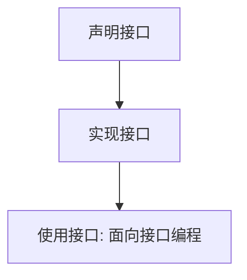

**接口使用三步流程：声明、实现、调用**



---

## 如果你熟悉 Vue/React，这很像 TypeScript 的接口

你在写 Vue/React 时，一定用过 TypeScript 的 `interface` 来定义组件 props 的类型或对象的结构。Java 的 `interface` 本质上也是干这件事——定义一组行为规范（契约），让不同的实现类遵守同一个签名。两者都有 `implements` 关键字，代码几乎一模一样。

**Vue 3 示例**：

```vue
<script setup lang="ts">
interface Payment {
  pay(amount: number): void;
}

class WeChatPay implements Payment {
  pay(amount: number) {
    console.log(`微信支付：${amount}元`);
  }
}

const payment: Payment = new WeChatPay();
payment.pay(100); // 输出：微信支付：100元
</script>
```

**React 示例**：

```tsx
interface Payment {
  pay(amount: number): void;
}

class Alipay implements Payment {
  pay(amount: number) {
    console.log(`支付宝支付：${amount}元`);
  }
}

function OrderComponent() {
  const payment: Payment = new Alipay();
  payment.pay(200);
  return <div>支付中...</div>;
}
```

**共同本质**：都是“面向契约编程”——调用方只依赖接口，不依赖具体实现类，从而轻松替换或新增实现，实现解耦。

**关键区别**：Java 的接口在运行时保留类型信息（可以通过 `instanceof` 判断），而 TypeScript 的接口只在编译时生效，运行时被擦除。另外，Java 8+ 接口可以包含 `default` 方法（提供默认实现）和 `static` 方法（工具方法），TypeScript 接口不能包含实现。

---

## 设计权衡：用接口换来了什么

| 得到了什么 | 付出了什么 |
|-----------|-----------|
| 严格的行为契约，保证多实现的一致性 | 需要提前设计接口，不能随意添加方法（除非用 default） |
| 多态支持，调用方与实现解耦 | 接口会增加抽象层，初学者容易过度设计 |
| 可以同时实现多个接口，弥补单继承的不足 | 如果接口方法过多，实现类必须全部实现（除非用 default） |

**何时该用接口**：
- 当你有多个类需要提供相同的行为，但实现方式不同（例如多种支付、多种日志输出）。
- 当你希望调用方只依赖抽象，不依赖具体实现（例如依赖注入、单元测试时替换 mock 对象）。

**何时不该用接口**：
- 如果只有一个实现，并且未来几乎不可能有第二个实现，直接用类即可。
- 如果行为需要共享状态（如成员变量），应该用抽象类（abstract class），因为接口不能包含实例字段。
- 如果方法需要被多个类继承且部分实现相同，考虑用抽象类或接口的 `default` 方法（但 `default` 方法不适合复杂逻辑）。

---

## 实战踩坑：初学者最容易犯的错

1. **忘记写 `implements`**：类没有显式实现接口，编译报错 `cannot find symbol`。
2. **实现方法忘记加 `public`**：接口方法默认 `public`，实现类中必须显式写 `public`，否则编译错误。
3. **认为接口可以 `new`**：接口不能实例化，只能用 `new` 实现类。
4. **认为接口中的变量可以修改**：接口中的变量默认是 `final` 常量，不能重新赋值。

> **强制边界，编译器替你兜底。** 只要一个类声明 `implements Payment`，编译器就会检查它是否实现了 `pay` 方法——没实现就编译报错。这就是接口最核心的力量。

---

## 一句话总结

Java 的接口就是一份“行为合同”：声明方法签名，强制实现类提供一致的方法，让调用方只依赖合同，不依赖具体实现。**用接口写代码，就像用 TypeScript 定义 props 类型——提前约定好，后面就不会乱。**

---

### 系列导航

**上一篇**：[Java 继承：为什么子类重写方法必须保持签名一致](#)
**下一篇**：[Java 包：为什么类必须归属明确命名空间](#)

> 这是「前端工程师系统学 Java」系列第 6 篇，系统解读 Java 设计哲学（面向前端工程师）。