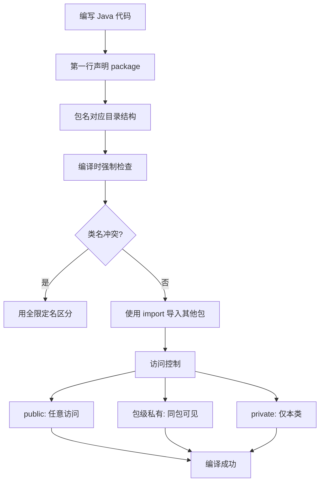

---

**总结一句话**：Java 的包机制就是“命名空间 + 访问控制”的编译时强制版，它用严格的物理目录约束换来了大型项目的可维护性。下次写 Java 文件时，第一件事就是写对 `package`，因为**包名是你的代码在 Java 世界里的身份证**。

---

### 系列导航

**上一篇**：[Java 接口：为什么契约必须先于实现](#)
**下一篇**：[Java 泛型：为什么集合必须声明元素类型](#)

> 这是「前端工程师系统学 Java」系列第7篇，系统解读 Java 设计哲学（面向前端工程师）。