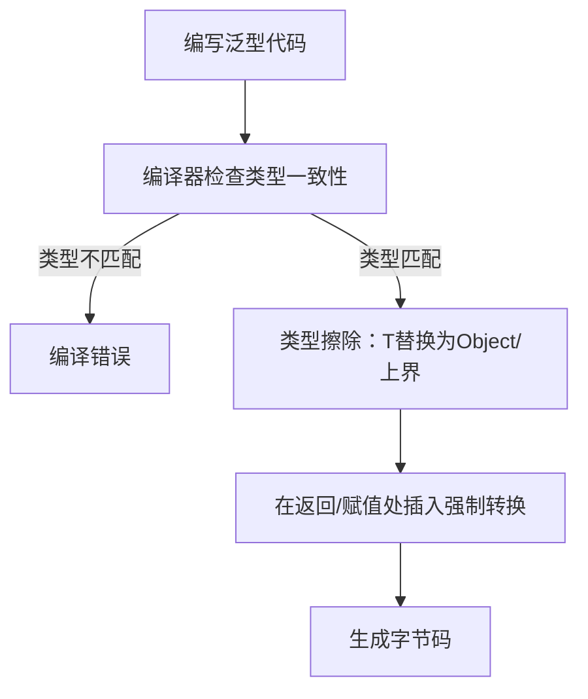

## Java 泛型类型擦除的编译时流程

在阅读“Java 是怎么做的？”部分时，理解类型擦除的三个核心步骤有助于把握整体机制。下图展示了从编写泛型代码到生成字节码的完整过程：



**说明**：编译器在编译期完成所有类型检查，然后将泛型信息擦除，最后自动插入必要的强制转换指令（如 `checkcast`），确保运行时类型安全。

---

<!-- 控制性问题：Java 泛型为什么选择类型擦除，以及它如何保证编译时类型安全？ -->

```java
// 没有泛型的日子
List users = new ArrayList();
users.add("Hello");
users.add(123); // 不小心混入 Integer
String s = (String) users.get(1); // 运行时 ClassCastException！
```

**Java 泛型通过编译时类型检查，把这种运行时崩溃扼杀在开发阶段。** 它的核心机制是类型擦除（Type Erasure）——泛型信息只在编译期存在，运行时完全消失，但编译器替你插入了所有必要的强制转换，保证类型安全。**强制边界，编译器替你兜底。**

---

## 你会在哪里遇到这个？

做 Spring Boot 项目时，你几乎每天都在接触泛型。比如从数据库查用户列表：

```java
List<User> users = userDao.findAll();  // 编译器知道 list 里是 User
User u = users.get(0);                // 不需要强转
```

如果没有泛型，你得写 `List users = ...`，然后每次 `(User) users.get(i)`——一旦有人插入了错误类型，错误会延迟到运行时才暴露，而且堆栈可能离插入点很远。另一个典型场景：Spring 的 `RestTemplate` 反序列化 JSON 时需要指定返回类型：

```java
ResponseEntity<List<User>> response = restTemplate.exchange(
    url, HttpMethod.GET, null,
    new ParameterizedTypeReference<List<User>>() {});
```

这里的 `List<User>` 不仅让编译器安心，还让框架通过反射在运行时拿到真实类型（利用匿名内部类的 `getGenericSuperclass()`），正确反序列化。**这就是泛型在真实项目中的价值：编译期安全 + 运行时可追溯。**

---

## Java 为什么这样设计？

Java 泛型选择类型擦除，而不是像 C# 那样在运行时保留泛型信息，**首要原因是向后兼容**。Java 5 引入泛型时，已有大量基于原始类型（raw type）的代码和类库（如 JDK 集合框架）。如果泛型信息保留到运行时，`ArrayList<String>` 和 `ArrayList<Integer>` 会变成两个不同的类，这会破坏 JVM 的类加载机制和旧代码的二进制兼容性。

类型擦除让旧代码无需修改就能与新泛型代码共存——旧代码使用原始类型（如 `List`），编译器发出警告但能通过；新代码使用泛型，享受类型安全。**代价是运行时失去了泛型类型信息**，导致一些限制：
- 不能 `new T()`（因为不知道 T 的具体类型）
- 不能 `instanceof T`（运行时无法判断）
- 不能创建泛型数组 `new T[10]`
- 静态方法和静态变量不能使用类型参数（所有实例共享同一个类，而类型参数在每个实例上可能不同）

作为对比，TypeScript 的泛型也是编译期擦除的，因为 JavaScript 没有类型系统，运行时完全不存在。Java 的擦除更“无奈”——它必须兼容已有的 JVM 和类库，而 TS 则不需要考虑运行时。两者都选择了擦除，但动机不同：Java 为了向后兼容，TS 为了与 JS 运行时对齐。**但最终效果一样：编译期安全，运行时零开销。**

---

## Java 是怎么做的？

**核心机制**：编译器在编译阶段对泛型代码进行类型检查，然后将类型参数替换为它们的上界（如果未指定边界，则替换为 `Object`），并在必要位置插入强制转换。这个过程叫“类型擦除”。

**尖括号语法**：
- `<T>` 声明一个类型参数，表示“某种类型”
- `<T extends Number>` 限定 T 必须是 Number 的子类（或本身），这样可以在方法中调用 Number 的方法（如 `intValue()`）
- 多个参数：`<K, V>` 用于 Map 等
- 通配符 `?`：表示未知类型，通常用于方法参数，如 `List<? extends Number>` 表示元素是 Number 或其子类的列表（只读），`List<? super Integer>` 表示元素是 Integer 或其父类的列表（可写）。

**原始类型（raw type）**：不带类型参数的泛型类，如 `ArrayList`（没有 `<E>`）。这是为了兼容旧代码，但编译器会给出 unchecked 警告。**永远不应该在新代码中使用原始类型**，因为它绕过了编译时类型检查。

### 核心代码示例

```java
// 一个简单的泛型容器类
public class Box<T> {
    private T content;

    public void put(T item) {
        this.content = item;
    }

    public T get() {
        return content;
    }

    // 演示类型擦除：不能 new T()
    // public T create() { return new T(); }  // 编译错误

    public static void main(String[] args) {
        // 类型安全的用法
        Box<String> stringBox = new Box<>();
        stringBox.put("Hello");
        String s = stringBox.get();  // 不需要强转，编译器自动插入 (String)

        // 原始类型用法（不推荐，仅演示兼容性）
        Box rawBox = new Box();       // 警告: raw use of parameterized class Box
        rawBox.put(123);              // 可以放 Integer
        String s2 = (String) rawBox.get(); // 运行时 ClassCastException！因为实际存的是 Integer

        // 泛型方法示例
        List<String> list = new ArrayList<>();
        addIfNotNull(list, "test");
        addIfNotNull(list, null);     // 不会添加 null
        System.out.println(list);     // [test]
    }

    // 泛型方法：<T> 在方法前声明
    public static <T> void addIfNotNull(List<T> list, T element) {
        if (element != null) {
            list.add(element);
        }
    }
}
```

**设计意图**：`Box<String>` 确保 `put` 只能接受 `String`，`get` 返回 `String`。原始类型 `Box` 虽然能用，但失去了类型安全，容易在运行时出问题。泛型方法 `addIfNotNull` 让方法本身也能独立于类使用类型参数。

> 🔍 精确说明：类型擦除后，`Box<String>` 和 `Box<Integer>` 在运行时都是同一个 `Box` 类（字节码中只有 `Box`），所有对 `T` 的操作都被替换为对 `Object` 的操作，并在返回时插入 `checkcast` 指令。这就是为什么 `get()` 返回 `String` 时不需要你手动强转——编译器已经插入了。

---

## 设计权衡与决策指南

**得到了什么**：
- 编译时类型安全，大量运行时错误提前暴露
- 消除强制转换，代码更简洁
- 增强代码自文档性：`List<User>` 比 `List` 更清晰地表达了意图

**付出了什么**：
- 运行时类型信息丢失，无法在运行时获取泛型真实类型（除非通过反射技巧，如 `ParameterizedTypeReference`）
- 不能创建泛型数组、不能 `instanceof` 泛型类型
- 类型擦除导致重载冲突：`void process(List<String>)` 和 `void process(List<Integer>)` 擦除后签名相同，编译失败
- 静态上下文中不能使用类型参数（因为所有实例共享同一个类）

**何时该用**：
- 集合、自定义容器（如 `Result<T>`）、工具类（如 `Optional<T>`）
- 需要类型安全的 API（如 `Comparable<T>`、`Comparator<T>`）
- 使用 Spring、MyBatis 等框架时，几乎所有涉及类型的地方都该用泛型

**何时不该用**：
- 不需要类型安全的简单传递（如仅作为标记的类，但很少见）
- 需要运行时具体类型的场景（如 JSON 反序列化，需要借助 `TypeReference` 或反射）
- 与旧代码交互时，必须使用原始类型（但应尽快迁移）

**与 TypeScript 对比**：Java 的泛型比 TS 更严格，例如 `List<String>` 不是 `List<Object>` 的子类型（泛型不协变），这防止了插入错误元素。TS 中 `Array<string>` 可以赋值给 `Array<object>`（因为结构类型系统），但同样有类型安全风险。Java 选择了更安全的方案，代价是灵活性略差。

---

## 如果你熟悉 TypeScript（前端类比）

TypeScript 的泛型语法与 Java 高度相似，都是使用尖括号 `<T>` 声明类型参数，并支持约束（`extends`）、多参数、通配符（`unknown` 或 `any` 的变体）。Vue 3 和 React 组件中大量使用泛型来保证 props、refs、hooks 的类型安全。

```vue
<!-- Vue 3 泛型组件示例（TypeScript） -->
<script setup lang="ts" generic="T">
interface Props {
  items: T[];
  renderItem: (item: T) => string;
}
const props = defineProps<Props>();
function getFirst(): T | undefined {
  return props.items[0];
}
</script>
```

```tsx
// React 泛型组件（TypeScript）
interface ListProps<T> {
  items: T[];
  renderItem: (item: T) => React.ReactNode;
}
function List<T>({ items, renderItem }: ListProps<T>) {
  return (
    <ul>
      {items.map((item, index) => (
        <li key={index}>{renderItem(item)}</li>
      ))}
    </ul>
  );
}
// 使用：自动类型安全
const users: User[] = [];
<List items={users} renderItem={(u) => u.name} />  // u 被推断为 User
```

**共同本质**：Java 和 TypeScript 的泛型都是**编译时类型安全**的工程解法——通过类型参数化，让编译器在开发阶段检查类型一致性，自动插入类型转换（Java 在字节码中插入 `checkcast`，TS 在编译后移除类型注解），从而消除运行时 `ClassCastException` 或 `TypeError`，同时让代码自文档化。

> ☕ Java 的 `Box<String>` 确保 `put` 只接受 `String`，`get` 返回 `String`。编译器擦除后替换为 `Object` 并插入强制转换，与 TS 编译后移除类型注解、运行时无类型信息完全一致。不同点在于 Java 的擦除是为了向后兼容，TS 的擦除是因为 JavaScript 没有类型系统——但两者最终都让开发者享受编译期保障，运行时零开销。

---

## 实践建议

1. **IDE 配置**：在 IntelliJ IDEA 中，将“Raw use of parameterized class”设置为 Error 级别（Settings → Editor → Inspections → Java → Code maturity → Raw use of parameterized class），强制自己避免原始类型。

2. **编码规范**：
   - 永远不要使用原始类型（除非与遗留代码交互且无法修改）
   - 使用 `@SuppressWarnings("unchecked")` 时，必须附上注释解释为什么是安全的
   - 对于集合，优先使用 `List<T>` 而非 `List`，即使 T 是 Object

3. **常见陷阱**：
   - 泛型数组：`new List<String>[10]` 编译错误，应使用 `ArrayList` 或 `List<List<String>>`
   - 不能 `instanceof` 泛型：`if (obj instanceof List<String>)` 编译错误，应检查原始类型后通过元素类型推断
   - 通配符边界：`List<? extends Number>` 只读（不能 add），`List<? super Integer>` 可写（可 add Integer），但 get 返回 Object

4. **Spring 中的泛型**：使用 `ParameterizedTypeReference` 获取运行时泛型类型，例如：
   ```java
   List<User> users = restTemplate.exchange(url, HttpMethod.GET, null,
       new ParameterizedTypeReference<List<User>>() {}).getBody();
   ```
   这个匿名内部类利用 `TypeToken` 模式在运行时保留 `List<User>` 的类型信息（因为 `getGenericSuperclass()` 可以获取超类的类型参数）。

**进阶误解澄清**：
- 泛型不是协变的：`List<String>` 不能赋值给 `List<Object>`，否则会破坏类型安全（可以插入 Integer 到 String 列表中）。但数组是协变的（`String[]` 可以赋值给 `Object[]`），这是历史遗留问题。
- 类型擦除导致的重载冲突：`void foo(List<String>)` 和 `void foo(List<Integer>)` 在同一个类中不能共存，因为擦除后都是 `void foo(List)`。但可以通过不同参数数量或不同参数顺序来避免。
- 通配符 `?` 不是类型参数，它表示“某个未知类型”，常用于方法签名以增加灵活性，例如 `void printAll(List<?> list)` 可以接受任何类型的 List。

---

**记住：强制边界，编译器替你兜底。** 写泛型代码时，你只需要遵守类型参数的约束，剩下的检查和转换都交给编译器。这种设计虽然牺牲了运行时的灵活性，但换来了整个生态的稳定性和旧代码的平滑迁移。下次你写 `List<User>` 时，想想背后擦除的代价和兼容的智慧——这就是 Java 泛型的精髓。

---

### 系列导航

**上一篇**：[Java 包：为什么类必须归属明确命名空间](#)  
**下一篇**：[RestController：为什么REST API必须与控制器职责强绑定](#)

> 这是「前端工程师系统学 Java」系列第 8 篇，系统解读 Java 设计哲学（面向前端工程师）。