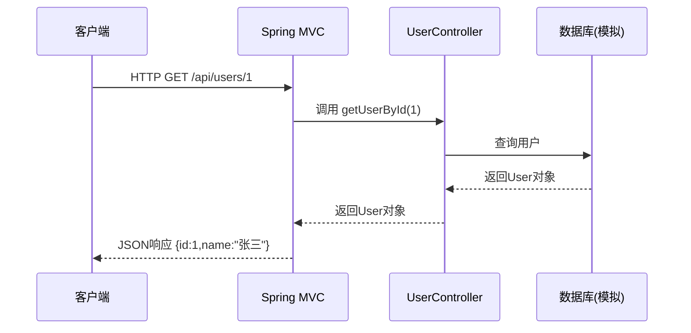

```markdown
<!-- 控制性问题：为什么 @RestController 能让你的 Java 方法自动变成 API 接口？ -->

想象你写一个返回用户信息的 API。传统方式需要继承 `HttpServlet`、覆盖 `doGet`、手动解析 URL、设置响应头、调用 JSON 库……一个简单的接口要写 20 行模板代码。而用 `@RestController`，只需要一个注解、一个方法、一行 `return`。**核心论点：@RestController 通过注解声明，自动完成 URL 映射、参数绑定和 JSON 序列化，让你从繁琐的 HTTP 模板代码中解放出来。** 记住这个记忆锚点——**“声明式路由，自动序列化”**，后面我们会反复回扣它。

## 这个机制解决了什么问题？

在没有 `@RestController` 之前，Java Web 开发中处理 HTTP 请求需要手动编写 Servlet（处理请求的 Java 类）。每个 API 你都要：
- 继承 `HttpServlet`，覆盖 `doGet`/`doPost` 方法
- 手动从 `HttpServletRequest` 对象（包含请求信息）里读取参数
- 手动把 Java 对象序列化成 JSON（把 Java 对象转换成字符串格式）写入 `HttpServletResponse` 对象（包含响应信息）
- 设置响应内容类型、编码等

这就像每次做饭都要自己生火、劈柴、刷锅。代码重复、难以测试（依赖 Tomcat 容器）、维护成本高——业务逻辑和 HTTP 细节搅在一起。

`@RestController` 通过**注解**（一种给代码加标记的语法，Spring 会识别并自动处理）把“服务员”（处理 HTTP 细节的代码）和“厨师”（业务逻辑）分开了。你只需要写一个普通 Java 类，标注 `@RestController`，然后定义方法并标注 `@GetMapping`（映射 GET 请求的注解）等，Spring 就会自动完成 URL 映射、参数绑定、结果序列化。**这就是“声明式路由，自动序列化”的威力。**

## Java 为什么这样设计？

Spring 的设计者借鉴了 Java 注解（Annotation，Java 5 引入的元数据机制）和反射（Reflection，程序运行时检查自身结构的能力）来实现“约定优于配置”。他们希望开发者专注于业务逻辑，而非底层 HTTP 协议细节。

对比传统 Servlet：你需要手动组装每个请求和响应。而 Spring 的选择是：用**注解声明式地描述**“这个方法是处理 GET 请求的”、“这个参数来自 URL 路径”、“返回值自动转 JSON”。代价是注解的解析和代理（Spring 动态生成子类）会带来少量运行时开销，但对绝大多数应用可以忽略。

> 🔍 精确说明：`@RestController` 本身是一个组合注解，它包含了 `@Controller` 和 `@ResponseBody`。`@Controller` 告诉 Spring 这个类是“控制器”，可以处理请求；`@ResponseBody` 告诉 Spring 方法的返回值直接写入 HTTP 响应体（而不是返回一个视图页面，比如 JSP 页面）。

## Java 是怎么做的？

Spring 通过反射扫描所有标注了 `@RestController` 的类，注册它们的处理方法。收到请求时，`HandlerMapping`（请求映射器）找到对应的方法，然后用 `HttpMessageConverter`（HTTP 消息转换器，如 `MappingJackson2HttpMessageConverter`）将返回值自动序列化为 JSON。

核心机制：
1. **注解驱动**：`@RequestMapping` 及其衍生注解（`@GetMapping`, `@PostMapping` 等）定义 URL 映射和 HTTP 方法。
2. **参数绑定**：通过 `@RequestParam`（从查询参数提取）、`@PathVariable`（从 URL 路径提取）、`@RequestBody`（从请求体提取）等注解从请求中提取数据并自动转换成 Java 类型。
3. **自动序列化**：`@ResponseBody` 触发 `HttpMessageConverter` 将返回对象转为 JSON/XML。

### 核心代码示例

```java
// 一个简单的 REST 控制器
@RestController  // 标注为 REST 控制器，所有方法默认 @ResponseBody
@RequestMapping("/api/users")  // 类级别 URL 前缀
public class UserController {

    // 处理 GET /api/users/{id} 请求
    @GetMapping("/{id}")  // 方法级别 URL 映射
    public User getUserById(@PathVariable Long id) {  // @PathVariable 从 URL 路径提取 id
        // 模拟从数据库查询用户
        User user = new User();
        user.setId(id);
        user.setName("张三");
        return user;  // 自动转为 JSON 返回给客户端
    }

    // 处理 POST /api/users 请求，请求体是 JSON
    @PostMapping
    public User createUser(@RequestBody User newUser) {  // @RequestBody 将请求体 JSON 转为 User 对象
        // 模拟保存到数据库
        newUser.setId(100L);
        return newUser;  // 返回创建后的用户（含新 ID）
    }
}

// 简单的用户实体类（POJO，普通 Java 对象）
public class User {
    private Long id;
    private String name;
    // getter/setter 必须提供，Jackson 序列化依赖它们
    public Long getId() { return id; }
    public void setId(Long id) { this.id = id; }
    public String getName() { return name; }
    public void setName(String name) { this.name = name; }
}
```

**代码意图说明**：
- 类上 `@RequestMapping("/api/users")` 定义所有方法的公共路径前缀。
- `@GetMapping("/{id}")` 匹配 GET 请求，`{id}` 是路径变量，由 `@PathVariable` 绑定到方法参数。
- `@RequestBody` 自动将请求体中的 JSON 字符串反序列化成 `User` 对象（需要对象有默认构造器和 getter/setter）。
- 方法返回 `User` 对象，Spring 自动调用 Jackson 库将其转成 JSON 写入响应。

**下图展示了 @RestController 处理 HTTP 请求的完整流程：**



## 前端类比：如果你熟悉 Nuxt 3 的 server routes

如果你写过 Nuxt 3，那么 `server/api/` 目录下的每个 `.ts` 文件自动注册为一个 API 端点，这正好对应 `@RestController` 的“类即控制器”思想：

```typescript
// server/api/user/[id].ts —— 对应 @RestController + @GetMapping("/{id}")
export default defineEventHandler(async (event) => {
  const id = getRouterParam(event, 'id');       // ✅ 类比 @PathVariable
  const user = { id: Number(id), name: '张三' }; // 模拟数据库查询
  return user;                                   // ✅ 自动序列化为 JSON（类比 @ResponseBody）
})
```

- **类比成立**：文件路径 `user/[id]` 自动映射为 `GET /api/user/{id}`，方法返回值自动转为 JSON，省去手动设置响应头、序列化等模板代码。这和 `@RestController` + `@GetMapping` + `@ResponseBody` 的声明式效果一致。
- **类比不成立**：Nuxt 的 `defineEventHandler` 是函数，不是类；Spring 的 `@RestController` 是类级别的注解，需要配合 `@RequestMapping` 等细粒度注解，且依赖 Spring 的依赖注入容器。Nuxt 没有注解机制，也没有“控制器”类的概念，只是文件系统约定。

**共同本质**：两者都通过“约定优于配置”的方式，把 URL 映射、参数提取、响应序列化从业务代码中剥离。但 Spring 的 `@RestController` 是建立在 Java 注解和反射之上的更强大的声明模型，而前端框架的 API 路由更依赖文件系统约定和函数式组合，缺少编译期类型安全（TypeScript 例外）和容器管理能力。

## 操作系统层面：它背后是什么？

`@RestController` 是 Spring 框架的注解，但它底层依赖的 Servlet 容器（如 Tomcat）在操作系统层面表现为一个监听特定端口的 TCP 服务器进程。当客户端（如浏览器）发起 HTTP 请求时，Tomcat 进程通过 `accept()` 系统调用接收连接，为每个连接分配一个线程（或通过 NIO 的事件循环），解析 HTTP 报文后交给 Spring 的 DispatcherServlet，最终路由到 `@RestController` 方法。因此，`@RestController` 的运行时背后是操作系统的网络栈（TCP/IP）、文件描述符（Socket fd）、线程池等资源。

### 典型排查场景

**场景**：前端调用 API 时返回 503 或连接超时，怀疑后端服务负载过高。

**排查命令**（Linux）：
```bash
# 查看哪个进程占用了 8080 端口（端口被占用时排查）
lsof -i:8080
ss -tulpn | grep :8080

# 查看 Java 进程的线程数（如果请求堆积，线程数可能飙升）
ps aux | grep java  # 获取 PID
ls /proc/<PID>/task | wc -l

# 查看 Tomcat 工作线程的栈（定位死锁或长时间阻塞）
jstack <PID> | grep -A 10 "http-nio-8080-exec" | grep -E "BLOCKED|WAITING"
```

**结论**：线程池耗尽或后端依赖（数据库/外部服务）响应慢导致请求堆积。

## 设计权衡与决策指南

**得到了什么**：
- 开发效率极高：无需手动处理 HTTP 协议细节。
- 可测试性：控制器可以脱离 Web 容器进行单元测试（使用 `MockMvc` 模拟 HTTP 请求）。
- 代码清晰：业务逻辑与 HTTP 绑定分离，方法签名直观反映输入输出。

**付出了什么**：
- 运行时开销：注解解析、代理生成、反射调用有一定性能损失（但对大多数业务可忽略）。
- 调试难度增加：错误可能发生在 Spring 的框架代码中，需要理解 Spring 处理流程。
- 灵活性受限：如果需要对 HTTP 响应做精细控制（如设置自定义头部），需要额外使用 `ResponseEntity` 包装。

**何时该用 / 何时不该用**：
- ✅ 标准 RESTful API：几乎所有后端服务都适用。
- ✅ 需要自动序列化/反序列化：前后端分离项目。
- ❌ 需要完全控制 HTTP 响应（如文件下载、流式输出）：使用 `ResponseEntity` 或直接操作 `HttpServletResponse`。
- ❌ 对性能极端敏感（每秒数万请求且响应体很小）：可以考虑手动处理以节省框架开销，但大多数场景不需要。

## 常见误解（踩坑提醒）

1. **“`@RestController` 只能返回 JSON”**：实际上它也可以返回其他格式（如 XML），只要配置了对应的 `HttpMessageConverter`。
2. **“忘记加 `@RequestBody` 也能绑定请求体”**：如果前端发 JSON 但参数没有 `@RequestBody`，Spring 会尝试从查询参数绑定，导致 `null`。
3. **“返回 `String` 时会被当作视图名”**：在 `@RestController` 下，`@ResponseBody` 生效，返回字符串会被直接写入响应体，不会当作视图名。

**回到记忆锚点**：**“声明式路由，自动序列化”**——你只需要关心业务逻辑，剩下的交给 `@RestController`。

---

### 系列导航

**上一篇**：[Java 泛型：为什么集合必须声明元素类型](#)
**下一篇**：[Autowired：为什么对象依赖必须由容器统一管理](#)

> 这是「前端工程师系统学 Java」系列第 9 篇，系统解读 Java 设计哲学（面向前端工程师）。