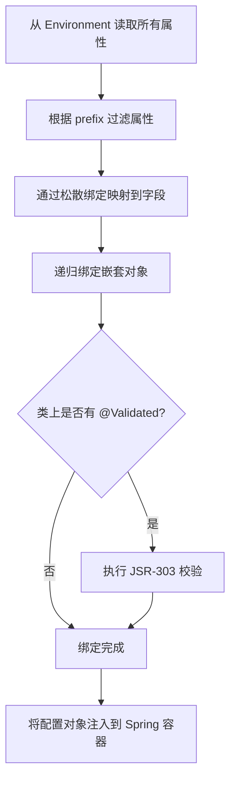

<!-- 控制性问题：为什么 @ConfigurationProperties 比 @Value 更适合管理复杂配置？ -->

做 Spring Boot 项目时，你一定遇到过这个场景：一个 `application.yml` 里躺着几十个配置项，数据库连接、Redis、消息队列、第三方 API 密钥、业务开关…… 而你用 `@Value` 一行一行地注入，结果代码散落在各个 Service 甚至 Controller 里。更糟糕的是，某天你手滑把 `port` 写成了字符串 `"3306abc"`，启动时直接抛 `NumberFormatException`，而你花了一小时才找到是哪个 `@Value` 在作怪。

**核心论点：`@ConfigurationProperties` 把一组相关的配置属性绑定到一个类型安全的 Java Bean 上，让配置从“字符串的集合”变成“强类型的领域对象”。** 这是 Spring 框架替你做的自动化工作，而不是让你手动维护映射关系。

---

### 这个机制解决了什么问题？

先快速过一下痛点，再深入原理。当你用 `@Value` 时，会遇到三个工程问题：

1. **类型转换全靠手动**：`@Value("${app.port}")` 返回的是字符串，你需要自己 `Integer.parseInt()`，而且如果 YAML 里写成了 `"abc"`，只有运行时才会炸。
2. **配置散落无法管理**：`@Value` 可以出现在任何类里，你想知道“数据库配置在哪定义的”，得全局搜索 `@Value("${datasource` —— 这就像把钥匙放在十个不同的抽屉里。
3. **没有校验**：你想确保 `url` 不能为空、`timeout` 必须在 1~60 秒，只能自己写 `@PostConstruct` 方法做一堆 if-else。

**记忆锚点：`@ConfigurationProperties` 的核心价值是“类型安全、集中管理、IDE 支持”——让配置像代码一样可读、可查、可校验。**

---

### Java 为什么这样设计？

Spring 团队没有发明新概念，而是**充分复用了 Java 已有的语言特性**：

- **Java Bean 规范**：`@ConfigurationProperties` 依赖标准的 getter/setter 来绑定属性。这是 Java 自 1.1 起就有的约定（所有框架如 Jackson、MyBatis 都遵守它），因此 Spring 可以零成本地利用反射和属性描述符。
- **JSR-303 Bean Validation**：校验逻辑直接写在属性上，与配置类耦合，无需额外校验代码。这体现了 Java 生态中“声明式优于命令式”的设计哲学。
- **反射与动态代理**：Spring 在启动时扫描所有 `@ConfigurationProperties` 类，通过 `Binder`（Spring Boot 2.0+）将 `Environment` 中的属性按照松散绑定规则注入。

> 🔍 **精确说明**：松散绑定（relaxed binding）是为了兼容不同命名风格——比如 `my-app.name`（kebab-case）、`myAppName`（驼峰）、`MY_APP_NAME`（环境变量）都能映射到 Java 字段 `myAppName`。这在从 YAML、环境变量、命令行参数等多源读取配置时非常实用。

对比其他语言：TypeScript 常用 `process.env` + 自定义 `zod` 模式校验，但每次读取都需要显式调用 `parse` 方法；Python 常用 `pydantic` 模型绑定环境变量。而 Java 的方案更“自动”——Spring 在启动时一次性完成绑定和校验，之后业务代码直接使用普通的 POJO，无需关心配置来源。

---

### 核心机制：三步走

#### 第一步：定义配置类

```java
@ConfigurationProperties(prefix = "app.datasource")
@Validated  // 启用 JSR-303 校验
public class DataSourceProperties {
    @NotEmpty(message = "数据库URL不能为空")
    private String url;

    @Min(1) @Max(65535)
    private int port = 3306;  // 提供默认值

    @Valid  // 嵌套对象也需要校验
    private Credentials credentials = new Credentials();

    // 必须提供 getter/setter，Spring 通过 setter 绑定
    public String getUrl() { return url; }
    public void setUrl(String url) { this.url = url; }
    public int getPort() { return port; }
    public void setPort(int port) { this.port = port; }
    public Credentials getCredentials() { return credentials; }
    public void setCredentials(Credentials credentials) { this.credentials = credentials; }

    // 嵌套类：表示 credentials 子属性
    public static class Credentials {
        @NotEmpty
        private String username;
        @NotEmpty
        private String password;
        // getter/setter 省略...
    }
}
```

**为什么这样写？**
- `@Validated` + `@NotEmpty` 确保配置缺失时应用直接启动失败，而不是在运行时抛出 NullPointerException。
- 嵌套类 `Credentials` 让配置结构清晰，`@Valid` 触发对嵌套对象的校验。
- 提供默认值 `port = 3306`，避免每次都要显式配置。
- **所有 setter 必须存在**——这是 Spring 绑定机制的核心约定（除非使用 `@ConstructorBinding`，后面会讲）。

#### 第二步：启用配置类

```java
@SpringBootApplication
@EnableConfigurationProperties(DataSourceProperties.class)
public class Application {
    public static void main(String[] args) {
        SpringApplication.run(Application.class, args);
    }
}
```

或者用 `@ConfigurationPropertiesScan("com.example.config")` 自动扫描指定包下的所有 `@ConfigurationProperties` 类。

#### 第三步：在 YAML 中写配置

```yaml
app:
  datasource:
    url: jdbc:mysql://localhost:3306/mydb
    port: 3306
    credentials:
      username: admin
      password: secret
```

**记忆锚点：整个过程是 Spring 在启动时自动完成的——扫描、绑定、校验，你只需要定义类、写配置、注入使用。**

---

### 绑定过程内部发生了什么？

Spring 启动时，`Binder` 会做以下事情：

1. 从 `Environment` 中读取所有属性（包括 YAML、环境变量、命令行参数）。
2. 根据 `prefix = "app.datasource"` 过滤出以 `app.datasource` 开头的属性。
3. 通过松散绑定规则，将 `app.datasource.url` 映射到字段 `url`（setter 方法名为 `setUrl`）。
4. 如果字段是嵌套对象（如 `credentials`），递归绑定。
5. 如果类上标注了 `@Validated`，调用 `Validator` 执行 JSR-303 校验，失败则抛出异常，阻止应用启动。

**下图展示了 `@ConfigurationProperties` 在启动时绑定的完整流程：**



**这就引出一个问题——** 如果配置项很多，IDE 怎么知道有哪些属性可以提示？答案是 `spring-boot-configuration-processor`。

---

### 让 IDE 给你自动补全

添加以下依赖（Maven）：

```xml
<dependency>
    <groupId>org.springframework.boot</groupId>
    <artifactId>spring-boot-configuration-processor</artifactId>
    <optional>true</optional>
</dependency>
```

编译后会在 `target/classes/META-INF` 下生成 `spring-configuration-metadata.json` 文件。IDE 读取这个文件后，就能为 `application.yml` 提供自动补全、类型提示和默认值文档。

**踩坑提示**：这个依赖必须标记为 `optional`，否则会被打包到生产 JAR 中，增加不必要的体积。

---

### 设计权衡：什么时候该用，什么时候不该用？

| 优点 | 缺点/代价 |
|------|-----------|
| 类型安全，减少运行时类型转换错误 | 需要额外编写 POJO 类，且必须提供 setter（违反不可变对象风格） |
| 支持 JSR-303 校验，启动时失败 | 松散绑定可能导致意外匹配（如 `my-app-name` 和 `myAppName` 冲突） |
| IDE 自动补全（需配置处理器） | 需要引入 `spring-boot-configuration-processor` 并确保编译时生成元数据 |
| 集中管理，便于重构 | 对于极少量的配置（如 1~2 个简单值），显得过度设计 |

**何时该用？**
- 配置项超过 3 个且属于同一领域（如数据库、缓存、第三方服务）。
- 配置项需要校验（非空、范围、格式）。
- 配置项需要默认值，且希望 IDE 能提示。
- 配置项可能在多个地方被引用（如 `datasource.url` 在多个 DAO 中使用）。

**何时不该用？**
- 配置项极少且无分组需求（如单个 `server.port`），此时 `@Value` 更简洁。
- 配置值需要动态变化（如从数据库或远程配置中心实时刷新），`@ConfigurationProperties` 默认只在启动时绑定一次，需要配合 `@RefreshScope` 使用。
- 配置值需要复杂计算（如根据其他配置推导），此时应使用 `@Bean` 方法返回计算后的对象。

---

### 如果你熟悉前端：这有点像用 zod 解析环境变量

如果你写过 Vue 3 或 React，一定遇到过这种情况：在 `process.env` 里读 `VITE_API_URL`，IDE 不会提示你拼写错误，直到运行时才发现 `undefined`。你想校验 `API_URL` 不能为空、`TIMEOUT` 必须是 1~60 的数字，只能手动写 `if (!apiUrl) throw` 之类的代码。

Java 的 `@ConfigurationProperties` 就是解决这些问题的“框架级方案”——它把配置变成强类型、可校验、有 IDE 提示的 Java Bean。前端没有完全对应的内置机制，但我们可以用 **TypeScript 类型 + 运行时校验库（如 zod）** 来模拟最核心的那部分：

```typescript
import { z } from 'zod';

const configSchema = z.object({
  apiUrl: z.string().url('API URL 不能为空且必须是合法 URL'),
  port: z.coerce.number().int().min(1).max(65535).default(3000),
  credentials: z.object({
    username: z.string().min(1, '用户名不能为空'),
    password: z.string().min(1, '密码不能为空'),
  }),
});

const rawConfig = {
  apiUrl: import.meta.env.VITE_API_URL,
  port: import.meta.env.VITE_PORT,
  credentials: {
    username: import.meta.env.VITE_CREDENTIALS_USERNAME,
    password: import.meta.env.VITE_CREDENTIALS_PASSWORD,
  },
};

const parsed = configSchema.safeParse(rawConfig);
if (!parsed.success) {
  throw new Error(`配置校验失败: ${parsed.error.message}`);
}
```

**类比成立的地方**：`configSchema` 相当于 Java 的 `@Validated` + JSR-303 注解，`safeParse` 在应用启动时一次性校验，失败则阻止渲染。

**类比止步于此**：前端需要**手动**从环境变量中提取字符串并构造原始对象，而 Java 的 `@ConfigurationProperties` 会自动从 `Environment` 中按前缀匹配并绑定，无需手动 `getProperty`。前端也没有“松散绑定”（如 `VITE_API_URL` 和 `viteApiUrl` 不会自动映射），必须严格一致。

**关键差异**：Java 是框架替你完成从配置源到 Java 对象的自动映射、松散绑定、编译期元数据生成；前端必须手动收集所有环境变量并调用解析函数。

---

### 进阶技巧：构造器绑定实现不可变对象

Spring Boot 2.2+ 支持 `@ConstructorBinding`，让你用构造器注入替代 setter，实现不可变配置对象：

```java
@ConstructorBinding
@ConfigurationProperties(prefix = "app.datasource")
public class DataSourceProperties {
    private final String url;
    private final int port;
    private final Credentials credentials;

    // 单个构造函数，Spring 通过构造器注入，无需 setter
    public DataSourceProperties(String url, int port, Credentials credentials) {
        this.url = url; 
        this.port = port; 
        this.credentials = credentials;
    }

    // 只有 getter，没有 setter
    public String getUrl() { return url; }
    public int getPort() { return port; }
    public Credentials getCredentials() { return credentials; }
}
```

**为什么值得用？** 不可变对象避免意外修改，且更符合函数式编程风格。但注意嵌套对象（如 `Credentials`）也需要构造器绑定，否则 Spring 无法创建。

**记忆锚点：`@ConstructorBinding` 让你在保持类型安全的同时，获得不可变对象的额外好处。**

---

### 实践建议

1. **避免松散绑定陷阱**：推荐在 `application.yml` 中使用 kebab-case（`my-app.name`），Java 字段使用驼峰（`myAppName`），环境变量使用大写下划线（`MY_APP_NAME`）。不要混用风格，否则可能因优先级导致意外覆盖。

2. **在测试中轻松注入**：使用 `@TestPropertySource` 或 `@SpringBootTest(properties = {...})` 覆盖配置，配合 `@Autowired DataSourceProperties` 验证绑定逻辑。

3. **结合 `@ConfigurationPropertiesScan`**：如果配置类很多，可以用 `@ConfigurationPropertiesScan("com.example.config")` 替代在每个类上写 `@EnableConfigurationProperties`，自动扫描指定包下的所有 `@ConfigurationProperties` 类。

4. **踩坑提醒**：`@ConfigurationProperties` 默认只在启动时绑定一次。如果配置值需要动态变化（如从远程配置中心实时刷新），必须配合 `@RefreshScope` 使用，否则修改配置后不会生效。

---

从 `@Value` 到 `@ConfigurationProperties`，你从“手动管理字符串”升级到了“声明式配置管理”。**记住核心：类型安全、集中管理、IDE 支持——这是 Spring 帮你做的三件事。** 下次你再遇到超过 3 个同领域配置项时，别再写 `@Value` 了，定义一个配置类吧。

---

### 系列导航

**上一篇**：[Autowired：为什么对象依赖必须由容器统一管理](#)
**下一篇**：[Filter：为什么横切关注点必须在DispatcherServlet之前拦截](#)

> 这是「前端工程师系统学 Java」系列第11篇，系统解读 Java 设计哲学（面向前端工程师）。