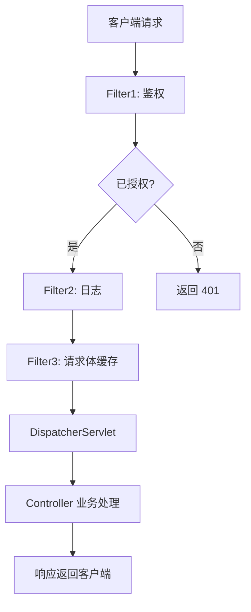

<!-- 控制性问题：Filter 如何通过链式处理将横切关注点从业务代码中剥离，并在实际项目中避免常见陷阱？ -->

你在 Spring Boot 项目里肯定写过这样的代码：每个 Controller 方法开头都重复调用 `logRequest()`、`checkAuth()`、`handleCors()`——直到有一天，你发现日志漏掉了某个异常，或者鉴权逻辑改了需要改动几十个文件。**Filter 就是用来解决这个问题的：它让你在请求到达 Controller 之前，插入一段可插拔的通用逻辑，把横切关注点从业务代码中彻底剥离。** 这个机制就像在请求处理链上装了一道道阀门，每个阀门只关心一件事，然后按顺序放行。

---

## Filter 解决了什么核心问题？

**横切关注点（Cross-cutting Concerns）的重复与耦合。** 日志、鉴权、CORS、请求编码——这些逻辑与业务正交（无关），但每个 Controller 都不得不自己调用。一旦变更（比如日志格式从 JSON 改成 XML），所有位置都要改。Filter 提供了一种“插拔式”的机制，把这些通用逻辑集中到一条链上，按顺序执行，并且每个 Filter 只做一件事（单一职责）。

> 🔍 **记忆锚点**：Filter 在请求到达业务代码之前建立了一道可插拔的防线，让你专注于业务，而把通用逻辑交给链式处理。

---

## Java 为什么这样设计？

Filter 源自 Servlet 规范（2.3 引入），设计动机很清晰：

1. **解耦**：通用处理与业务处理分离，业务开发者无需关心鉴权、日志等基础设施。
2. **可组合**：多个 Filter 串联成链，通过顺序控制实现不同功能的叠加，每个 Filter 只关注一件事。
3. **性能与安全**：Filter 在 Servlet 容器层面执行，比 Spring 的拦截器更早，能拦截静态资源请求、处理编码、防止恶意请求过早消耗业务资源。
4. **与 Servlet 容器兼容**：Filter 是 Java EE 标准，不依赖 Spring，可以在任何 Servlet 容器（Tomcat、Jetty）中运行，Spring 只是提供了更便捷的注册方式。

---

## Filter 是怎么工作的？

核心接口是 `javax.servlet.Filter`（Jakarta 规范后为 `jakarta.servlet.Filter`），三个方法：
- `init(FilterConfig)`：初始化时调用，可读取配置参数。
- `doFilter(ServletRequest, ServletResponse, FilterChain)`：每次请求调用，通过 `chain.doFilter()` 将请求传递给下一个 Filter 或目标 Servlet（Spring 的 DispatcherServlet）。
- `destroy()`：容器销毁时清理资源。

**关键执行时机**：Filter 在 Spring 的 `DispatcherServlet` 之前执行，因此无法访问 Spring MVC 的上下文（如 `@RequestMapping` 注解、依赖注入的 Service），只能操作原始的 `HttpServletRequest` 和 `HttpServletResponse`。如果需要访问 Spring 的 Bean，可以通过 `@Component` 注入，但 Filter 本身必须是 Spring 管理的 Bean。

**进阶难点：Filter 链的顺序控制**  
多个 Filter 的执行顺序由 `@Order` 注解或 `Ordered` 接口决定。数值越小，越先执行。注意：`@Order` 只对 Spring 管理的 Filter Bean 生效（通过 `FilterRegistrationBean` 注册时也可以设置 `setOrder`）。如果使用 `@WebFilter`（Servlet 原生注解），则顺序由 web.xml 中的 `<filter-mapping>` 顺序决定，Spring Boot 下默认不保证顺序。

**进阶难点：避免 RequestBody 被多次读取**  
`HttpServletRequest` 的 `getInputStream()` 或 `getReader()` 只能读取一次，因为底层是流。如果 Filter 先读取了请求体（比如用于日志或验签），后续的 Filter 或 Controller 就无法再次读取，导致业务异常。解决方案是**包装请求**：继承 `HttpServletRequestWrapper`，将请求体数据缓存到字节数组中，然后重写 `getInputStream()` 和 `getReader()` 返回缓存的数据。

**Filter 链执行流程示意图**（请求从客户端进入，经过多个 Filter，最终到达 Controller）：



---

## 核心代码示例：请求日志 + 请求体缓存

以下是一个完整示例，实现请求日志记录并解决请求体多次读取问题。

```java
import org.springframework.stereotype.Component;
import org.springframework.web.filter.OncePerRequestFilter;
import javax.servlet.*;
import javax.servlet.http.HttpServletRequest;
import javax.servlet.http.HttpServletRequestWrapper;
import javax.servlet.http.HttpServletResponse;
import java.io.*;
import java.nio.charset.StandardCharsets;

@Component
@Order(1) // 控制 Filter 链顺序，数值小先执行
public class LoggingFilter extends OncePerRequestFilter {

    @Override
    protected void doFilterInternal(HttpServletRequest request,
                                    HttpServletResponse response,
                                    FilterChain chain) throws ServletException, IOException {
        // 包装请求，使其可重复读取
        CachedBodyHttpServletRequest wrappedRequest = new CachedBodyHttpServletRequest(request);
        
        // 记录请求信息
        String body = wrappedRequest.getBody(); // 缓存读取
        System.out.println("Request URI: " + request.getRequestURI());
        System.out.println("Request Body: " + body);
        
        // 继续执行后续 Filter 或 Controller，此时 Controller 仍能读取请求体
        chain.doFilter(wrappedRequest, response);
    }

    /**
     * 自定义 HttpServletRequestWrapper，缓存请求体
     */
    private static class CachedBodyHttpServletRequest extends HttpServletRequestWrapper {
        private byte[] cachedBody;

        public CachedBodyHttpServletRequest(HttpServletRequest request) throws IOException {
            super(request);
            InputStream requestInputStream = request.getInputStream();
            this.cachedBody = toByteArray(requestInputStream);
        }

        @Override
        public ServletInputStream getInputStream() throws IOException {
            return new CachedBodyServletInputStream(this.cachedBody);
        }

        @Override
        public BufferedReader getReader() throws IOException {
            ByteArrayInputStream byteArrayInputStream = new ByteArrayInputStream(this.cachedBody);
            return new BufferedReader(new InputStreamReader(byteArrayInputStream, StandardCharsets.UTF_8));
        }

        public String getBody() {
            return new String(cachedBody, StandardCharsets.UTF_8);
        }

        private byte[] toByteArray(InputStream inputStream) throws IOException {
            ByteArrayOutputStream buffer = new ByteArrayOutputStream();
            byte[] data = new byte[4096];
            int n;
            while ((n = inputStream.read(data, 0, data.length)) != -1) {
                buffer.write(data, 0, n);
            }
            return buffer.toByteArray();
        }

        private static class CachedBodyServletInputStream extends ServletInputStream {
            private final ByteArrayInputStream inputStream;

            public CachedBodyServletInputStream(byte[] cachedBody) {
                this.inputStream = new ByteArrayInputStream(cachedBody);
            }

            @Override
            public int read() throws IOException {
                return inputStream.read();
            }

            @Override
            public boolean isFinished() {
                return inputStream.available() == 0;
            }

            @Override
            public boolean isReady() {
                return true;
            }

            @Override
            public void setReadListener(ReadListener listener) {
                throw new UnsupportedOperationException();
            }
        }
    }
}
```

**代码意图说明**：
- 继承 `OncePerRequestFilter`：保证每个请求只执行一次 Filter（即使有转发也不会重复）。
- `@Order(1)`：控制多个 Filter 的执行顺序，1 表示高优先级。
- 自定义包装器 `CachedBodyHttpServletRequest`：在 `doFilterInternal` 中构造，缓存请求体，然后传给 `chain.doFilter`，后续的 Filter 和 Controller 都能通过 `getInputStream()` 获取到缓存的数据。

> 🔍 **记忆锚点回扣**：这个 Filter 就像一道阀门，在请求进入业务代码之前，记录日志并缓存请求体，然后放行——链式处理让通用逻辑和业务逻辑彻底分离。

---

## 如果你熟悉前端，这很像中间件模式

如果你写过 Node.js 的 Express 或 Koa，一定熟悉中间件（middleware）的概念：在请求到达路由处理函数之前，可以插入多个函数，按顺序执行，每个函数可以决定是否继续传递请求。Java 的 Servlet Filter 正是同样的思想——只是运行在 Servlet 容器层面，比 Express 更底层（能拦截静态资源）。Vue Router 的全局守卫和 React 的 axios 拦截器也属于同类模式，但作用域不同。

**Express 中间件与 Filter 的对应关系**：
- `app.use((req, res, next) => { ... })` 等价于 `doFilter(request, response, chain)`，`next()` 对应 `chain.doFilter()`。
- `express.json()` 中间件相当于 Java 中缓存请求体的包装器，但它是标准化的，无需手动实现。
- 多个中间件通过 `app.use()` 串联，顺序决定执行链，与 Filter 的 `@Order` 本质相同。

**但类比止步于此：关键差异**
1. **执行范围**：Java Filter 能拦截**所有**请求（包括静态资源、错误页面），而前端中间件只拦截 HTTP API 请求或路由跳转。
2. **上下文访问**：Java Filter 只能操作原始的 `HttpServletRequest`/`ServletResponse`，无法访问 Spring 的 Controller 参数；Express 中间件也无法直接访问路由处理器的参数（但 `req.params` 在中间件中也可用，那是 Express 的特性）。
3. **顺序控制**：Java 的 `@Order` 更显式，Express 依赖代码注册顺序（隐式）。

**共同本质**：在请求/响应处理链中插入“横切关注点”，通过链式调用实现解耦与可组合性，每个中间件只关注一件事（单一职责）。

---

## 设计权衡与决策指南

| 权衡点 | 得到的好处 | 付出的代价 |
|--------|-----------|------------|
| Filter 执行在 DispatcherServlet 之前 | 能拦截静态资源、处理字符编码、早期鉴权 | 无法访问 Spring MVC 上下文，需手动解析请求体 |
| 使用 `OncePerRequestFilter` | 避免重复执行（如转发场景） | 增加了抽象层，但实际影响很小 |
| 包装请求以重复读取 | 允许 Filter 和 Controller 都读取请求体 | 需要额外内存缓存请求体（大请求体可能 OOM） |
| 通过 `@Order` 控制顺序 | 灵活组合多个 Filter | 必须确保所有 Filter 都使用 Spring 管理，否则顺序不可控 |

**何时该用 Filter？**
- 需要处理**所有请求**（包括静态资源、错误页面）的通用逻辑，如字符编码、CORS、安全头。
- 需要在请求到达 Spring 的 `DispatcherServlet` 之前执行，例如强制 HTTPS、IP 黑名单。
- 需要操作原始的 `HttpServletRequest` 和 `HttpServletResponse`（如添加自定义响应头）。

**何时不该用 Filter？**
- 需要访问 Spring 的 Controller 参数或异常处理（如 `@ControllerAdvice`），应使用 Spring 拦截器（`HandlerInterceptor`）。
- 逻辑只针对特定 URL 模式且需要 Spring 的依赖注入，优先考虑 `HandlerInterceptor`。
- 需要修改 ModelAndView 或处理视图渲染，应使用 `HandlerInterceptor` 的 `postHandle` 方法。

---

## 实践建议（真实项目中的坑与技巧）

1. **优先使用 `OncePerRequestFilter`**：避免因转发或 include 导致 Filter 重复执行，减少意外。
2. **注册 Filter 时明确顺序**：使用 `FilterRegistrationBean` 并设置 `setOrder()`，或者使用 `@Order` 注解（配合 `@Component`）。避免混合使用 `@WebFilter`（Servlet 原生注解）和 Spring 管理的 Filter，否则顺序不确定。
3. **避免在 Filter 中做耗时操作**：Filter 执行在请求处理早期，如果阻塞（如调用远程服务），会拖慢整个请求。对于耗时操作，考虑异步 Filter（`AsyncContext`）或移到业务层。
4. **处理请求体缓存时注意内存**：如果可能接收大文件上传，不要缓存整个 body，而应针对小请求体（如 JSON）使用。可以结合 `ContentCachingRequestWrapper` 但需了解其缓存行为（默认不缓存，需显式调用 `getContentAsByteArray()`）。
5. **静态检查规则**：在 IDE 中配置检查，禁止在 Filter 中直接使用 `request.getInputStream()` 而不包装，避免后续读取失败。
6. **单元测试**：使用 Spring Mock 测试 Filter，验证顺序和请求体缓存逻辑。示例：`MockHttpServletRequest` 可以设置内容，然后断言 Filter 是否正确包装。

---

## 深入底层：操作系统视角下的 Filter

Filter 运行在 Servlet 容器（如 Tomcat）的线程池中。每个 HTTP 请求到达时，Tomcat 会从操作系统线程池中分配一个内核线程（对应一个 Java 线程）来处理该请求。Filter 的 `doFilter` 方法就在这个线程上执行。当 Filter 调用 `chain.doFilter()` 时，请求继续沿着 Filter 链传递，最终到达 Spring 的 DispatcherServlet，整个过程都在同一个线程内完成。因此，Filter 的执行本质上是一个线程在执行一系列回调，涉及操作系统的线程调度和上下文切换。

Filter 处理请求体（如读取 JSON）时，底层通过 `HttpServletRequest.getInputStream()` 读取网络 Socket 中的数据，这对应操作系统的文件描述符（fd）上的 `read()` 系统调用。如果 Filter 需要缓存请求体，则会在 JVM 堆内存中分配字节数组，这对应操作系统的虚拟内存分配。

**典型排查场景**：Filter 中缓存请求体导致内存溢出（OOM）。

**现象**：应用在高峰时频繁 Full GC，最终 OOM，Heap Dump 显示大量 `byte[]` 被 `CachedBodyHttpServletRequest` 持有。

**排查步骤**：
1. 先运行 `jstat -gcutil <PID> 1000 10`，观察到 `FGC`（Full GC 次数）快速增加，且 `O`（老年代）使用率居高不下。
2. 再运行 `jmap -dump:format=b,file=heap.hprof <PID>` 获取堆转储，然后用 MAT 或 jhat 分析，找到 `byte[]` 的 GC Root，确认是被 Filter 包装类的缓存引用。
3. 结论：Filter 中未限制请求体大小，大请求导致大量 `byte[]` 堆积在堆中，引发 OOM。解决方案：在 Filter 中设置最大缓存大小，或改用流式处理（不缓存）。

**Linux 排查命令**：
```bash
# 查看 Tomcat 进程的 PID
ss -tulpn | grep :8080
# 或通过 jps 查看 Java 进程
jps -l | grep -i tomcat

# 查看 Tomcat 的工作线程数（线程池大小）
jstack <PID> | grep "http-nio" | wc -l

# 查看 Tomcat 进程打开的文件描述符总数
lsof -p <PID> | wc -l

# 查看当前 TCP 连接状态
ss -s

# 查看进程的内存映射
pmap -x <PID> | grep -E "heap|anon"

# 查看 JVM 堆内存使用情况
jstat -gcutil <PID> 1000 5
```

> 🔍 **记忆锚点回扣**：Filter 这道阀门不仅控制着业务逻辑的入口，也直接影响着操作系统的线程和内存——理解底层能帮你写出更健壮的代码。

---

Filter 的设计思想——链式处理、横切关注点剥离——是解决 Web 应用中通用逻辑重复的经典方案。掌握它，你就能在 Spring 项目中优雅地处理日志、鉴权、CORS 等基础设施，而不再污染业务代码。下次再遇到“每个 Controller 都写一遍”的重复逻辑，想想 Filter：一道阀门，一次解决。

---

### 系列导航

**上一篇**：[ConfigurationProperties：为什么配置必须类型安全且可验证](#)
**下一篇**：[RestControllerAdvice：为什么全局异常必须统一响应格式](#)

> 这是「前端工程师系统学 Java」系列第 12 篇，系统解读 Java 设计哲学（面向前端工程师）。