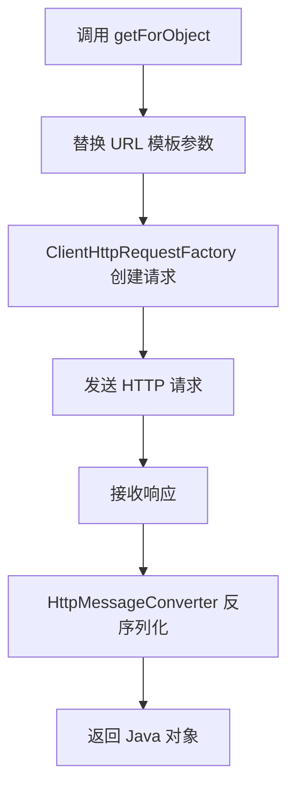

**RestTemplate 内部处理流程图**



<!-- 控制性问题：为什么在 Spring 中调用 HTTP 接口可以像调用本地方法一样简单？ -->

```java
// 用 Java 原生的 HttpURLConnection 调用一个 GET 接口
URL url = new URL("https://api.example.com/users/123");
HttpURLConnection conn = (HttpURLConnection) url.openConnection();
conn.setRequestMethod("GET");
int status = conn.getResponseCode();
if (status == 200) {
    BufferedReader in = new BufferedReader(new InputStreamReader(conn.getInputStream()));
    String inputLine;
    StringBuilder content = new StringBuilder();
    while ((inputLine = in.readLine()) != null) {
        content.append(inputLine);
    }
    in.close();
    // 手动把 JSON 字符串解析成 User 对象...
}
```

这段代码你看了什么感觉？每次调用外部 API 都写一遍，烦不烦？**RestTemplate 就是 Spring 帮你把这个“烦”字去掉的工具——它把 HTTP 请求封装成一行代码，让你只关心业务数据。**

```java
@Autowired
private RestTemplate restTemplate;

User user = restTemplate.getForObject("https://api.example.com/users/{id}", User.class, 123);
```

看到了吗？URL 里的 `{id}` 会自动替换成 `123`，返回的 JSON 自动变成 `User` 对象。**这就是 RestTemplate 的核心：把“建立连接、发送请求、读取响应、异常处理”这些固定动作全部封装，你只需要提供三个变量：URL、返回类型、参数。**

---

### 这个机制到底怎么工作的？

Spring 用了一个经典的设计模式——**模板方法模式**（Template Method Pattern）。简单说：不变的部分（连接、读写、异常）由框架写好，你只需要提供变化的部分（URL、参数、返回值类型）。RestTemplate 内部使用 `ClientHttpRequestFactory` 来发起实际的 HTTP 请求，并利用 `HttpMessageConverter` 列表（比如 `MappingJackson2HttpMessageConverter`）自动把 JSON 转成 Java 对象。

**你不需要知道底层是 `HttpURLConnection` 还是 Apache HttpClient，RestTemplate 帮你选好了默认实现。**

> 🔍 精确说明：`getForObject` 内部调用了 `execute` 方法，该方法会调用 `doExecute`，而 `doExecute` 会使用 `ClientHttpRequestFactory` 创建请求，发送后通过 `HttpMessageConverter` 提取响应体并反序列化。整个过程对你是透明的。

---

### 核心代码示例：从 GET 到 POST 再到泛型

#### 1. GET 请求：获取单个对象
```java
User user = restTemplate.getForObject("https://api.example.com/users/{id}", User.class, 123);
```
**这行代码做了什么？** 发起 GET 请求，把 `{id}` 替换成 `123`，收到 JSON 后自动反序列化成 `User` 对象。**RestTemplate 把 HTTP 请求变成了一行代码。**

#### 2. POST 请求：发送 JSON 并获取响应
```java
User newUser = new User("Alice", "alice@example.com");
User createdUser = restTemplate.postForObject("https://api.example.com/users", newUser, User.class);
```
`newUser` 会自动被序列化成 JSON 发送，返回的 JSON 再转成 `User` 对象。**前后端对齐，一行搞定。**

#### 3. 泛型列表：需要特殊处理
如果你要获取 `List<User>`，不能直接写 `List<User>.class`（Java 泛型在运行时会擦除类型信息）。Spring 提供了 `ParameterizedTypeReference`：
```java
ResponseEntity<List<User>> response = restTemplate.exchange(
    "https://api.example.com/users",
    HttpMethod.GET,
    null,
    new ParameterizedTypeReference<List<User>>() {}
);
List<User> users = response.getBody();
```
**这就是 Java 特有的“类型擦除”问题**——JavaScript 没有这个烦恼，直接返回数组就行。但在 Java 里，你必须用这个技巧告诉 RestTemplate：“我要的是 `List<User>`，不是 `List`”。

#### 4. 错误处理：默认抛异常
```java
try {
    User user = restTemplate.getForObject("https://api.example.com/users/999", User.class);
} catch (HttpClientErrorException e) {
    System.err.println("用户不存在: " + e.getStatusCode());
}
```
**RestTemplate 默认对 4xx/5xx 状态码抛出异常**，你可以在 `catch` 里统一处理，也可以自定义 `ResponseErrorHandler` 实现全局逻辑。

---

### 如果你熟悉前端，这就像 axios 或 fetch

**RestTemplate 和前端 HTTP 客户端（axios、fetch）解决的是同一个工程问题：封装 HTTP 请求，自动处理 JSON 转换，统一错误处理。**

Vue 3 中用 axios：
```vue
<script setup>
import axios from 'axios'
const user = await axios.get('https://api.example.com/users/123').then(res => res.data)
const newUser = { name: 'Alice', email: 'alice@example.com' }
const createdUser = await axios.post('https://api.example.com/users', newUser).then(res => res.data)
</script>
```

React 中用 fetch：
```tsx
const user = await fetch('https://api.example.com/users/123').then(res => res.json())
const response = await fetch('https://api.example.com/users', {
  method: 'POST',
  headers: { 'Content-Type': 'application/json' },
  body: JSON.stringify(newUser)
})
const created = await response.json()
```

**共同本质：都是对底层 HTTP 库（Java 的 `HttpURLConnection` / 浏览器的 `fetch`）的封装，提供声明式 API，自动处理 JSON 转换，让开发者只关注业务数据。**

区别在于：
- Java 因为类型擦除，需要 `ParameterizedTypeReference` 保留泛型信息；JavaScript 动态类型，直接返回数组。
- RestTemplate 是同步阻塞的，前端 HTTP 请求天然异步（Promise）。入门阶段你不需要关心这个差异。

---

### 入门级踩坑提醒

1. **忘记处理异常**：RestTemplate 默认抛异常，但你不 catch 就会导致请求失败且无日志。一定要加 try-catch 或自定义 `ResponseErrorHandler`。
2. **URL 模板写错**：`{id}` 是占位符，不是 `{0}` 或 `%s`。参数顺序要对应。
3. **超时设置**：默认超时可能很长（几分钟），生产环境一定要配：
```java
@Bean
public RestTemplate restTemplate(RestTemplateBuilder builder) {
    return builder
        .setConnectTimeout(Duration.ofSeconds(5))
        .setReadTimeout(Duration.ofSeconds(5))
        .build();
}
```

4. **连接泄漏**（高级但重要）：RestTemplate 默认使用连接池（如果用了 `HttpComponentsClientHttpRequestFactory`）。如果连接没有正确释放，文件描述符（fd）会耗尽，导致 `Too many open files` 错误。在 Linux 上可以用 `lsof -p <PID> | wc -l` 查看 fd 数量，用 `ss -tp | grep <PID>` 查看连接状态。**最简单的预防：配置 `RestTemplateBuilder` 时设置合理的超时和连接池大小。**

---

**RestTemplate 把 HTTP 请求变成一行代码**——它让你从繁琐的底层网络编程中解放出来，专注于业务。当你下次在 Spring 项目里需要调用外部 API 时，第一反应应该是：用 RestTemplate。

---

### 系列导航

**上一篇**：[RestControllerAdvice：为什么全局异常必须统一响应格式](#)  
**下一篇**：[WebMvcConfigurer：为什么MVC行为必须可编程式定制](#)

> 这是「前端工程师系统学 Java」系列第 14 篇，系统解读 Java 设计哲学（面向前端工程师）。