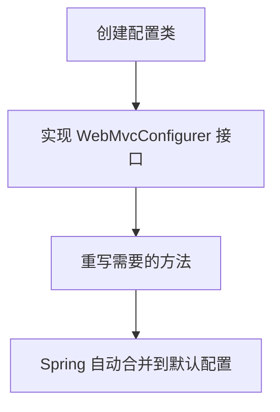

## 这个机制解决了什么问题？

Spring Boot 默认帮你配好了 MVC：静态资源在 `classpath:/static/`、路径区分大小写、没有拦截器（interceptor，在请求到达 Controller 前执行的自定义逻辑）。但真实项目几乎总要调整——加个登录校验、把 `/images/**` 指向外部目录。

最容易想到的办法是直接改 Spring 的自动配置类，但升级版本时你的修改就丢了。另一个办法是自己写一个全新的配置类覆盖所有默认，但工作量太大，还容易漏掉默认行为（比如静态资源缓存、错误页面处理）。

**WebMvcConfigurer 的设计就是让你“只补充，不覆盖”。** 你只需要实现这个接口，在里面写你想添加的配置，Spring 会把你写的和默认配置合并，最终形成一个完整的配置。这是一种“回调（callback，框架在特定时机调用你提供的代码）”机制，让你在不破坏框架的前提下扩展功能。

> 🔍 **记忆锚点**：只补充，不覆盖——Spring 替你兜底。

---

## Java 为什么这样设计？

Java 在 2014 年发布的 Java 8 中引入了接口的“默认方法（default method，接口中可以写有方法体的方法）”。这个特性让接口可以拥有默认实现，从而允许在不破坏已有实现类的情况下给接口添加新方法。

Spring 团队利用了这一点：`WebMvcConfigurer` 接口里的所有方法都有默认空实现（方法体为空，什么都不做）。你只需要重写（override，在实现类中重新定义接口的方法）你关心的那一个方法即可，其他方法依然走 Spring 的默认行为。这比传统 Java 设计（比如继承一个抽象类，必须实现所有抽象方法）灵活得多，也避免了继承带来的强耦合（coupling，代码之间的依赖程度）。

从语言设计哲学上看，Java 一直强调“大型团队、长期维护、可读可推导”。`WebMvcConfigurer` 这种模式让多个开发者可以各自写自己的配置类，每个配置类只负责一件事（比如一个类管拦截器，另一个类管静态资源），并且彼此不冲突。最终 Spring 会把所有 `WebMvcConfigurer` 的实现类收集起来，按顺序调用它们的方法。这比写一个巨大的配置类要清晰得多，也更容易做单元测试。

---

## 核心代码示例

以下是一个完整的 Spring Boot 项目中的 `WebMvcConfigurer` 实现，演示了三种最常见的用法：添加拦截器、自定义静态资源映射、配置路径匹配规则。

**使用 WebMvcConfigurer 的典型流程**



```java
import org.springframework.context.annotation.Configuration;
import org.springframework.web.servlet.config.annotation.*;

// @Configuration 表示这是一个配置类，Spring 会把它当作 Bean 管理
@Configuration
public class MyWebConfig implements WebMvcConfigurer {

    /**
     * 添加拦截器：所有请求先经过 loginCheckInterceptor
     * 相当于在请求到达 Controller 之前做一个预处理（比如检查登录状态）
     */
    @Override
    public void addInterceptors(InterceptorRegistry registry) {
        // 注册一个自定义拦截器，拦截所有路径，但排除登录接口和静态资源
        registry.addInterceptor(new LoginCheckInterceptor())
                .addPathPatterns("/**")          // 拦截所有请求
                .excludePathPatterns("/login", "/css/**", "/js/**");
        // 注意：多个拦截器按注册顺序执行
    }

    /**
     * 自定义静态资源映射：把 /uploads/** 的请求映射到本地磁盘 /var/www/uploads/
     * 这样用户访问 /uploads/photo.jpg 就能直接看到文件
     */
    @Override
    public void addResourceHandlers(ResourceHandlerRegistry registry) {
        registry.addResourceHandler("/uploads/**")
                .addResourceLocations("file:/var/www/uploads/");
        // 注意：这里用 "file:" 前缀表示文件系统路径，不加前缀默认是 classpath 或 Servlet 上下文
    }

    /**
     * 配置路径匹配规则：让所有路径不区分大小写
     * 默认 Spring MVC 是区分大小写的，比如 /User 和 /user 是两个不同路径
     */
    @Override
    public void configurePathMatch(PathMatchConfigurer configurer) {
        // 设置路径匹配器为不区分大小写（使用 AntPathMatcher 的 caseSensitive 属性）
        configurer.setUseCaseSensitiveMatch(false);
    }
}
```

**代码说明**：
- `LoginCheckInterceptor` 需要你自己实现 `HandlerInterceptor` 接口（另一个接口，包含 `preHandle`、`postHandle`、`afterCompletion` 方法）。这里只展示注册过程。
- `addResourceHandlers` 里 `file:/var/www/uploads/` 是 Linux 路径，Windows 下写 `file:D:/uploads/` 即可。注意路径末尾必须有 `/`。
- `configurePathMatch` 的设置会影响所有路径匹配，包括 Controller 上的 `@RequestMapping`。不区分大小写可能导致某些预期之外的匹配，慎用。

> 🔍 **记忆锚点**：你只写需要的方法，其他保持默认——Spring 替你合并。

---

## 设计权衡与决策指南

**你得到了什么**：
- **松耦合**：你的配置代码和 Spring 默认配置完全分离，升级 Spring 版本时无需修改。
- **可组合**：多个 `WebMvcConfigurer` 实现类可以共存，各自负责不同功能，互不干扰。
- **按需实现**：你只需要重写你需要的方法，其他保持默认。

**你付出了什么**：
- **学习成本**：需要了解 Spring MVC 的默认行为（比如静态资源默认路径、拦截器执行顺序）。
- **调试难度**：如果多个 `WebMvcConfigurer` 配置了同一个功能（比如两个类都添加了拦截器），执行顺序可能不如预期，需要检查 `@Order` 注解或配置类的加载顺序。
- **性能影响**：每个请求都会经过你注册的拦截器，如果拦截器逻辑复杂（比如数据库查询），会增加响应时间。

**何时该用**：
- 需要添加自定义拦截器、静态资源映射、CORS 配置、路径匹配规则、消息转换器等。
- 希望保留 Spring Boot 的自动配置，只做增量扩展。

**何时不该用**：
- 如果只是想通过 `application.properties` 或 `application.yml` 就能配置（比如 `spring.mvc.static-path-pattern`），优先用配置文件，更简单。
- 如果需要彻底替换 Spring MVC 的默认行为（比如完全自定义 `DispatcherServlet`），应该继承 `WebMvcConfigurationSupport` 并重写所有相关方法，但这意味着放弃 Spring Boot 的自动配置，需要你自己管理所有细节。

**与其他方案对比**：

| 方案 | 特点 | 适用场景 |
|------|------|----------|
| **WebMvcConfigurer** | 只补充，不覆盖；保留自动配置 | 大多数增量定制需求（拦截器、静态资源、CORS） |
| **继承 WebMvcConfigurationSupport** | 完全替换自动配置；需手动配置所有 MVC 组件 | 深度定制，例如自定义视图解析器、消息转换器 |
| **@EnableWebMvc 注解** | 效果同继承 WebMvcConfigurationSupport，完全覆盖自动配置 | 不推荐初学者使用，容易丢失默认行为 |

- 直接继承 `WebMvcConfigurationSupport`：你会失去自动配置，必须手动配置所有 MVC 组件（包括视图解析器、消息转换器等），适用于需要深度定制的场景。
- 使用 `@EnableWebMvc` 注解：它会完全替代自动配置，和继承 `WebMvcConfigurationSupport` 效果类似，同样不推荐初学者使用。

---

## 如果你熟悉前端：这个设计很像 Vue 3 的插件

如果你是前端开发者，第一次看到 `WebMvcConfigurer`，可以把它想象成 **Vue 3 的插件（plugin）**。它们都让你在不破坏框架默认行为的前提下，插入自己的逻辑。

在 Vue 3 中，如果你想给所有组件添加一个全局的 `$auth` 对象，或者拦截所有路由跳转，你会写一个插件：

```javascript
// myPlugin.js
export default {
  install(app) {
    // 添加全局属性（类似 WebMvcConfigurer 的 addInterceptors）
    app.config.globalProperties.$auth = { isLoggedIn: false };
    // 注册全局指令（类似 addResourceHandlers 映射静态资源）
    app.directive('focus', { mounted(el) { el.focus(); } });
  }
};

// main.js
import { createApp } from 'vue';
import App from './App.vue';
import myPlugin from './myPlugin';

const app = createApp(App);
app.use(myPlugin); // 相当于 @Configuration + 实现 WebMvcConfigurer
```

**类比点**：
- ✅ **不覆盖默认**：Vue 插件 `install` 方法里只添加新功能，不修改 Vue 核心逻辑。同样，`WebMvcConfigurer` 的方法都是“添加”配置（如注册拦截器、映射静态资源），不会覆盖 Spring 的默认行为。
- ✅ **按需实现**：你只需写自己需要的部分（如 `addInterceptors`），其他方法保持默认。Vue 插件也可以只实现 `install` 方法，不必关心其他生命周期。

**类比止步点**：
- ❌ **注册机制不同**：Vue 插件通过 `app.use(plugin)` 显式注册，而 Spring 通过 `@Configuration` 注解自动扫描所有 `WebMvcConfigurer` 实现类并收集它们。
- ❌ **作用域不同**：Vue 插件是全局的，影响整个应用；`WebMvcConfigurer` 只影响 Spring MVC 的配置层，不涉及业务逻辑。

> 🔍 **记忆锚点**：类比帮理解动机，但实现细节要回到 Java 本身。

---

## 踩坑提示（前端转 Java 常见误解）

1. **不要忘记 `@Configuration`**：就像 Vue 插件需要 `app.use()` 注册一样，`WebMvcConfigurer` 实现类必须加上 `@Configuration` 注解，否则 Spring 不会扫描到它。
2. **不要把 `@EnableWebMvc` 和 `WebMvcConfigurer` 混用**：`@EnableWebMvc` 会完全覆盖 Spring Boot 的自动配置，相当于你手动接管了所有 MVC 配置，此时 `WebMvcConfigurer` 可能失效或行为异常。初学者最容易犯这个错。
3. **多个配置类顺序问题**：如果两个 `WebMvcConfigurer` 都注册了拦截器，后执行的可能覆盖先执行的（取决于 `@Order` 或加载顺序）。在前端，多个 Vue 插件也会按顺序执行，但通常不会互相覆盖。

---

## 工程哲学总结

**WebMvcConfigurer = 框架留给用户的“自定义插槽”**，让你在保持默认配置的基础上，安全地添加专属逻辑。这种设计在 Java 生态中非常常见（如 `WebSecurityConfigurerAdapter`、`ErrorController`），体现了 **“组合优于继承”** 和 **“约定优于配置”** 的思想。前端开发者可以用 Vue 插件的“注册-扩展”模式来类比入门，但要记住：Java 的接口回调更强调“框架主动调用用户代码”，而前端更多是“用户主动调用框架 API”。

**最后一句**：下次你想在 Spring Boot 里加个拦截器或改静态资源路径，不要慌，写个 `@Configuration` 类实现 `WebMvcConfigurer`，只补充你需要的那几行——剩下的交给 Spring。

---

### 系列导航

**上一篇**：[RestTemplate：为什么HTTP客户端必须由Spring统一封装](#)
**下一篇**：[@Valid：为什么请求参数校验必须与业务逻辑解耦](#)

> 这是「前端工程师系统学 Java」系列第 15 篇，系统解读 Java 设计哲学（面向前端工程师）。