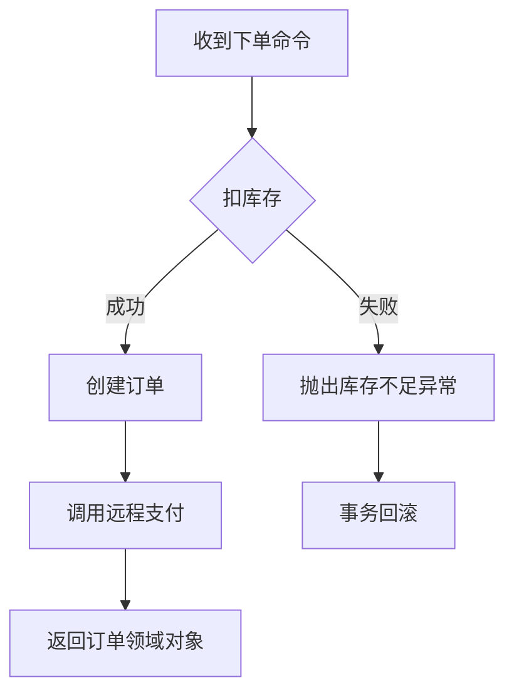

<!-- 以下为插入的流程图，展示 Service 层处理订单的业务逻辑流程 -->

**图：`OrderService.placeOrder()` 方法的业务逻辑流程**



---

<!-- 原文内容保持不变，以下为原文 -->

<!-- 控制性问题：为什么 Java 项目需要 Service 层？ -->

你在写订单系统，Controller 里直接扣库存、校验用户、生成订单号。两周后，后台补单也要扣库存，你复制粘贴了同一段代码。又过两周，产品要求扣库存时增加风控校验，你翻遍所有 Controller 改代码。更糟的是，事务边界混乱——扣库存成功但生成订单失败，库存已经扣了，无法回滚。

**Service 层的核心使命是把业务规则从请求处理（Controller）和持久化（Repository）中剥离出来，形成一个独立的、可复用的、事务可控的领域逻辑层。** 这就是业务逻辑的隔离层——让每个改动只发生在一处，让每个事务边界清晰可见。

---

## 这个机制解决了什么问题？

Service 层解决了三个工程问题：

1. **复用性**：同一段业务逻辑（如“扣库存”）不会被多个 Controller 重复实现，改动只需一处。
2. **可测试性**：业务逻辑脱离 HTTP 请求和数据库连接，可以单独用单元测试验证。
3. **事务边界控制**：一个业务用例往往涉及多个数据库操作（扣库存 + 生成订单 + 发消息），Service 层是声明事务的天然边界，保证原子性。

这三个问题在任何一个稍具规模的项目中都会出现。没有 Service 层，代码会迅速退化为“面条式代码”——逻辑散落在 Controller 和 Repository 里，改一处就要排查多处。

---

## Java 为什么这样设计？

Java 在大型企业应用中，团队规模大、代码生命周期长、需求变更频繁。分层架构（Controller → Service → Repository）是经过多年实践沉淀的工程模式。Spring 框架通过 IoC 容器和 AOP 将其固化。

- **对比 C/S 架构时代**：业务逻辑散落在 UI 事件或存储过程里，无法复用、无法测试。Java 社区从 EJB 到 Spring，逐步强调“POJO + 接口”的轻量级 Service 设计，让业务逻辑不依赖框架。
- **Spring 的魔法**：用 `@Service` 注解标记一个类为业务组件，Spring 自动创建单例 Bean，并通过 AOP 代理为 `@Transactional` 等方法织入事务管理。开发者只需关注业务代码，框架负责横切关注点。

> 🔍 精确说明：`@Service` 本质上是 `@Component` 的语义化别名，Spring 会扫描并注册为 Bean。AOP 代理通过 JDK 动态代理或 CGLIB 生成，在方法调用前后插入事务开启/提交/回滚逻辑。

---

## Java 是怎么做的？

Service 层的核心设计原则：

- **单一职责**：一个 Service 方法只完成一个业务用例（如 `placeOrder`），内部调用多个 Repository 方法或工具类。
- **事务边界**：在 Service 方法上声明 `@Transactional`，Spring 会保证方法内所有数据库操作在同一个数据库连接中执行，出现异常则全部回滚。
- **异常处理**：业务异常（如库存不足、订单已取消）应抛出**非受检异常**（继承 `RuntimeException`），让事务回滚机制自动生效，同时避免 Controller 被迫捕获。通常自定义领域异常，如 `InsufficientStockException`。
- **DTO 转换职责分离**：Service 方法接收和返回的对象应该是**领域对象**（如 `Order`），而不是 Controller 层的 DTO。DTO 转换在 Controller 层或专门的 Assembler 中完成，避免业务逻辑被视图需求污染。

### 核心代码示例

```java
// ---------- 领域异常 ----------
public class InsufficientStockException extends RuntimeException {
    public InsufficientStockException(String skuId, int requested, int available) {
        super(String.format("SKU %s 库存不足，需求 %d，可用 %d", skuId, requested, available));
    }
}

// ---------- Service ----------
@Service
public class OrderService {
    private final InventoryRepository inventoryRepository;
    private final OrderRepository orderRepository;
    private final PaymentClient paymentClient; // 远程调用

    public OrderService(InventoryRepository inventoryRepository,
                        OrderRepository orderRepository,
                        PaymentClient paymentClient) {
        this.inventoryRepository = inventoryRepository;
        this.orderRepository = orderRepository;
        this.paymentClient = paymentClient;
    }

    @Transactional  // 事务边界：扣库存 + 创建订单 + 扣款在一个事务中
    public Order placeOrder(PlaceOrderCommand command) {
        // 1. 扣库存（领域逻辑）
        boolean deducted = inventoryRepository.deductStock(command.getSkuId(), command.getQuantity());
        if (!deducted) {
            throw new InsufficientStockException(command.getSkuId(), command.getQuantity(),
                    inventoryRepository.getAvailable(command.getSkuId()));
        }

        // 2. 创建订单（领域对象，非DTO）
        Order order = Order.create(command.getUserId(), command.getSkuId(), command.getQuantity());
        orderRepository.save(order);

        // 3. 调用远程支付（事务内，若失败则回滚）
        paymentClient.charge(order.getPaymentId(), order.getTotalAmount());

        return order;  // 返回领域对象，Controller 负责转成 DTO
    }
}

// ---------- Controller（仅示意职责分离） ----------
@RestController
public class OrderController {
    private final OrderService orderService;
    private final OrderAssembler orderAssembler;  // 专门做DTO转换

    @PostMapping("/orders")
    public OrderResponse placeOrder(@RequestBody PlaceOrderRequest request) {
        PlaceOrderCommand command = orderAssembler.toCommand(request);  // DTO转命令对象
        Order order = orderService.placeOrder(command);
        return orderAssembler.toResponse(order);  // 领域对象转响应DTO
    }
}
```

**关键设计意图**：
- `@Transactional` 加在 Service 方法上，而不是 Repository 上——因为一个业务用例涉及多个持久化操作。
- 异常直接抛出，Spring 事务管理器会捕获并回滚（默认对 `RuntimeException` 回滚）。
- Controller 不接触领域对象内部的细节，只做参数校验和 DTO 转换。

> **这就是 Service 层作为业务逻辑隔离层的价值——扣库存、创建订单、支付这三个步骤要么全部成功，要么全部回滚，而这一切只需要一个 `@Transactional` 注解。**

---

## 设计权衡与决策指南

| 得到的好处 | 付出的代价 |
|-----------|-----------|
| 业务逻辑集中，易于修改和测试 | 增加层间调用开销（但微乎其微，常可忽略） |
| 事务边界清晰，避免“部分成功” | 需要设计好异常体系，否则事务回滚可能失效 |
| 职责分离，Controller 变薄 | 需要额外编写 Assembler/Converter 代码 |

**何时该用 / 何时不该用**：
- ✅ **必须用**：任何涉及多个数据库操作或远程调用的业务用例（订单、支付、库存）。
- ✅ **推荐用**：即使只有一个数据库操作，但未来可能扩展（如添加校验、日志），Service 层作为扩展点。
- ❌ **不必用**：纯查询且无业务逻辑的“透传”场景（如根据 ID 查用户信息），可以直接在 Controller 调用 Repository，但为了统一风格，多数项目仍保留 Service 层。

**与其他方案对比**：
- **贫血模型 vs 充血模型**：传统 Service + POJO 是贫血模型（数据和行为分离），适合简单业务。复杂领域（如金融结算）可引入 DDD 的充血模型，让领域对象自己处理业务规则，Service 只做编排。但前者学习成本低，适合大多数 Spring 项目。
- **事务脚本 vs 领域模型**：Service 层本质是“事务脚本”——一个方法对应一个用例。如果业务规则经常变化且与数据紧密耦合，可考虑领域模型。但事务脚本在 80% 的场景下够用且高效。

---

## 如果你熟悉 Vue/React，这很像……

前端没有“事务回滚”和“IoC 容器”的对应物，但有一个非常相似的概念：**Composables（Vue 3） / 自定义 Hooks（React）**。它们同样将业务逻辑（如扣库存、校验、调用 API）从组件中抽离，形成可复用、可测试的独立模块。

```javascript
// composables/useOrderService.js（Vue 3）
import { ref } from 'vue'
import { inventoryApi, orderApi, paymentApi } from '@/api'

export function useOrderService() {
  const loading = ref(false)
  const error = ref(null)

  async function placeOrder(command) {
    loading.value = true
    error.value = null
    try {
      const stock = await inventoryApi.deductStock(command.skuId, command.quantity)
      if (!stock.success) {
        throw new Error(`库存不足: ${stock.message}`)  // 类似 Java 的领域异常
      }
      const order = await orderApi.create({ ...command })
      await paymentApi.charge(order.paymentId, order.totalAmount)
      return order
    } catch (e) {
      // ❌ 前端无法自动回滚已成功的 API 调用，需要手动补偿
      error.value = e.message
      throw e
    } finally {
      loading.value = false
    }
  }

  return { placeOrder, loading, error }
}
```

**共同本质**：前端和后端的 Service 层都致力于**将业务逻辑从 UI/请求处理器中分离**，让代码可复用、可测试。区别在于后端有事务管理和 AOP 等基础设施，前端需要手动处理副作用和补偿逻辑。

> ☕ **Java 呼应**：Spring 的 `@Service` + `@Transactional` 让开发者只需关注业务规则，框架自动保证数据库操作的原子性。前端没有这个“魔法”，需要更谨慎地设计错误处理策略。

---

## 实践建议

1. **IDE 配置**：在 IntelliJ IDEA 中，安装 `Spring Assistant` 插件，可快速跳转 Service 实现和接口。
2. **静态检查规则**：使用 ArchUnit 或自定义 Checkstyle 规则，禁止 Controller 直接注入 Repository（除非极少数查询）。
3. **编码规范**：
   - Service 方法命名用动词短语（`placeOrder`、`cancelOrder`），不要用 CRUD 名（`save`、`delete`）。
   - 每个 Service 方法只抛业务异常，不抛 `Exception` 或 `Throwable`。
   - `@Transactional` 不要加在 `private` 方法上（AOP 代理不生效），且避免在同一个类中自调用（事务失效）。
4. **测试策略**：为 Service 编写单元测试时，使用 Mockito 模拟 Repository 和远程客户端，只验证业务逻辑和异常路径。

**踩坑提示**：新手常犯的错误是在 Controller 里直接调用多个 Repository 方法，然后手动 try-catch 回滚。这不仅让 Controller 变胖，还容易遗漏回滚场景。**记住：事务边界必须由 Service 层守卫，这是它存在的根本理由。**

---

回到开头那个订单系统——当你把扣库存、创建订单、调用支付都放在 `OrderService.placeOrder()` 里，并加上 `@Transactional` 后，后续所有改动都只在一个文件里完成。风控校验加在方法开头，库存逻辑调整只改这一个方法，单元测试也只测这一个类。**这就是 Service 层作为业务逻辑隔离层的最大价值：让复杂系统变得可维护、可信任。**

---

### 系列导航

**上一篇**：[`@Valid`：为什么请求参数校验必须与业务逻辑解耦](#)
**下一篇**：[`Conditional`注解：为什么Bean加载必须按环境/条件精准裁剪](#)

> 这是「前端工程师系统学 Java」系列第17篇，系统解读 Java 设计哲学（面向前端工程师）。