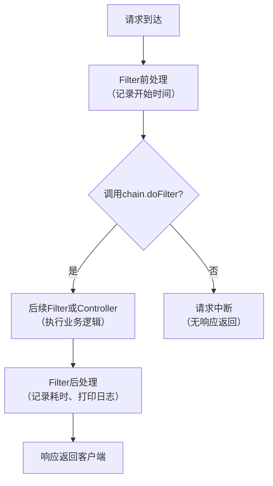

你在写 Spring Boot 项目，给所有接口加请求耗时日志——最直接的想法是在每个 Controller 方法里写 `System.currentTimeMillis()`，但 10 个接口就要复制 10 次，改起来想哭。**Java Filter 就是服务端的“请求拦截器”，让你在请求到达 Controller 之前统一处理这类“横切关注点”，就像 Axios 拦截器在前端做的那样。**

## 为什么需要 Filter？

Web 应用中，日志、鉴权、跨域（CORS）、字符编码等逻辑几乎每个请求都要处理，但它们和“查数据库”、“返回 JSON”这些核心业务无关。如果分散在各处，维护成本飙升——改一个日志格式要改所有 Controller。Filter 把这些通用逻辑抽出来，形成一个可插拔的拦截链，业务代码只关心自己的事。

这就引出一个问题：**Java 是怎么实现这种“统一拦截”的？**

## Java 的设计：责任链模式

Java Servlet 规范（定义 Web 应用如何与服务器交互的标准）提供了一个 `Filter` 接口。它有三个生命周期方法：

- `init(FilterConfig)`：容器启动时调用，用于初始化（可选）。
- `doFilter(ServletRequest, ServletResponse, FilterChain)`：每次请求匹配时调用，核心逻辑写在这里。
- `destroy()`：容器关闭时调用，释放资源（可选）。

多个 Filter 可以按顺序串联，每个 Filter 决定是否继续执行下一个，或者直接返回响应——这就是**责任链模式**（Chain of Responsibility）。**核心就一句话：你必须调用 `chain.doFilter()` 把请求传给下一个，否则请求会卡死。**

## 动手写一个 Filter：记录请求耗时

下面是一个完整的例子，通过 `@WebFilter` 注解注册，拦截所有路径（`/*`）。

```java
import javax.servlet.*;
import javax.servlet.annotation.WebFilter;
import javax.servlet.http.HttpServletRequest;
import java.io.IOException;

// @WebFilter 声明这是一个过滤器，urlPatterns 指定拦截路径
@WebFilter(urlPatterns = "/*")
public class LoggingFilter implements Filter {

    @Override
    public void init(FilterConfig filterConfig) throws ServletException {
        // 初始化方法，可以读取配置参数（这里省略）
    }

    @Override
    public void doFilter(ServletRequest request, ServletResponse response,
                         FilterChain chain) throws IOException, ServletException {
        // 1. 将请求转为 HTTP 请求，获取 URI
        HttpServletRequest req = (HttpServletRequest) request;
        long start = System.currentTimeMillis();

        // 2. 调用 chain.doFilter() 将请求传递给下一个过滤器或目标 Servlet
        //    注意：如果不调用这个方法，请求会被阻塞，客户端永远不会收到响应
        chain.doFilter(request, response);

        // 3. 请求处理完成后，记录耗时
        long duration = System.currentTimeMillis() - start;
        System.out.println("[" + req.getMethod() + "] " + req.getRequestURI()
                           + " 耗时 " + duration + " ms");
    }

    @Override
    public void destroy() {
        // 清理资源（这里不需要）
    }
}
```

在 Spring Boot 主类上加上 `@ServletComponentScan` 就能自动扫描到它：

```java
@SpringBootApplication
@ServletComponentScan  // 启用对 @WebFilter、@WebServlet 等注解的扫描
public class Application {
    public static void main(String[] args) {
        SpringApplication.run(Application.class, args);
    }
}
```

下图展示了 Filter 处理请求的完整流程，重点突出了 `chain.doFilter()` 的关键作用：



**关键点解释：**
- `@WebFilter(urlPatterns = "/*")`：告诉容器拦截所有请求。初学者常犯的错误是写错路径（比如只写 `/` 而不是 `/*`），导致 Filter 不生效。
- `chain.doFilter(request, response)`：**必须调用**，否则请求链会中断。这是最常见的踩坑点——新手容易忘记调用，导致接口永远不返回。
- 日志写在 `doFilter` 调用之后：这样能记录包含业务处理在内的完整耗时。如果写在调用之前，只能记录 Filter 自身的耗时。

> 🔍 **记忆锚点**：Filter 的核心是 `chain.doFilter()`，忘记调用 = 请求被吞掉。

## 如果你熟悉前端：这很像 Axios 拦截器

Vue 或 React 里用 Axios 的请求/响应拦截器，和 Filter 的 `doFilter` 机制几乎一模一样：

```javascript
// Axios 请求拦截器：对应 Filter 的 doFilter 前半部分（请求到达 Controller 前）
axios.interceptors.request.use(config => {
  config.metadata = { startTime: Date.now() };
  return config; // 必须返回 config，否则请求中断 —— 类似 chain.doFilter()
}, error => Promise.reject(error));

// Axios 响应拦截器：对应 Filter 的 doFilter 后半部分（Controller 返回响应后）
axios.interceptors.response.use(response => {
  const duration = Date.now() - response.config.metadata.startTime;
  console.log(`[${response.config.method}] ${response.config.url} 耗时 ${duration}ms`);
  return response;
}, error => Promise.reject(error));
```

**共同本质**：都是基于责任链模式的请求预处理/后处理机制。拦截器/Filter 按顺序串联，每个环节必须显式传递控制权（`return config` / `chain.doFilter()`），否则请求链中断。业务代码完全不需要知道这些通用逻辑的存在。

**差异**：Filter 运行在服务端（Servlet 容器），能拦截所有进入服务器的请求（包括静态资源、错误页面）；Axios 拦截器只拦截前端发出的 HTTP 请求。另外 Filter 有 `init` 和 `destroy` 生命周期，Axios 没有。

## 什么时候用 Filter，什么时候用别的？

| 方案 | 拦截范围 | 是否支持 Spring 依赖注入 | 典型用途 |
|------|----------|--------------------------|----------|
| Filter | 所有请求（包括静态资源、错误页面） | 需要额外配置（注册为 Bean） | 底层通用处理（编码、跨域、压缩） |
| Spring 拦截器 | 仅 Controller 请求（Handler 级别） | 天然支持 | 日志、权限、参数验证 |
| AOP 切面 | 任意方法（不限于 Web） | 天然支持 | 业务逻辑增强（如事务、性能监控） |

**何时该用 Filter：**
- 需要拦截所有请求（包括静态资源）的通用逻辑：跨域（CORS）、字符编码、安全头、请求日志、性能监控。
- 需要修改请求或响应对象的底层操作：比如压缩响应体、对请求体进行解密。

**何时不该用 Filter：**
- 细粒度的业务权限校验：应使用 Spring Security 的过滤器链或方法级安全注解。
- 需要访问 Spring 管理的 Bean（如 Service 层）：虽然可以通过 `@Autowired` 注入（需将 Filter 注册为 Spring Bean），但更推荐使用 Spring 拦截器（`HandlerInterceptor`），它天然支持依赖注入且能获取处理器（Handler）信息。
- 只需要拦截 Controller 请求，不需要处理静态资源：使用 Spring 拦截器更轻量。

## 实践中的踩坑提醒

1. **忘记 `chain.doFilter()`**：这是初学者的头号错误。可以在 IDE 中为 Filter 类添加模板，自动生成 `doFilter` 中的 `chain.doFilter` 调用。
2. **Filter 顺序搞错**：多个 Filter 时，使用 `@Order` 注解或 `FilterRegistrationBean` 的 `setOrder()` 方法明确顺序。避免依赖隐式顺序（如类名排序）。
3. **在 Filter 中做耗时操作**：Filter 是同步阻塞的，如果执行数据库查询或远程调用，会阻塞整个请求线程。这类操作应移到业务层异步处理。
4. **使用 Spring 的 `OncePerRequestFilter`**：如果需要确保每个请求只执行一次（避免重复执行），继承 `OncePerRequestFilter` 而非直接实现 `Filter`。这个抽象类处理了转发（forward）和包含（include）场景下的重复调用问题。

> 🔍 **记忆锚点**：Filter 就像服务端的 Axios 拦截器，记住 `chain.doFilter()` 就是前端的 `return config`，忘记它请求就断了。

现在你可以打开 IDE，创建一个 Spring Boot 项目，加上上面的 `LoggingFilter`，启动后请求任意接口，看看控制台是不是打印了耗时日志。从“使用者”升级为“理解者”，这就是第一步。

---

### 系列导航

**上一篇**：[Conditional注解：为什么Bean加载必须按环境/条件精准裁剪](#)
**下一篇**：[@Autowired：为什么Bean依赖必须由容器自动装配](#)

> 这是「前端工程师系统学 Java」系列第19篇，系统解读 Java 设计哲学（面向前端工程师）。