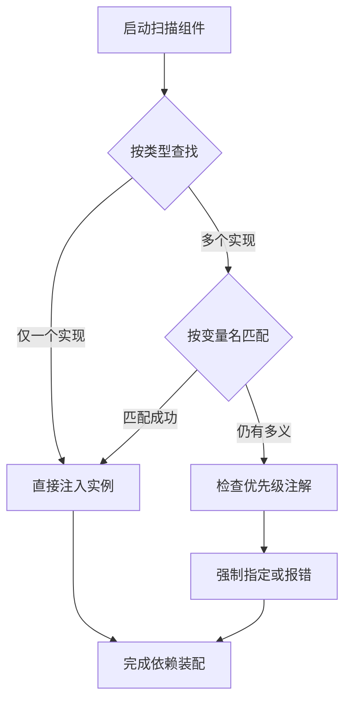

<!-- 控制性问题：为什么 Spring 鼓励你用 @Autowired 代替手写 new？ -->

业务类里直接 `new UserService()`，环境一换或写单元测试就得全局搜索替换。**强制边界，框架替你兜底**，把“找谁干活”的决策权交给 Spring，而不是硬编码在业务逻辑里。

做 Spring Boot 项目时，你一定会遇到这个场景——Service 层需要调用数据库查询或第三方消息服务。早期做法是在方法内部手写 `new DatabaseClient()`，随着业务膨胀，构造函数变得极其冗长，每次切换测试环境都要手动替换成模拟对象。这就引出一个问题：业务逻辑不该同时承担“做什么”和“用什么做”两件事。

`@Autowired`（自动寻找并注入依赖对象的注解）解决的就是这个痛点。它让类只需声明“我需要谁能帮我”，具体分配哪个实例由外部配置统一接管。**强制边界，框架替你兜底**，依赖关系从此集中可见，更换技术方案无需改动核心代码。理解了这一点，再看底层机制就清楚了。

Spring 处理依赖的过程分三步：启动时扫描所有标记为组件（被 Spring 纳入统一管理的普通 Java 类），按类型建立内部清单；遇到注入点时先按目标类型查找，找到多个则降级按变量名匹配。如果你熟悉 Vue 3 的 `inject` 机制，这很像跨层级获取共享服务——但区别是，Vue 需要你手动指定名字并显式传参，Spring 则是框架在启动期全自动完成匹配。前端依赖靠静态导入和手动编排，而 Spring 靠运行时结构解析与自动扫描，工程目标一致，实现手段不同。

**下图展示了 Spring 自动装配依赖对象的决策流程：**


```java
// 定义业务契约
public interface NotificationChannel {
    void notify(String message);
}

@Component // 标记为组件，启动时自动注册到 Spring 容器
public class EmailChannel implements NotificationChannel {
    public void notify(String message) { System.out.println("[邮件] " + message); }
}

@Service // 业务层组件标记，属于 @Component 的特化形式
public class OrderService {
    // 构造器注入：通过类的构造函数传入所需依赖对象的方式
    private final NotificationChannel channel; 

    public OrderService(NotificationChannel channel) {
        this.channel = channel;
    }
}
```

这里有个细节大多数初学者会踩坑：**强依赖一律使用构造器注入**。很多人喜欢直接在成员变量上打 `@Autowired`（字段注入，即直接给成员变量赋值的方式）。这会导致单元测试极其痛苦：因为字段被框架偷偷赋值，测试时无法直接通过构造函数传入 Mock 替身类（用于替代真实外部服务的测试对象），反而要动用底层工具去强行修改私有字段。记住，构造器注入就像 Vue 中父组件通过 Props 传值一样，依赖关系一目了然且不可变。

理解了单一依赖的处理，再看多实现场景就清楚了——如果清单里有多个同类实现，Spring 会按变量名精确匹配。若仍存在歧义，必须搭配 `@Qualifier`（指定具体名称标签以消除歧义的注解）强制破局。`@Primary`（标记为默认首选实现的注解）仅用于定义环境切换的兜底方案。

> 🔍 精确说明：`@Autowired` 不是魔法，它只是“按类型查找 → 按名称消歧 → 动态赋值”的工具链。任何看似神奇的行为背后，都能追溯到 Spring 启动阶段的扫描与实例化流水线。

这种设计得到了彻底的解耦与测试友好度，但也付出了隐式依赖的代价。阅读代码时，你无法一眼看出类到底依赖了谁，因此团队通常会在 IDE 中开启检查规则，将字段注入标红警告。依赖关系变为隐式时，命名即契约，避免重构包名引发连锁报错。

> 💡 踩坑提示：循环依赖场景（A 依赖 B，B 又依赖 A）绝对不要使用 `@Autowired`。此时应改用方法级注入或调整架构分层，否则框架启动时会直接抛出死锁异常。

掌握了这套规则，你就不会再盲目复制粘贴注解。**强制边界，框架替你兜底**，当你清楚每一行注解背后的装配意图时，Spring 项目就不再是黑盒，而是可预测、可测试的工程资产。

---

### 系列导航

**上一篇**：[Spring Boot Filter：为什么HTTP请求处理必须分层拦截](#)
**下一篇**：[Spring Profile：为什么配置必须按环境精准隔离](#)

> 这是「前端工程师系统学 Java」系列第 20 篇，系统解读 Java 设计哲学（面向前端工程师）。
