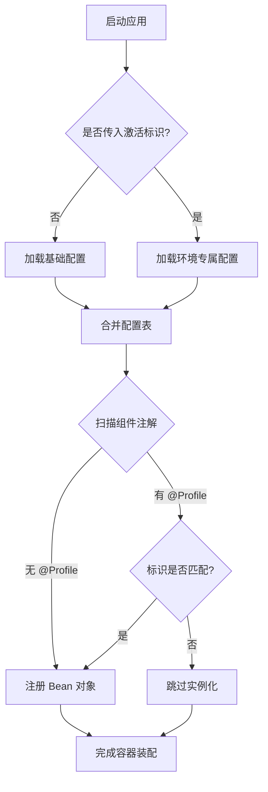

<!-- 控制性问题：为什么同一份编译好的 Jar 包能在不同机器上自动切换配置，而不需要修改任何代码或重新发版？ -->

开发环境的测试库地址和线上生产库完全不同。如果把这些参数写死在单一配置文件里，每次发版都要人工替换，稍不留神就会连错数据库，直接引发线上故障。
**核心论点：Spring Profile 机制通过“环境决策权彻底外置”，让框架在启动时根据外部标识符自动筛选配置。** 记住这个锚点：**环境差异外置，框架按需装配**。后续所有操作都围绕这一原则展开。

早期开发者习惯用 `if (System.getProperty("env").equals("prod"))` 这种硬编码分支来区分环境。业务核心逻辑被环境判断严重污染，单元测试根本无法隔离真实网络依赖。Spring 没有妥协，而是把判断权从业务代码中剥离，交给底层调度器统一处理。

实现方式非常直观。Spring 维护了一个 `Environment`（用于读取当前应用运行环境信息和已激活配置组的抽象接口）作为中枢。当你启动应用并传入激活标识后，它会按固定优先级合并配置：先读主配置文件提供兜底骨架，再加载同名后缀的环境专属文件进行覆盖。

**Spring Profile 配置加载与组件装配流程**


| 配置来源 | 加载时机 | 覆盖规则 | 典型用途 |
|:---|:---|:---|:---|
| `application.yml` | 始终加载 | 基础键值定义 | 提供全局默认值与结构骨架 |
| `application-{profile}.yml` | 仅对应 Profile 激活时 | 同名 Key 覆盖主配置 | 存放环境特有参数（如数据库URL） |
| 命令行参数 `--key=value` | 启动时解析 | 最高优先级，强制覆盖 | 临时调试或 CI/CD 流水线注入 |

```java
// 完整最小可运行示例：组合注解标记 + 环境专属配置
@SpringBootApplication
public class DemoApplication {
    public static void main(String[] args) {
        SpringApplication.run(DemoApplication.class, "--spring.profiles.active=dev");
    }
}

@Component
@Profile("dev")
public class DevConfigService {
    public String getDbUrl() { return "jdbc:mysql://localhost:3306/test_db"; }
}
```

运行这段代码时，Spring 容器（负责创建和管理 Java 对象生命周期的中枢）会在初始化阶段执行拦截。`@Profile`（一个用于标记组件的注解，表示该组件仅在指定环境标识激活时才注册到容器）就像一道闸门。匹配则分配内存并实例化，不匹配则直接跳过。`Component`（一个将普通类注册为 Spring 托管对象的注解）配合注解，完成了物理隔离。

这里有一个细节大多数教程会跳过，但它决定了你踩不踩坑：**环境差异外置，框架按需装配**。未匹配的组件不仅不会执行初始化代码，甚至连类文件都不会被加载到 JVM 方法区。这意味着零性能损耗，也杜绝了跨环境配置互相污染的隐患。

如果你熟悉前端工程化，这套逻辑和你用 Vite 管理多环境模式如出一辙。Vite 允许你创建 `.env.development` 和 `.env.production`，启动时通过 `npm run dev -- --mode xxx` 注入对应变量。两者本质完全一致：利用外部标识符切断配置耦合。但必须明确一个关键止步点——前端配置替换发生在**构建打包期**，产物一旦生成环境变量就固化了；而 Spring 的 `@Profile` 是**纯运行期**行为。同一份 Jar 包不用重新编译，换个启动参数就能随时切换环境上下文。

理解了这个差异，前端转 Java 的同学就不会误以为“改配置需要重新发版”。实际上 Java 的热切换能力更强，但也因此要求启动参数必须严格校验。**环境差异外置，框架按需装配**，守不住这条线，动态切换就成了摆设。

初学者最容易在这里踩坑。很多人以为写了 `@Profile("dev")` 就万事大吉，结果启动时报错找不到 Bean。根本原因通常只有两个：要么忘记显式声明当前要激活哪个 Profile，要么错误地把注解加在了未被 Spring 扫描路径覆盖的工具类上。Profile 不是魔法开关，它依赖明确的激活指令和标准的组件扫描路径。

> 🔍 精确说明：若主配置文件中未设置激活标识，Spring 会尝试加载所有不带 Profile 限定的组件。此时若业务层强依赖了某环境专属 Bean，必然因找不到定义而崩溃。永远不要在主 `application.yml` 里写死环境差异值，提供合法默认值才是优雅降级的正解。

排查这类报错只需要三步走：第一步核对命令行或环境变量是否传入了正确的 `--spring.profiles.active=xxx`；第二步检查目标类是否加了 `@Component` 且位于启动类的子包下；第三步确认主配置是否包含了该环境缺失的关键参数。**环境差异外置，框架按需装配**，掌握这个节奏，你的应用就能真正实现一次构建、随处部署。

---

### 系列导航

**上一篇**：[@Autowired：为什么Bean依赖必须由容器自动装配](#)
**下一篇**：[@ControllerAdvice：为什么全局异常必须集中响应格式](#)

> 这是「前端工程师系统学 Java」系列第 21 篇，系统解读 Java 设计哲学（面向前端工程师）。