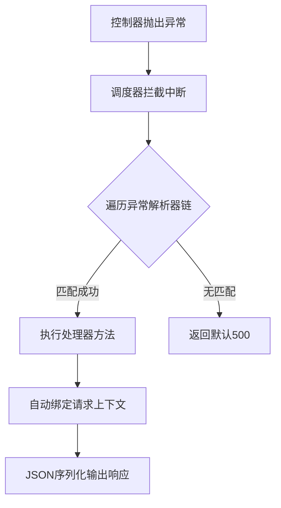

<!-- 控制性问题：为什么大型 Spring Boot 项目必须用 @ControllerAdvice 替代分散的 try-catch？ -->

```java
@GetMapping("/users/{id}")
public ResponseEntity<UserVO> getById(@PathVariable Long id) {
    try { return ok(convert(userService.findById(id))); }
    catch (UserNotFoundException e) { return error(404, e); }
    catch (DataAccessException e) { return error(500, e); }
}
```
随着模块拆分和多人协作，几十个 Controller 里的 `try-catch` 会迅速演变成维护黑洞：状态码口径打架、生产堆栈直接拼进 JSON 返回给客户端、新增异常类型就得改遍所有方法。
**大型项目必须用 `@ControllerAdvice`（控制器增强注解）把失败处理集中收敛到单一入口，实现业务逻辑与容错契约的彻底解耦。**

这里有个核心设计原则：**强制边界，让异常处理从“业务副产物”变成“框架契约”。** 当你把错误处理交给全局拦截器时，IDE 就能扫描出哪些方法违反了规范，静态检查工具才能介入。否则，规范永远只是团队文档里的一行字。这就引出一个问题——Spring 凭什么能精准捕获每个 Controller 抛出的异常，而不干扰正常请求？

---

Spring MVC 的请求链路由 `DispatcherServlet`（中央分发器）统一调度。当 Controller 方法抛出异常时，默认行为是直接中断并返回 500。但 Spring 提供了一个扩展点：启动期扫描所有标注了 `@ControllerAdvice` 的 Bean，读取它们方法上的 `@ExceptionHandler`（异常处理器注解），将“异常类型 → 处理方法”的映射关系注册到 `HandlerExceptionResolver`（异常解析器链）中。

请求运行时，只要 Controller 方法向上抛出异常，`DispatcherServlet` 就会暂停常规流程，按优先级遍历这个解析器链。匹配规则依赖 Java 原生的 `Class.isAssignableFrom()`：你抛出的是 `OrderStockException`，而注册了 `RuntimeException.class`，框架会自动命中它。方法参数还能自动绑定 `HttpServletRequest` 或 `Model`，返回值直接走消息转换器序列化成 JSON。

**图：@ControllerAdvice 全局异常处理生命周期**


| 维度 | 传统 try-catch | @ControllerAdvice |
|------|----------------|-------------------|
| 触发时机 | 编译期硬编码在业务方法内 | 运行时动态匹配异常继承树 |
| 契约一致性 | 开发者自觉程度决定 | 框架强制统一序列化格式 |
| 跨模块复用 | 需手动复制粘贴工具类 | 启动期自动注册，开箱即用 |

理解了集中拦截的机制，再看前端的实现思路就清晰了。如果你熟悉现代前端工程，这完全对应 Axios 响应拦截器或自定义 `useApiFetch` Hook：

```typescript
// 前端典型做法：统一包装错误结构
http.interceptors.response.use(r => r.data, (e) => {
  const s = e.response?.status
  return Promise.reject({ code: s ?? 500, reason: e.response?.data?.reason, message: e.message })
})
```

两者本质都在做同一件事：把“失败处理”从具体执行链路抽离，建立统一的错误契约。区别在于路由机制——Spring 靠元数据声明+反射动态路由，天然支持基于类继承树的自动匹配；前端则依赖运行时链式拦截，通常只能硬编码 HTTP 状态码分支。Java 是框架底层自动派发，前端需要开发者显式封装引入。

---

明白了原理，实战中踩坑的概率反而最高。很多写过 3 个月 Java 的前端转岗者，喜欢写一个 `@ExceptionHandler(Exception.class)` 当作万能兜底。但这会直接吞掉 Spring 内置的参数校验异常（如 `MethodArgumentNotValidException`）。表单提交校验失败本该返回 400 和详细字段错误，被你的全局 Exception 一截胡，客户端拿到的只有“服务暂时不可用”。

> 🔍 精确说明：基类优先匹配具有传染性。如果 Advice 类上加了 `@RestControllerAdvice(basePackages = "com.example.order")`，它只会拦截指定包路径下的 Controller。这是为了避免非 Web 层的 Service 异常被错误序列化。注意 `@RestControllerAdvice` 隐式叠加了 `@ResponseBody`，跳过视图解析直接走 Jackson 序列化，不再经过 ViewResolver。

工程上如何决策？对外提供 REST/gRPC 接口的服务、多团队协作的单体或微服务项目，必须用这套机制。内部 CLI 工具或对性能极度敏感的核心同步链路，反而应该让异常直接暴露给调用方。Filter 运行在 Servlet 容器层，拿不到 `@RequestBody` 和方法级注解；Advice 运行在 MVC 调度层，能感知业务语义。两者互补，别互相替代。

落地时有三条铁律必须遵守：第一，日志分级纪律要刻进 DNA——业务预期内的失败（参数错误、库存不足）打 `WARN`；真正代表系统故障的（NPE、连接池耗尽）打 `ERROR` 并附带完整堆栈。第二，禁止裸 `catch (Exception e)`，除非你做全局兜底且确认不会覆盖框架校验逻辑。第三，Advice 类本身不包含复杂业务，直接用 `MockMvc`（模拟 HTTP 请求的测试工具）写单元测试验证状态码和响应体结构，不依赖数据库。

**强制边界，让异常处理从“业务副产物”变成“框架契约”。** 当你把零散的 `try-catch` 替换为声明式的 `@ControllerAdvice`，代码库的维护成本会从指数级下降为线性。下次在 Controller 里看到嵌套的异常捕获块时，直接重构到全局处理器——这就是工程直觉该走的路。

---

### 系列导航

**上一篇**：[Spring Profile：为什么配置必须按环境精准隔离](#)
**下一篇**：[HandlerInterceptor：为什么控制器逻辑必须前置/后置增强](#)

> 这是「前端工程师系统学 Java」系列第 22 篇，系统解读 Java 设计哲学（面向前端工程师）。
