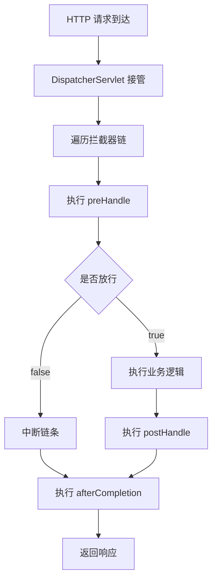

<!-- 控制性问题：HandlerInterceptor 凭什么能在不污染业务代码的前提下，精准切割请求生命周期并保障高并发安全？ -->

```java
// 每个 Controller 方法里重复写 Token 校验和耗时统计
if (!validToken(request)) throw new AuthException();
long start = System.currentTimeMillis();
```
如果全量复制，业务代码会迅速膨胀且难以统一维护；如果改用 Servlet Filter，又拿不到 Spring 依赖注入对象。核心论点是：**HandlerInterceptor 通过同步阻塞的接口多态（Java 接口机制允许运行时动态绑定具体实现），在零字节码增强开销下实现了请求生命周期的精准切割。** 记住这个锚点：**强制边界，单例无状态兜底**。

早期团队习惯用 Filter 拦截所有请求，但 Filter 运行在 Servlet 容器层，生命周期粗糙，只有一个 `doFilter` 入口。当你需要知道业务方法是否执行成功，或者想精确计算 Controller 方法的耗时（排除视图渲染和 JSON 序列化）时，Filter 就无能为力了。反过来，Spring AOP 虽然灵活，但它依赖动态代理生成运行时代理类，对 Web 层来说启动开销偏大，且无法干预请求进入控制器前的“放行决策”。

Spring 的设计者选择了折中路线：让 `DispatcherServlet`（负责接收 HTTP 请求并分发给对应 Controller 的核心调度组件）接管拦截器链。当请求进来，Servlet 会遍历当前路径匹配的 Interceptor 列表，依次调用它们的钩子方法。这就引出一个关键问题——**这些钩子到底怎么配合完成“前置决策、后置处理、异常清理”三段式管道？**

```java
@Component // 注册为 Spring Bean，默认单例实例
public class RequestTraceInterceptor implements HandlerInterceptor {

    @Override
    public boolean preHandle(HttpServletRequest request, HttpServletResponse response, Object handler) {
        String requestId = java.util.UUID.randomUUID().toString();
        request.setAttribute("traceId", requestId);
        response.setHeader("X-Trace-ID", requestId);
        return true; // 返回 false 则中断链条，不进入 Controller
    }

    @Override
    public void postHandle(HttpServletRequest request, HttpServletResponse response, Object handler, ModelAndView modelAndView) {
        long cost = System.currentTimeMillis() - (long) request.getAttribute("startTime");
        System.out.printf("[Trace:%s] 业务执行耗时: %d ms%n", request.getAttribute("traceId"), cost);
    }

    @Override
    public void afterCompletion(HttpServletRequest request, HttpServletResponse response, Object handler, Exception ex) {
        if (ex != null) {
            System.err.printf("[Trace:%s] 请求异常终止: %s%n", request.getAttribute("traceId"), ex.getClass().getSimpleName());
        }
    }
}
```

看这段代码，三个方法各司其职。`preHandle` 是链条的开关，返回 `true` 继续向下，返回 `false` 直接中断。这解释了为什么拦截器能替代部分路由分发逻辑。进入 Controller 后，业务模型准备完毕但响应体还没写入网络，此时触发 `postHandle`。很多开发者在这里尝试修改 `response.getWriter()`，结果导致双重写入报错；正确做法是追加全局响应头或收集埋点指标。最后，无论同步还是异步任务结束，`afterCompletion` 都会按注册相反顺序执行。如果前面抛出未捕获异常，这里的 `ex` 参数就不为 null。

> 🔍 精确说明：`postHandle` 和 `afterCompletion` 的参数差异决定了前者能看到模型/视图，后者只能看到最终结果或异常。整个流程是同步阻塞的，确保异常栈和请求上下文能正确传递。理解了这种同步调用栈的特性，再看高并发下的线程安全问题就清楚了。

**下图展示了 HandlerInterceptor 在请求生命周期中的三段式管道流转过程：**


如果你熟悉 Vue 或 React，这套机制其实非常眼熟。现代前端框架同样抽象出“前置决策 → 核心执行 → 后置清理”的三段式管道。

```vue
// Vue Router beforeEach 守卫示例
router.beforeEach((to, from, next) => {
  const traceId = crypto.randomUUID()
  to.meta.traceId = traceId // 类似 request.setAttribute("traceId", ...)
  next() // 等价于 return true；next(false) 则中断链条
})
```

两者本质都是**框架级生命周期门控（Gatekeeper）**。但区别在于，前端路由守卫运行在浏览器端，基于异步 Promise 链和事件驱动；而 `HandlerInterceptor` 跑在 Tomcat 工作线程里，是严格的同步阻塞调用。前端无法做到 `postHandle` 阶段修改已序列化的 HTTP 响应体，这是服务端拦截器独有的能力。更关键的是，前端组件通常按需挂载，而 Spring 默认将 Interceptor 注册为**单例 Bean（整个应用生命周期内仅存在一个实例）**。这意味着你必须彻底抛弃成员变量，否则多线程访问同一个实例会导致数据交叉覆盖。回到我们的记忆锚点：**强制边界，单例无状态兜底**——所有临时状态必须收敛到 `HttpServletRequest` 属性中，利用请求本身的短生命周期做天然隔离。

违反无状态约束的代价是立竿见影的。假设你在 `preHandle` 里定义了一个 `private Map<String, Object> cache;`，Tomcat 线程池里有 200 个 Worker Thread（操作系统分配给 Java 进程的工作线程，底层对应 Linux POSIX 线程）同时打过来，它们共享同一个 `cache` 实例，瞬间就会引发脏读或线程竞争。这时候不能靠猜，得看系统层表现。

当拦截器内部写了同步阻塞调用（比如没设超时的 Feign 客户端或 JDBC 查询），工作线程会长时间处于睡眠等待状态。OS 层面表现为网络连接积压，客户端频繁收到 504 Gateway Timeout。排查步骤很直接：先抓堆栈定位卡点，再查连接池状态。

```bash
# 查看 JVM 线程状态，筛选被拦截器阻塞的线程
jstack <PID> | grep -E "BLOCKED|WAITING" | head -20
# 检查 TCP 连接堆积与文件描述符泄漏
ss -tnp state all '( dport = :8080 )' | awk '{print $1}' | sort | uniq -c
```

实际项目中，绝大多数“拦截器拖垮接口”都是因为违背了设计权衡里的原则：把耗时操作塞进了同步管道。记住，**HandlerInterceptor 适合毫秒级的横切逻辑，不适合任何可能阻塞 OS 时间片的长耗时任务**。如果必须调外部服务，请改用非阻塞客户端或提前在消息队列里异步处理。

明白了机制和底线，什么时候该用、什么时候不该用就很清晰了。

需要精确控制请求在进入 Controller 前是否放行？用 Interceptor。需要在业务执行后、响应返回前修改模型或响应头？用 Interceptor。涉及限流、审计、灰度路由等跨模块非功能性逻辑？依然是它的主场。

但如果只是简单的协议过滤、Gzip 压缩或基础安全检查，请直接上 Servlet Filter。它更早介入，不受 Spring 生命周期约束，性能更好。如果需要处理复杂的路由分发或大量动态参数解析，自定义参数解析器或 AOP 更合适。若拦截器内必须做权限校验且抛出自定义异常，务必配合 `@ControllerAdvice` 统一收敛，别让杂乱的异常污染业务层。

最后验证一下你的认知：下次看到 `HandlerInterceptor`，别把它当成普通的工具类。它是 Spring 交给你的**轻量级管道阀门**。拧对方向（同步无状态+精准生命周期），它能帮你守住架构边界；拧反了（滥用成员变量或塞入阻塞调用），它就会成为压垮线程池的第一块多米诺骨牌。动手在你的 Spring Boot 项目里注册一个只打印 `request.getRequestURI()` 的拦截器，观察 `preHandle` 返回 `false` 时 `postHandle` 的静默行为，这就是理解它的最快路径。

---

### 系列导航

**上一篇**：[@ControllerAdvice：为什么全局异常必须集中响应格式](#)
**下一篇**：[REST API 必须用 @RestController 声明端点](#)

> 这是「前端工程师系统学 Java」系列第 23 篇，系统解读 Java 设计哲学（面向前端工程师）。

