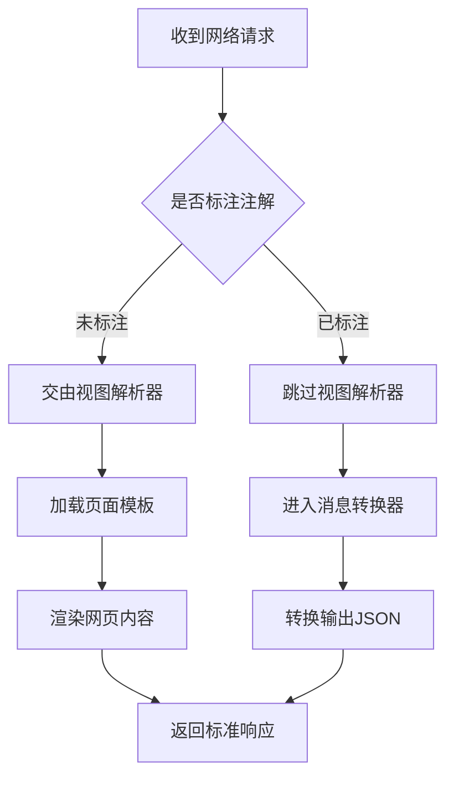

<!-- 控制性问题：为什么 Spring 要用 @RestController 替代传统的 @Controller？ -->

用旧版教程写接口，类上标了 `@Controller` 却返回 404 或狂打模板警告。**Spring 引入 `@RestController` 的核心目的只有一个：强制将数据接口与页面渲染解耦，让你不再为每个方法重复声明“我不需要视图”。** 记住这句话：**注解即契约，声明即边界**。

早期企业开发里，同一个控制器既要跳转后台管理页，又要返回 JSON 给前端调用。这导致两类需求互相干扰：要么漏掉 `@ResponseBody`（告诉框架直接将返回值写入 HTTP 响应体，跳过视图模板查找），触发 404；要么误传模型对象污染数据。Spring 的解法很干脆：利用 Java 元注解机制（允许在一个注解上组合其他注解），把 `@Controller`（标记这是一个处理 HTTP 请求的组件）和 `@ResponseBody` 打包成 `@RestController`。看到它，团队就清楚该类职责是纯 API 输出，认知负荷直接减半。

理解了这种打包逻辑，再看请求流转就清楚了。框架启动时会扫描类级别注解，发现 `@RestController` 后，会自动为其下所有带路径映射的方法（如 `@GetMapping`）挂载响应体开关。这意味着你不需要在每个方法上反复确认“这里要不要跳页面”，框架已经替你划清了数据输出的红线。**注解即契约，声明即边界**，这一行标注替你挡掉了所有视图搜索的杂音。

```java
// @RestController：Spring MVC 的组合注解，底层自动合并 @Controller 和 @ResponseBody。
// 意图：声明这是一个纯数据接口类，所有方法默认直接输出响应体（如 JSON），跳过视图模板查找。
@RestController
public class OrderApi {
    @GetMapping("/orders/{id}") // 映射 GET 请求路径
    public Map<String, Object> getOrder(@PathVariable Long id) { // @PathVariable 用于提取 URL 中的动态参数
        Map<String, Object> response = new HashMap<>(); // HashMap 是 Java 基础的键值对集合
        response.put("orderId", id);
        response.put("status", "PAID");
        return response; // 无需额外注解，Spring 自动调用 Jackson 转换器序列化为 JSON
    }
}
```

扫描到注解后，Spring MVC 会直接绕过 ViewResolver（视图解析器，负责根据名称查找 .jsp/.html 模板文件），进入 HttpMessageConverter（消息转换器，负责 Java 对象与 JSON 字节流的互转）。你只管返回数据结构，HTTP 状态码默认 200 OK。如果你熟悉 Vue 3，这种设计你会非常亲切。在 Nuxt 的 `server/api/` 目录中，一个 `.ts` 文件天然就是 `@RestController`。导出函数即声明路由，`return { orderId: '1024' }` 自动转为 `application/json`。两者本质相同：通过声明式标记建立数据契约，让框架接管序列化、响应头与路由分发。

**请求处理流水线对比**


```vue
// server/api/order.ts（Nuxt 3 等价写法）
export default defineEventHandler(() => {
  // 声明即契约：框架自动识别纯数据返回，设置 Content-Type 并序列化
  return { orderId: '1024', status: 'PAID' };
});
```

区别在于，前端 API 路由基于文件系统模块导出，而 Java 依赖 JVM 容器管理类实例，且必须显式处理异常拦截。别以为加了注解就能躺平，初学者最容易在这里栽跟头。**返回 `void` 期望自动返回 200 是最典型的误区。** Spring MVC 对空返回值的路由逻辑是尝试寻找名为 `void` 的视图资源，必然触发 404。正确做法是明确返回具体对象，或使用 `ResponseEntity<Void>`（Spring 提供的标准响应包装器，支持自定义状态码与响应头）配合 `.ok().build()` 显式声明成功。

| 维度 | 避坑动作 | 原理说明 |
|------|----------|----------|
| 依赖兜底 | 检查 `pom.xml` 是否含 `spring-boot-starter-web` | 缺失时 Jackson 转换器不注册，直接抛 500 `No converter found...` |
| 参数越界 | 关闭 IDE Inspection 对 `Model` 对象的红色警告 | `Model` 专用于向服务端渲染页面传递局部变量，API 类中出现属架构污染 |
| 日志调试 | 开启 `logging.level.org.springframework.web=DEBUG` | 观察 `HttpMessageConverterExtractor` 日志，直观验证序列化链路 |

写完接口不代表能跑通网络。`@RestController` 背后的服务实际运行在嵌入式 Tomcat 容器中，对应操作系统的 TCP Server Socket。本地 `curl localhost:8080/orders/1` 正常，但其他机器访问报 `Connection refused`？90% 是因为 Spring Boot 默认出于安全考虑，只绑定了回环地址 `127.0.0.1`。打开终端执行 `ss -tulpn \| grep :8080`，如果 `Local Address` 显示 `127.0.0.1:8080`，直接在 `application.yml` 追加 `server.address: 0.0.0.0` 重启即可。端口监听范围一旦放开，你的数据契约才算真正交付到生产环境。

**注解即契约，声明即边界**。掌握它，你就跨过了从“拼凑代码”到“设计服务”的第一道门槛。

---

### 系列导航

**上一篇**：[HandlerInterceptor：为什么控制器逻辑必须前置/后置增强](#)
**下一篇**：[配置类必须用 @Configuration 显式声明](#)

> 这是「前端工程师系统学 Java」系列第 24 篇，系统解读 Java 设计哲学（面向前端工程师）。

