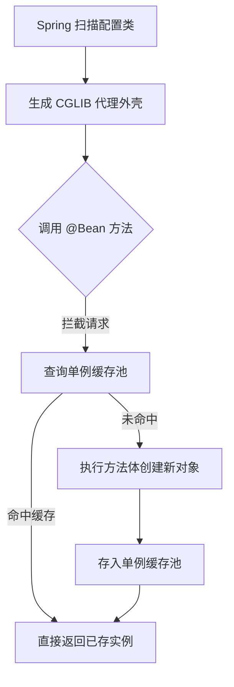

<!-- 控制性问题：为什么在 @Configuration 类里直接调用方法，Spring 能保证永远返回同一个实例？ -->

写 Spring Boot 项目时，你经常会在 `config` 包里看到这样的代码：
```java
@Configuration
public class InfraConfig {
    @Bean public DataSource dataSource() { return new HikariDataSource(); }
}
```
如果你在业务逻辑里直接 `new InfraConfig()` 再调方法，数据库连接池会瞬间创建几十份。**核心论点：`@Configuration` 的本质不是“写静态配置”，而是 Spring 启动时为你生成的“单例工厂拦截器”。**

这个注解强制绑定了一条底层规则：**所有标注 `@Bean`（标记该方法负责创建对象并交由 Spring 容器管理生命周期）的方法调用，都会被自动代理接管。** 理解了这个拦截机制，你就掌握了配置类的内存模型。

Spring 容器启动扫描到该类时，底层会借用 CGLIB（一种在运行时动态生成字节码的工具库）给原类套上一层“外壳”。这层外壳专门干一件事：每次调用目标方法前，先查内部缓存；命中了直接扔给你，没命中才执行方法体创建新对象并存入缓存。这就是为什么你在同一个配置类内部互相调用方法时，拿到的永远是同一份引用。

**CGLIB 代理拦截与单例缓存流程**


```java
// 验证方法间互相引用的单例行为
@Bean
public DataSource ds1() { return new HikariDataSource(); }
@Bean
public JdbcTemplate jdbc(DataSource ds1) { 
    // 这里直接写方法名，Spring 代理会拦截并返回已缓存的 ds1
    return new JdbcTemplate(ds1); 
}
```
看这段代码就清楚了，参数里直接写方法名，而不是传外部变量。代理链捕获了这个调用路径，确保 `jdbc` 拿到的是和 `ds1` 完全相同的内存地址。

> 🔑 记忆锚点：**强制边界，编译器替你兜底**。代理机制把“何时创建、创建几次”的控制权收归集中入口，防止业务代码随意 `new` 导致状态割裂。

> 🔍 精确说明：这里的“缓存”特指 Spring 单例池（Singleton Bean Registry）。代理类优先查询该池，而非每次走 Java 虚拟机栈帧分配。

如果你熟悉 Vue 工程，这套逻辑几乎一模一样。在 `src/di.ts` 里，我们通常用闭包作用域缓存来模拟这种单例工厂：
```typescript
let _apiCache: any = null
export function initApi(env: string) {
  if (!_apiCache) {
    console.log(`[Api] 正在初始化，环境=${env}`)
    _apiCache = { fetch: () => {} } 
  }
  return _apiCache
}
```
前端没有 JVM 字节码层做透明拦截，而是靠模块级变量 `if (!_apiCache)` 的判断来保证全局复用。两者工程意图完全一致：把“一次性创建 + 全局共享”的装配逻辑收敛到独立入口，利用类型系统或框架调度防止散乱的实例化操作破坏状态一致性。

理解了前置拦截的原理，再看初学者最容易踩的坑就顺理成章了。很多人觉得手动实例化更灵活，于是写了类似 `DataSource ds = new InfraConfig().dataSource();` 的代码。这行代码彻底绕过了 Spring 的代理外壳，相当于直接裸奔执行方法体。结果就是每次调用都重新 `new` 一个连接池，不仅浪费堆内存，还会引发多份实例并行请求导致的线上故障。

记住这条红线：**绝对不要手动 `new` 配置类**。必须依赖容器托管，否则所有的单例保证与依赖注入链路都会断裂。

在实际搭建 Spring Boot 项目时，你可以遵循三条简单规范来避开陷阱。首先，把所有 `@Configuration` 类统一放在 `com.xxx.config` 包下，命名严格遵循 `XxxConfig` 格式。其次，配置类里只写基础设施的装配逻辑（如数据源、跨域规则、第三方 SDK 客户端），千万不要塞 Controller 或 Service 级别的业务流转代码。最后，修改配置参数后记得重新编译重启应用，这是强类型语言换取工程严谨性必然付出的代价。当你习惯用这种“显式工厂”的思维去组织项目结构时，代码的可推导性和可维护性会显著提升。

---

### 系列导航

**上一篇**：[REST API 必须用 @RestController 声明端点](#)
**下一篇**：[@Value 注入必须绑定配置项而非硬编码](#)

> 这是「前端工程师系统学 Java」系列第 25 篇，系统解读 Java 设计哲学（面向前端工程师）。
