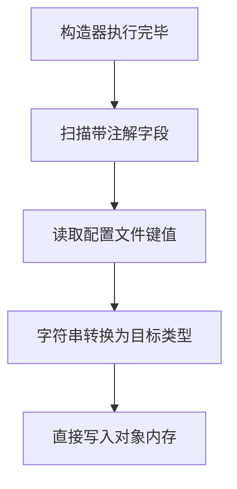

<!-- 控制性问题：@Value 到底是怎么把外部配置文本变成 Java 对象里的可用变量的？ -->

支付网关连错地址、测试环境误用生产密钥，这类线上事故往往源于把配置写死在代码里。`@Value`（用于将外部配置值绑定到类字段的注解）的核心作用就是**让配置文件里的文本自动“长”进 Java 对象的字段里**。

记忆锚点：**配置外置化，启动时一次性绑定。** 它不是魔法，而是 Spring 在你创建对象的那一刻，顺手把外部参数填进去的工程妥协。理解了这一条主线，你就不会再纠结“改了配置文件为什么没生效”，也不会试图用它去替代所有的参数传递。

做 Spring Boot 项目时，你一定会遇到这个场景：业务逻辑需要读取数据库超时时间、第三方 API 的地址或者功能开关。如果把这些值写成 `static final`（编译期固定不变的静态常量），每次换环境都得改源码、重新打包，发布流程直接瘫痪。`@Value` 的出现就是为了切断代码和配置的强绑定。它的执行时机非常明确：不在你调用方法时解析，而是在 Spring 容器帮你创建这个类实例的瞬间完成。流程可以简化为四步：扫描到标注了注解的字段 → 去 `application.properties` 或 `yml` 里找对应的键 → 把匹配到的字符串转换成目标类型 → 直接写入对象内存。整个过程对你透明，你只需要声明一个变量，框架负责兜底赋值。

**Spring 容器绑定配置的底层流程**


> 🔍 精确说明：该机制属于 Spring 的后置处理器逻辑，它在构造器执行完毕后介入。这意味着被注解标记的字段永远无法声明为 `final`（初始化后不可变的修饰符），因为 `final` 要求赋值一次即锁定，而这里需要运行期覆盖。

```java
import org.springframework.beans.factory.annotation.Value;
import org.springframework.stereotype.Component;
import java.util.List;

@Component // 标识当前类需交由 Spring 托管的注解
public class OrderConfig {
    // 冒号后面是默认值，找不到配置时自动 fallback
    @Value("${order.gateway.host:localhost:8080}")
    private String gatewayHost;

    // 基础类型会自动转换，配置项缺失则走 false
    @Value("${order.retry.enabled:false}")
    private boolean retryEnabled;

    // 逗号分隔的字符串会被自动拆成 List（集合接口）
    @Value("${order.supported.statuses:PENDING,PAID,CANCELLED}")
    private List<String> supportedStatuses;
}
```
这段代码展示了 `@Value` 的三大核心能力：占位符解析、类型安全转换、默认值容错。注意看 `private` 修饰符，这保证了注入后的值不会被外部代码随意篡改，符合面向对象封装原则。**配置外置化，启动时一次性绑定**——框架在初始化阶段就把这些边界值钉死在对象里，后续业务只管消费，无需关心数据来源。

理解了基础用法，再看设计边界就清楚了。很多初学者喜欢把所有配置都扔给 `@Value`，但这其实是一种反模式。当配置项超过五个，或者存在层级嵌套时，分散的注解会让类职责变得臃肿，IDE 也失去了属性补全的能力。此时你应该考虑按模块聚合配置。不过对于单个标量参数，`@Value` 依然是最快上手的路径，代价是牺牲了一部分代码可读性。其他开发者阅读你的方法签名时，看不到参数来源，只能通过注释来猜测依赖关系。

如果你熟悉 Vue 3，可能会联想到 `import.meta.env` 读取 `.env` 文件的做法。两者在工程动机上完全一致：都是把写死的地址抽离到外部文件，支持多环境切换。**但类比到此为止。** 前端构建工具是在打包时将变量替换成常量，属于编译期静态替换；而 `@Value` 发生在应用启动阶段，属于运行期动态注入。前端改完 `.env` 忘了重启 Vite 服务器，页面会卡住；Java 改完配置文件忘了重启应用，进程只会继续读旧数据。这是两种技术栈下的必然差异。

这里有个细节大多数教程会跳过，但它决定了你踩不踩坑：**绝对不要把 `@Value` 用在构造器参数上。** 初学者常误以为它能保证对象创建时的完整性。但 Spring 的初始化顺序是“先跑构造器 → 再执行字段注入”。如果你在构造器里标了注解，此时框架还没拿到配置，取出来的值必定是 `null`，直接引发空指针异常。若必须在构造期使用配置，请改用官方推荐的 `@ConstructorBinding`（强制 Spring 在构造器阶段完成属性绑定的注解）配合专门的配置类。

另外，防御性编码不能省。即使配了默认值，也建议在业务入口加一层校验。比如 `if (timeoutMs <= 0) throw new IllegalArgumentException("超时参数异常")`。防止因拼写错误导致默认值长期生效，掩盖真实的配置缺失问题。**配置外置化，启动时一次性绑定**的本质是信任假设，代码必须为自己的信任加上保险栓。

动手验证一下：新建一个 Spring Boot 项目，创建一个带 `@Component` 的类，打上两个 `@Value` 字段，在配置文件中写死对应 key。启动后打断点观察字段值，你会发现它们已经安静地躺在对象内存里了。记住，后端没有前端的实时热更新钩子，配置变更永远伴随重启。掌握这套机制，你才算真正跨过了从“写脚本”到“做企业级服务”的门槛。

---

### 系列导航

**上一篇**：[配置类必须用 @Configuration 显式声明](#)
**下一篇**：[Filter 和 Interceptor 必须分清职责边界](#)

> 这是「前端工程师系统学 Java」系列第 26 篇，系统解读 Java 设计哲学（面向前端工程师）。
