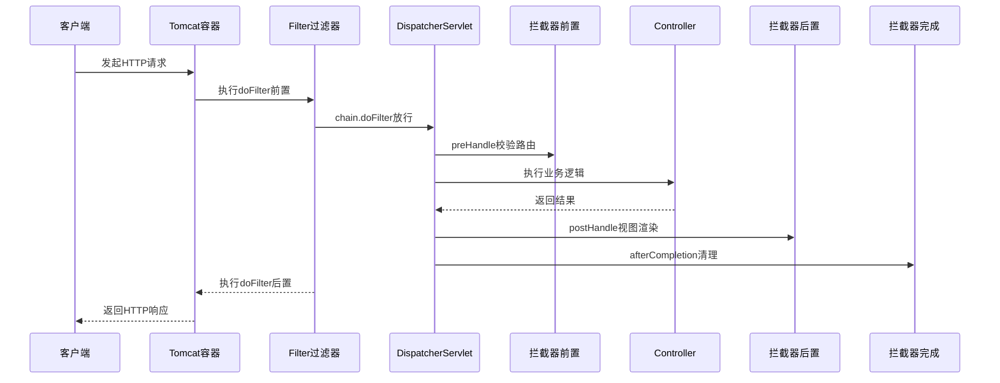

写 Spring Boot 项目时，你大概率会在同一个类里混用 `Filter` 和 `Interceptor`，结果发现鉴权逻辑跑在日志后面，或者 `@Autowired` 注入的 Service 全是 `null`。核心论点：Filter 是容器级的网络管道，Interceptor 是框架级的路由钩子；两者不是并列选项，而是嵌套关系。记住这个记忆锚点：**“协议层管连通，应用层管意图”**。理解这一点，你就不会再为拦截顺序和上下文缺失头疼。

这就引出一个问题——请求从到达网卡到返回客户端，中间要经历哪些阶段？Servlet 规范（即 JDK 1.4 时代定下的 Web 容器标准）设计了 `Filter` 接口。它由 Tomcat 等容器直接管理，运行在 `DispatcherServlet`（即 Spring MVC 核心调度器，负责将请求分发给具体 Controller）之外。当你实现 `doFilter` 方法时，代码块在 `FilterChain`（即过滤器链，用于串联多个过滤逻辑）调用之前执行的是前置逻辑，在之后执行的是后置逻辑。此时 Spring 的 IoC 容器还没完全接管请求，Filter 拿不到任何 Spring Bean。

```java
// Filter：容器层拦截，独立于 Spring 上下文
@Component
public class CorsAndEncodingFilter implements Filter {
    @Override
    public void doFilter(ServletRequest req, ServletResponse res, FilterChain chain) throws IOException, ServletException {
        HttpServletResponse httpResponse = (HttpServletResponse) res;
        httpResponse.setHeader("Access-Control-Allow-Origin", "*"); // 前置：设置协议头
        long start = System.currentTimeMillis();
        chain.doFilter(req, res); // 放行进入 Spring 管道
        log.info("Filter后置耗时: {}ms", System.currentTimeMillis() - start);
    }
}
```

理解了这层网络边界，再看 Spring 内部的 `Interceptor` 就清楚了。Spring 没有推翻 Filter，而是选择了叠加。它在 DispatcherServlet 内部切出了三个精准的控制点：`preHandle`（即前置处理，路由匹配成功、Controller 执行前触发）、`postHandle`（即后置处理，Controller 执行完、视图渲染前触发）、`afterCompletion`（即完成回调，整个请求闭环结束后触发）。这三阶段构成了框架内的细粒度流水线。

**请求从到达网卡到返回客户端的生命周期与嵌套执行顺序：**


> 🔍 精确说明：`chain.doFilter()` 是一个同步阻塞调用，它会占满当前容器的 Worker 线程（即处理网络 IO 的后台线程），直到下游全部执行完毕才返回。前端拦截器多为异步声明式，而这里必须严格同步，这是 Java Web 模型的底层约束。

如果你熟悉 Vue 或 React，这套分层架构简直一模一样。前端同样遵循“网络层 vs 框架层”的职责划分：Axios 拦截器对应 Java 的 Filter，它在 HTTP 客户端层面包装请求头、处理全局重试，脱离具体页面逻辑独立运行。而 Vue Router 的 `beforeEach` 守卫或 React 的 Loader，则完美复刻了 Interceptor 的分层控制。它们运行在应用路由层，可以直接读取状态库（等价于 Spring Bean），通过返回 `false` 或抛出 Response 来短路导航流程。

⚠️ 类比止步点：前端缺乏 postHandle 的等价物。因为前后端分离后数据直出 JSON，前端 UI 框架直接绑定响应，无需拦截器在“渲染前填充 Model”。此外，前端异常通常由 ErrorBoundary 或 Promise.catch 处理，而 Java 的 afterCompletion(Exception ex) 能捕获 Controller 抛出的原始异常并统一格式化，这是框架闭环设计的必要性。

既然职责分明，实战中该怎么选？很多开发者踩坑是因为没理清异常处理和线程安全的红线。Filter 中抛出的异常会直接穿透给容器，走默认的 500 错误页，Spring 的 `ControllerAdvice`（即全局异常处理器）根本抓不到。而 Interceptor 的 afterCompletion 能拿到原始异常，方便做结构化日志或监控上报。更致命的是线程安全问题：两者都是 Spring 管理的单例 Bean。绝对不要在成员变量里存请求参数！必须用 `ThreadLocal`（即线程局部变量，保证每个请求线程拥有独立的数据副本），且务必在 afterCompletion 里手动 remove()，否则高并发下用户数据会互相覆盖。

决定用谁，看这张决策表就够了：

| 场景特征 | 推荐方案 |
|---|---|
| 跨域(CORS)、GZIP压缩、字符编码、IP黑白名单 | `Filter` |
| JWT鉴权、租户隔离、审计日志、动态路由元数据判断 | `Interceptor` |
| 需要拦截特定 Service 方法调用 | 别用这两者，上 `AOP`（即面向切面编程，通过动态代理在方法调用前后插入逻辑） |

注意排序陷阱。未显式指定顺序时，Spring Boot 默认按类名字典序注册，极易引发隐蔽的 Bug。务必加上 `@Order(1)` 或使用 `FilterRegistrationBean.setOrder()` 强制收敛优先级。

写到这里，你可能觉得只是 API 调用的区别。但一旦流量上来，这两者的底层表现会直接映射到操作系统层面。Filter 的执行完全依赖 Web 容器分配的进程虚拟内存和内核调度的线程池。如果你在 Filter 里写了同步阻塞调用（比如查数据库或调外部 RPC），Worker 线程就会卡在 `chain.doFilter()` 之后。现象是 CPU 使用率极低，但接口 P99 飙升甚至报 504。排查时先跑 `top -H -p <PID>` 看线程状态是否为大量 `S`（睡眠），再用 `jstack <PID> | grep http-nio` 定位堆栈。如果发现几十条线程全堵在自定义 Filter 里，立刻将耗时操作剥离到独立线程池。

另外，Socket 泄漏也是高频坑。高并发下如果 Filter 没规范关闭流，文件描述符（fd）会迅速耗尽。运行 `lsof -p <PID> | grep TCP | wc -l` 对比系统限制，看到大量 `CLOSE_WAIT` 状态就说明连接没释放。运行 `ss -tnp '( sport = :8080 )' | awk '{print $1}' | sort | uniq -c` 也能快速统计半开连接堆积情况。养成用 try-with-resources 包裹 IO 流的习惯，能避开绝大多数 OS 级瓶颈。

动手验证一下你的直觉。新建一个 Spring Boot 项目，分别注册一个打印耗时的 Filter 和一个带 `@Autowired` 的 Interceptor。故意在 Controller 里抛个运行时异常，观察全局异常处理器能不能抓到 Filter 里的错。你会发现，“协议层管连通，应用层管意图”不是一句空话，而是框架设计者用十几年生产事故换来的分层契约。把横切逻辑放在对的位置，你的代码才会真正具备可插拔的能力。

---

### 系列导航

**上一篇**：[@Value 注入必须绑定配置项而非硬编码](#)
**下一篇**：[开发阶段必须启用 Spring Boot DevTools](#)

> 这是「前端工程师系统学 Java」系列第 27 篇，系统解读 Java 设计哲学（面向前端工程师）。
