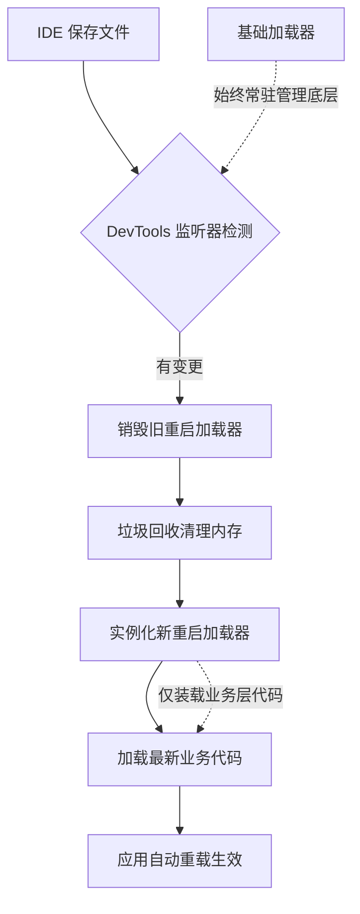

每次改一行 Controller 逻辑，传统 Java 开发都要手动停服务、跑 Maven、等 Tomcat 启动，打断心流至少 30 秒。引入 DevTools 后，IDE 按 `Ctrl+S` 保存，应用 2 秒内自动重载生效。核心在于：**DevTools 不尝试原地替换代码，而是用双类加载器隔离业务与框架，通过快速销毁重建实现秒级反馈。**

记住这个锚点：**拆加载域保稳定，断旧状态换速度**。全文的配置策略和避坑指南都以此为基准。

Java 是强类型语言，类一旦加载到虚拟机就很难原地修改。设计者没有去硬刚 JVM 的限制，而是采用了“分家”策略。Spring Boot 启动时会创建两个类加载器（负责把编译好的字节码读入内存并管理的组件）。第一个叫基础加载器，只管 Spring 核心、Tomcat、JDBC 驱动这些雷打不动的底层依赖；第二个叫重启加载器，专门装你写在 `src/main/java` 里的业务代码。当你保存文件时，DevTools 内置的文件监听器检测到变更，直接让重启加载器下岗，触发垃圾回收器（自动清理不再持有引用的内存的机制）把旧对象清掉，再立刻实例化一个新加载器读取最新编译的文件。基础设施完全不受影响，切换成本被压到了毫秒级。

**🔥 DevTools 秒级热重载执行流程**


这就引出一个工程问题——哪些文件该触发服务器重启，哪些只刷新浏览器？

```yaml
# application.yml：控制 DevTools 的监听策略
spring:
  devtools:
    restart:
      enabled: true
      # 明确告诉 DevTools：static 和 templates 目录变动，只触发浏览器刷新，不要重启 JVM
      exclude: "static/**,templates/**"
      # 额外监控非标准输出目录（如自定义构建产物）
      additional-paths: "src/main/custom-code"
```

这里有个前端熟悉的影子。如果你在 Vue 项目里配过 `vite.config.ts`，一定见过 `server.watch.ignored` 字段。它的逻辑和这里的 `exclude` 一模一样：告诉构建工具忽略 `node_modules` 或静态资源目录，只盯着源码变动做增量编译。DevTools 也是这套“监听变更+作用域隔离”的三段式架构。但别忘了我们的锚点：**断旧状态换速度**。前端 HMR（模块热替换）默认会尽量保留组件的运行状态，而 Java 为了绝对的安全和隔离，每次重载都会彻底清空重启加载器里的所有对象引用。

这意味着你的全局计数器、本地缓存会瞬间归零。如果需要跨重启持久化数据，必须主动接入 Redis 或数据库，千万别指望 JVM 内存能替你记着。

```java
@RestController
public class DemoController {
    
    // ⚠️ 初学者高频踩坑点：重启加载器销毁时会清空所有静态变量和单例缓存
    private static int requestCount = 0;

    @GetMapping("/count")
    public String count() {
        requestCount++;
        return "本次请求计数: " + requestCount;
    }
}
```

理解了原理，在实际联调时怎么确认它在工作，或者遇到不生效的情况怎么办？DevTools 底层依赖操作系统的文件系统事件通知机制。Linux 内核对单个进程能注册的文件监控句柄数有硬性上限（默认通常是 8192）。如果你的项目编译产物特别多，或者 IDE 疯狂输出日志，句柄耗尽会导致 DevTools 静默失效，保存代码后毫无反应。

> 🔍 精确说明与排查命令：
> 1. 运行 `cat /proc/sys/fs/inotify/max_user_watches`，若显示远小于项目文件总数，说明触发了内核限制。可通过 `sudo sysctl fs.inotify.max_user_watches=524288` 临时扩容。
> 2. 获取进程 PID 后，执行 `jstat -gcutil <PID> 1000 5` 观察元空间（Metaspace）是否阶梯式上涨无法回落，这通常意味着某个第三方组件在全局静态集合中持有了旧类的强引用，阻断了 GC 卸载类加载器。
> 3. 配合 `lsof -p <PID> | grep -E "\.(class|java)" | wc -l` 确认目标文件是否被正确打开。未被监听的目录请立刻加入 `exclude` 列表。

在真实的单体 Spring Boot 项目开发中，把这个工具链跑通，配合合理的排除策略，你每天节省下来的等待时间足够多推几个微服务接口。养成随时检查系统监听参数和静态变量生命周期的习惯，比盲目调优 JVM 启动参数管用得多。

---

### 系列导航

**上一篇**：[Filter 和 Interceptor 必须分清职责边界](#)
**下一篇**：[全局异常处理必须用@ControllerAdvice统一收口](#)

> 这是「前端工程师系统学 Java」系列第 28 篇，系统解读 Java 设计哲学（面向前端工程师）。
