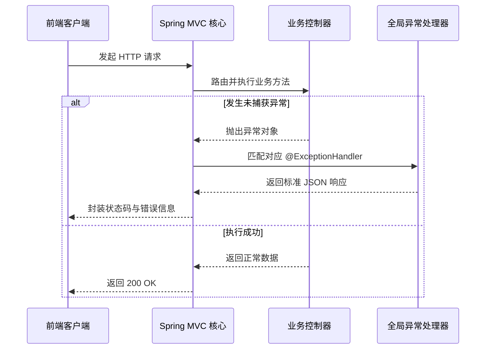

<!-- 控制性问题：为什么 Spring 要用 @ControllerAdvice 统一接管异常，而不是在每个 Controller 里手写 try-catch？ -->

你在写 Spring Boot 接口时，是否习惯在每个方法末尾补 `try-catch`（传统的异常捕获代码块）来防崩溃？一旦漏写一个，线上直接抛出裸堆栈，前端解析失败，敏感信息也跟着泄露。核心论点：**用 `@ControllerAdvice` 统一接管异常，能实现“统一错误契约，主流程只管快乐路径”。** 强制边界，让框架替你兜底脏活。

早期做 Java Web，开发者习惯在业务方法里手动包异常。这导致同一个判空逻辑复制粘贴几百次，且不同接口返回的错误 JSON 结构五花八门。前端对接痛苦，后期维护成本呈指数级上升。更严重的是，原生异常会把服务器内部堆栈直接打印给调用方，攻击者可借此探测架构细节。

Spring 选择把“捕获异常”和“生成响应”彻底抽离。你只需声明一个带有 `@RestControllerAdvice`（全局异常通知类，等同于控制器增强+自动转JSON）的类，Spring 启动时会利用反射（Reflection，运行期读取注解并动态装配对象）扫描它。当任何 Controller 抛出未处理的异常时，调度中心会自动中断原流程，按方法参数签名精准匹配对应的处理函数。

**下图展示了异常被统一接管时的完整调用时序：**


```java
// 定义统一的错误响应结构
public record ErrorResponse(int code, String message) {}

// 自定义业务异常（继承 RuntimeException，编译期不强制检查，确保默认向上抛出）
public class BizException extends RuntimeException { 
    private final int code; 
    public BizException(int code, String msg) { super(msg); this.code = code; } 
    public int getCode() { return code; } 
}

@RestControllerAdvice
public class GlobalExceptionHandler {
    @ExceptionHandler(MethodArgumentNotValidException.class) 
    public ResponseEntity<ErrorResponse> handleValid(MethodArgumentNotValidException ex) {
        return ResponseEntity.badRequest().body(new ErrorResponse(400, "参数格式错误"));
    }
    @ExceptionHandler(BizException.class) 
    public ResponseEntity<ErrorResponse> handleBiz(BizException ex) {
        return ResponseEntity.status(ex.getCode()).body(new ErrorResponse(ex.getCode(), ex.getMessage()));
    }
    @ExceptionHandler(Exception.class) 
    public ResponseEntity<ErrorResponse> handleGeneric(Exception ex) {
        return ResponseEntity.internalServerError().body(new ErrorResponse(500, "系统繁忙，请稍后重试"));
    }
}
```

看懂这段代码就明白核心设计意图：**统一错误契约，主流程只管“快乐路径”**。业务方法只管 `throw new BizException()`，不用管下游怎么收。框架负责格式化、包装状态码、通过 `ResponseEntity`（Spring 封装的 HTTP 响应对象）将字节流写入发送缓冲区。

如果你熟悉 Vue 或 React，这套模式你并不陌生。前端通常用 Axios 拦截器实现完全相同的效果：

```vue
<script setup>
import axios from 'axios'
const api = axios.create({ baseURL: '/api' })
// ✅ 集中拦截并转换错误结构，替代组件内反复的 .catch()
api.interceptors.response.use(res => res.data, err => {
  const status = err.response?.status || 500
  return Promise.reject({ code: status, message: '服务异常' })
})
</script>
```

两者本质一样：把散落的错误处理逻辑收口到单一节点。但区别在于，前端拦截器跑在浏览器单线程，受限于事件循环和内存限制；而 Java 的方案依托 JVM 的动态代理机制，能在服务端线程池层面做深度资源隔离。前端方案偏向“客户端体验兜底”，Java 方案偏向“服务端契约治理”。

理解了机制，再来看初学者最容易踩的两个坑。
第一是“吞掉异常”。很多新手在兜底方法里记录了日志却忘了 `return` 响应对象，或者像前端漏写 `Promise.reject()` 一样，直接让方法执行完毕。结果就是前端收到 200 OK 但拿不到数据，误以为请求成功了。**记住：统一错误契约，主流程只管“快乐路径”，失败路径必须显式返回标准结构。**
第二是“混用局部与全局”。如果你在某个 Controller 内部也写了 `@ExceptionHandler`，它会优先于全局配置生效。模块专属异常放局部，跨模块通用异常（如参数校验、认证失败）坚决放全局。

> 🛠️ 动手验证：当全局处理器没按预期工作时，别急着改代码，先用系统层命令定位瓶颈。
> `jps` 找进程 PID，`top -H -p <PID>` 看线程是否打满，`jstack <PID>` 抓快照查是否有大量 `WAITING` 线程卡在数据库连接或网络 I/O 上。注意，`@ControllerAdvice` 只能拦截“已成功投递至 Controller 层”的 Java 异常；如果底层 TCP Socket 阻塞或连接池耗尽，请求根本进不到你的处理类，这时需要检查网络连通性或调整 `ReadTimeout`。

回到日常开发，下次写 Spring Boot 项目时，直接新建 `GlobalExceptionHandler` 类，把 `MethodArgumentNotValidException` 和自定义异常扔进去。开启团队静态检查规则，禁止 Controller 包裹业务逻辑的 `try-catch`。强制异常向上传递，交给框架处理。

当你发现接口报错不再千奇百怪，日志里全是结构化记录时，你就真正掌握了后端工程化的第一条铁律：**统一错误契约，主流程只管“快乐路径”**。剩下的脏活，交给 `@ControllerAdvice`。

---

### 系列导航

**上一篇**：[开发阶段必须启用 Spring Boot DevTools](#)
**下一篇**：[@Autowired必须理解依赖注入时机与循环依赖破局逻辑](#)

> 这是「前端工程师系统学 Java」系列第 29 篇，系统解读 Java 设计哲学（面向前端工程师）。
