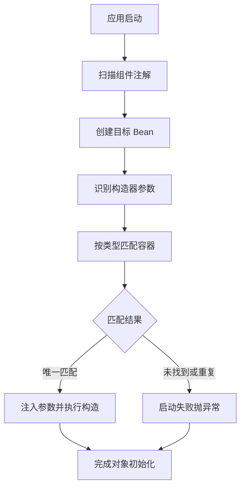

<!-- 控制性问题：为什么 Spring 项目里不能自己写 new，而要依赖 @Autowired？ -->
在 Controller 里直接 `new UserServiceImpl()` 很直观，但一旦切到测试环境或想换底层实现，整个调用链瞬间报错。**Spring 强制接管对象创建权，把“怎么造”交给容器，你只负责“用什么”。**

传统写法让每个类自己负责实例化所依赖的对象，依赖一多就像打结的耳机线，牵一发而动全身。`@Autowired`（Spring 用于自动注入依赖的注解）配合 **Spring 容器**（由框架统一维护的 Java 对象池），把创建和组装的责任彻底剥离。你只需要声明“需要什么能力”，框架会在应用启动期自动扫描并补齐。**隐式绑定，容器兜底**——这就是它存在的唯一目的。

```java
// 1. 定义能力契约（interface 表示一组方法的抽象集合，屏蔽具体实现细节）
public interface PaymentGateway {
    boolean pay(String orderId, double amount);
}

// 2. 具体实现（@Service 注解标记该类由容器统一管理）
@Service("alipayGateway")
public class AlipayPaymentGateway implements PaymentGateway {
    @Override // 重写父接口中的方法
    public boolean pay(String orderId, double amount) {
        System.out.println("调用支付宝支付: " + orderId);
        return true;
    }
}

// 3. 业务层使用构造器注入（final 修饰变量表示赋值后不可更改）
@Service
public class OrderProcessService {
    private final PaymentGateway gateway;

    @Autowired
    public OrderProcessService(PaymentGateway gateway) {
        this.gateway = gateway;
    }

    public void checkout(String orderId) {
        gateway.pay(orderId, 99.0);
    }
}
```

这段代码展示了最标准的落地姿势。Spring 启动时会遍历所有被组件注解标记的类，默认采用**按类型匹配**规则：在已加载的对象池中查找唯一且类型兼容的实例填进去。如果容器里发现了多个同类型的实现，Spring 会直接抛出启动异常；如果没找到，也会拒绝启动（除非你显式关闭严格检查）。这里特意使用接口类型作为参数，意味着未来只需新建一个 `WechatPaymentGateway` 并加上 `@Service`，业务代码一行不改就能无缝切换支付渠道。构造器执行完毕后对象才真正成型，配合 `final` 关键字能确保依赖在诞生时就完整存在，彻底杜绝后续方法调用时触发空指针异常的风险。

**下图梳理了 Spring 容器在启动期自动装配依赖的核心流程：**



很多人初学时会选择把 `@Autowired` 直接标在成员变量上（字段注入），看起来更简洁。但这里有个细节大多数教程会跳过：字段注入允许对象在构造阶段处于“半成品”状态，多线程环境下极易引发空指针。构造器注入则强迫框架在对象出生前就把所有依赖塞满，对象一旦创建完毕就是完整且安全的。团队规范里通常直接禁用字段注入，就是为了堵住这个隐蔽的并发漏洞。

> ⚠️ 初学者真实踩坑：很多前端转 Java 的同学习惯在方法体里 `new` 对象，觉得这样最可控且符合直觉。但在 Spring 项目中，如果你在 A 类里手动 `new` 了 B 类，B 类里的 `@Autowired` 字段全部是 `null`。因为 `new` 出来的对象是脱离框架监管的“孤儿”，根本不会触发自动装配逻辑。**正确姿势永远是让 Spring 帮你实例化，你只负责告诉它“你需要谁”**。

如果你熟悉 Vue 3 的 Composable（一种返回响应式数据的函数）或 Pinia Store（集中管理状态的全局对象），这种“解耦创建与使用”的工程直觉并不陌生。前端通过 `import` 显式引入服务模块，运行时复用单例实例；而 Java 的 `@Autowired` 是隐式的，发生在 JVM 启动期的动态解析阶段。两者的核心动机都是打破硬编码，但实现路径截然不同：前端靠模块化导入保证依赖透明，Spring 靠注解标记换取架构灵活性。**不要试图在前端寻找字段自动赋值的工具，前端的解耦靠的是接口抽象和显式传参，强行套用注解反而会破坏 TypeScript 的类型推断体验。**

理解了这套逻辑，再来看日常 Spring Boot 项目的迭代就清晰了。当你需要接入第三方 SDK 或切换测试 Mock 数据时，不再需要全局搜索替换 `new` 后面的类名。单元测试可以直接传入模拟对象，无需拉起整个框架；配置文件微调也零代码侵入。**隐式绑定，容器兜底**，这正是现代 Java 工程能够支撑复杂业务迭代的底层基石。动手创建一个最小可运行的 Demo 吧，把 `new` 换成构造器参数，你会立刻感受到依赖关系变得干净利落。

---

### 系列导航

**上一篇**：[全局异常处理必须用@ControllerAdvice统一收口](#)
**下一篇**：[Java类是Spring Bean的唯一载体](#)

> 这是「前端工程师系统学 Java」系列第 30 篇，系统解读 Java 设计哲学（面向前端工程师）。

