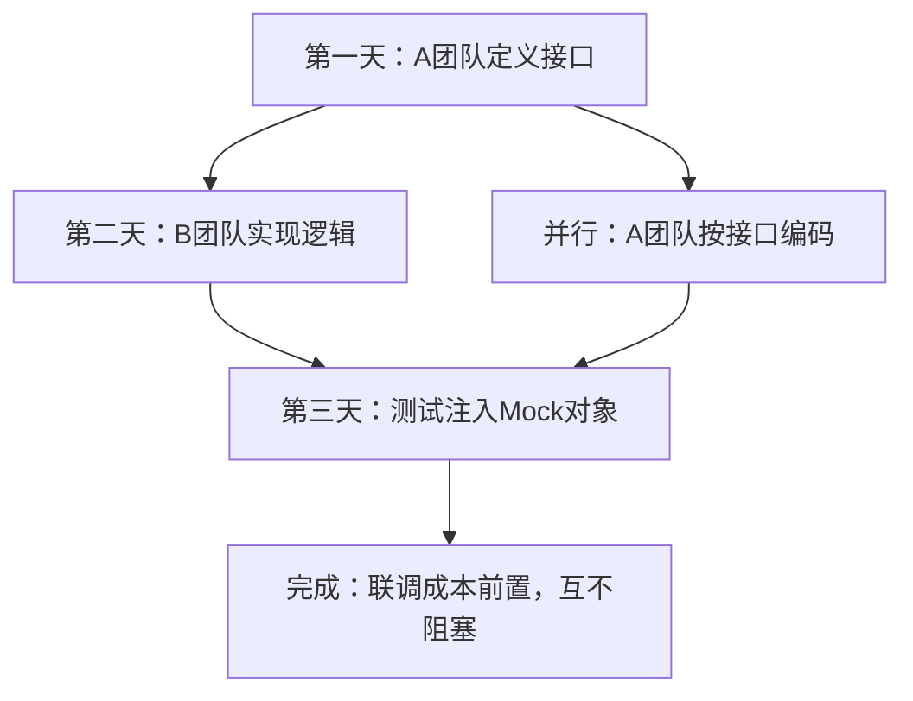

<!-- 控制性问题：为什么大型 Java 项目必须用接口代替直接 new 具体类？ -->

你在写订单服务时直接 `new SmsClient()`，切供应商或写测试时全得改。

**面向接口编程的本质，是用编译期契约强制解耦“能力定义”与“具体实现”，让跨团队开发不再互相阻塞。**

做 Spring Boot 项目时，A 团队负责订单流转，B 团队负责消息推送。如果没有接口，A 的代码里写死 `import com.xxx.SmsClient;`，B 还没写完代码，A 的 IDE 直接报红，CI 流水线挂掉。这就是强耦合带来的协作灾难。

Java 的 `interface`（接口：声明一组行为规范的关键字）就是为了解决这个问题设计的。它只规定“需要什么能力”，不暴露内部数据结构。类通过 `implements`（实现：类承担接口约定义务的关键字）接入后，必须补齐所有方法的实体逻辑。

这就引出一个问题——调用方到底该怎么用这个契约？

```java
// 1. 定义契约：只声明“需要什么能力”，不暴露内部状态
public interface MessageSender {
    // abstract 方法（抽象方法：只有签名没有方法体，强制实现类必须提供代码）
    void send(String content);
    
    // default 方法（默认方法：允许接口提供带花括号的方法体，实现类可选择不覆盖）
    default void validateContent(String content) {
        if (content == null || content.trim().isEmpty()) {
            throw new IllegalArgumentException("消息内容不能为空");
        }
    }
}

// 2. 实现契约：具体技术栈由不同团队或运行环境决定
public class EmailSender implements MessageSender {
    @Override
    public void send(String content) {
        System.out.println("执行邮件发送: " + content);
    }
}

// 3. 调用方：只依赖接口类型，彻底解耦具体实现
public class OrderNotifier {
    private final MessageSender sender;

    // 构造器传入接口引用，便于生产换实现、测试换 Mock
    public OrderNotifier(MessageSender sender) {
        this.sender = sender;
    }

    public void handleOrderSuccess(String orderId) {
        sender.validateContent(orderId);
        sender.send("[通知] " + orderId);
    }
}
```

看到这段代码你就明白了：**接口是团队交接的“行为清单”**。`OrderNotifier` 完全不关心底层是发邮件还是调 Webhook，它只认 `MessageSender` 这个契约。当 B 团队把阿里云短信换成腾讯云时，你只需要在启动配置里改一行实例化代码，业务逻辑一行不用动。

如果你熟悉 Vue 3 和 TypeScript，这就像你在 `<script setup lang="ts">` 里定义了一个 `interface MessageSender { send(msg: string): void; }`。前端组件通过 Props 把具体的 `{ send() {...} }` 对象传进去，子组件只写 `props.sender.send(id)`。两边都在用类型系统建立“能力边界”，上游只管“能做什么”，下游专注“怎么做”。区别在于，Java 的接口是编译期强校验且运行时无额外开销的静态契约，而前端的 TS 接口会在编译成 JS 后消失，运行时依赖的是动态对象结构。

理解了契约优先，再看多人协作就清楚了。第一天 A 团队提交接口定义到 Git；第二天 B 团队同步写实现类，A 团队直接用接口编码，双方互不等待；第三天测试同学传一个空实现的 Mock 对象就能跑通链路。这就是把联调成本从“运行时网络请求”前置到了“编译期类型对齐”。

**跨团队协作与解耦流程：**


但这里有个细节大多数教程会跳过，初学者极易踩坑：**接口里绝对不能写普通实例字段**。如果你在接口里写 `String configUrl;`，Java 编译器会默默把它变成 `public static final String configUrl = "";` 常量。接口只约束“行为契约”，不承载“数据状态”。想共享可变状态，请改用 `abstract class`（抽象类：提供部分实现并允许子类继承的类）。另外，手写实现时务必加上 `@Override`（重写标记：提示编译器检查方法签名是否匹配），否则拼错方法名只会悄悄生成一个新方法，不会报错。

回到最初的问题：大型项目为什么要用接口？因为人类团队的沟通带宽是有限的。接口用编译器的强制力，替你把“谁该交付什么”锁死在代码里。当你下次面对频繁变动的第三方 SDK 或并行开发的微服务时，记住这句锚点：**强制边界，编译器替你兜底**。先写好接口定义，再各自填空，你的代码库就不会长成互相引用的面条代码。

---

### 系列导航

**上一篇**：[Java类是Spring Bean的唯一载体](#)
**下一篇**：[Java继承是复用与扩展的双刃剑](#)

> 这是「前端工程师系统学 Java」系列第 32 篇，系统解读 Java 设计哲学（面向前端工程师）。
