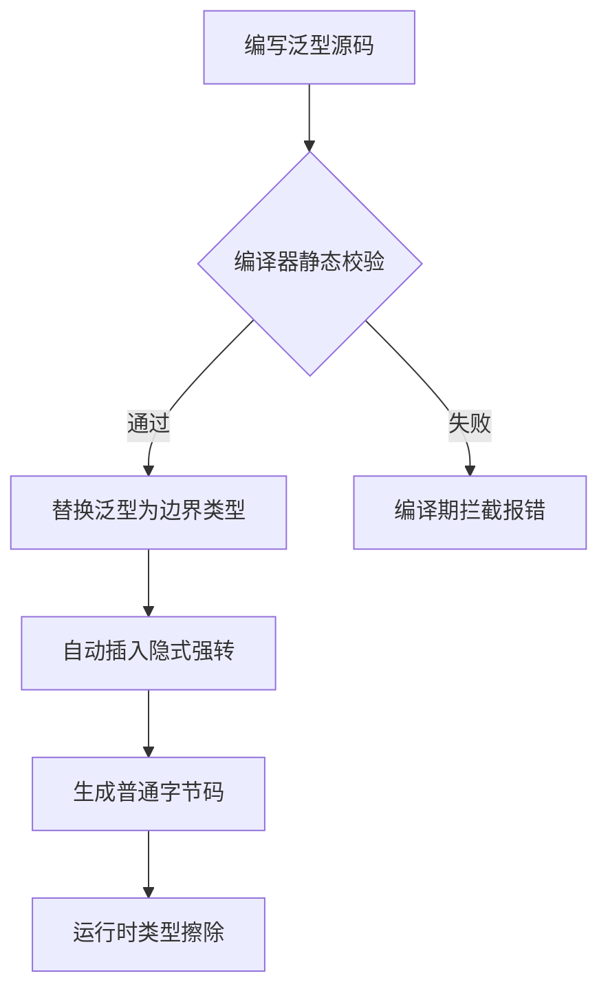

<!-- 控制性问题：Java 泛型为什么要在编译期强校验类型，却在运行时彻底擦除它？ -->

跨团队联调时，A 接口返回 `Result<Object>`，B 团队拿回去疯狂 `(User) result.getData()`，一旦上游传错类型，线上直接 `ClassCastException` 炸裂。核心论点：**Java 泛型用“编译期契约前置”换取了大型协作的确定性，而运行时擦除是向历史包袱妥协的工程最优解。** 记住这个锚点：**把“人肉契约审查”变成“机器自动校验”，代价是运行时交出具体类型的控制权。**

做中大型微服务或单体项目时，模块边界就是 API 边界。没有泛型之前，集合和返回值一律退化为 `Object`。调用方被迫承担类型校验责任，要么写满强转，要么靠文档注释约定。这种“裸类型（Raw Type）”依赖的是开发者的自觉性，在人员流动或需求变更时，契约会迅速漂移。泛型的出现，本质是把数据结构的内容类型固化到语言层面。只要方法签名写着 `List<Order>`，编译器就会在赋值处拦截所有非 `Order` 的尝试。它不改变运行时的内存布局，只在编译期生成检查指令。这就引出一个问题——既然要安全，为什么运行时不保留这些信息？

Java 5 引入泛型时，设计团队面临一个经典的两难：既要编译期类型安全，又要兼容过去十年积累的海量遗留代码。C++ 的模板系统在编译期为每种类型生成独立副本，导致编译时间呈指数增长，二进制文件体积庞大。C# 后来采用“装箱泛型”，在运行时保留完整类型信息，跨平台时有额外开销。Java 团队评估后，决定走折中路：不改动 JVM 的对象内存布局和指令集，仅在编译器做静态分析。

这就是**类型擦除（Type Erasure）**的底层逻辑。编译完成后，`<T>` 会被替换为它的第一个边界（默认 `Object`，若声明 `extends Number` 则替换为 `Number`）。编译器自动在赋值处插入隐式强转，确保类型安全由编译器兜底，而非 JVM 运行时拦截。对于架构师而言，这是一个典型的“用少量运行时灵活性换取全局生态稳定性”的决策。

**📊 泛型编译与类型擦除核心流程**


| 维度 | 说明 |
|---|---|
| **收益** | 编译期拦截类型错误；消除冗余强转；跨模块 API 契约可视化 |
| **代价** | 运行时丢失具体泛型类型；通配符增加认知负担；部分场景需反射穿透 |
| **历史包袱** | 旧版字节码完全兼容；GC 压力不增加；语言规范可预测 |

> 🔍 精确说明：擦除不是语言缺陷，而是 Java 保持向后兼容的必然选择。你写的 `List<String>` 编译后就是 `List`，JVM 根本不知道里面装的是什么。理解这一点，你就不会在运行时纠结 `getClass().getTypeParameters()` 为什么返回空数组。

理解了擦除，再看框架源码就清楚了。Spring Data JPA 的 `CrudRepository<User, Long>` 或 MyBatis-Plus 的 `BaseMapper<T>`，接口通过泛型绑定实体与主键。实现类必须显式声明具体类型，否则查询方法签名、条件构造器都无法正确推导 SQL 参数类型。HTTP 客户端拉取分页列表时，JSON 反序列化器如果只拿到 `class List`，也会丢失内部元素类型，导致嵌套字段映射失败。框架怎么解决？答案是**反射穿透**。

Java 规定匿名内部类的泛型参数签名会被编译器保留。Spring 等框架正是利用这一规则，通过继承泛型类并创建匿名子类，让反射 API 能抓取到完整的类型链。

```java
import java.lang.reflect.ParameterizedType;

public class GenericTypeUtil {
    // 利用匿名内部类保留泛型签名，反射可读取 ParameterizedType(参数化类型反射接口)
    public static class StringListRef extends GenericTypeUtil {}
    
    public static void main(String[] args) throws Exception {
        java.lang.reflect.Type genericSuperclass = StringListRef.class.getGenericSuperclass();
        ParameterizedType parameterizedType = (ParameterizedType) genericSuperclass;
        
        // 提取 <String> 的真实类型
        java.lang.reflect.Type actualType = parameterizedType.getActualTypeArguments()[0];
        System.out.println("解析出的实际类型: " + actualType); 
    }
}
```

这里有个细节大多数教程会跳过：`ParameterizedType` 之所以能工作，是因为编译器在生成匿名子类 `.class` 时，保留了父类的泛型形参映射表。RestTemplate 的 `ParameterizedTypeReference` 底层原理完全一致。继续往下走，你会碰到通配符与方向控制。`?` 代表未知类型。`<? extends T>` 限制上限，允许安全读取；`<? super T>` 限制下限，允许安全写入。这被称为 **PECS原则（Producer Extends, Consumer Super）**，本质是数据流向的安全约束。

```java
public class TypeBoundsDemo {
    // 只读场景：生产者扩展（Producer Extends）
    public double sumOfNumbers(List<? extends Number> numbers) {
        double total = 0;
        for (Number n : numbers) { 
            total += n.doubleValue();
        }
        return total;
    }

    // 只写场景：消费者超类（Consumer Super）
    public void fillBox(List<? super Integer> box) {
        box.add(1);   
    }
}
```

这就回到了我们的核心锚点：**把“人肉契约审查”变成“机器自动校验”，代价是运行时交出具体类型的控制权。** 通配符和反射黑魔法，都是在这个控制区内打补丁的工程实践。

如果你熟悉前端工程，这套机制对你来说并不陌生。TypeScript 泛型与 Java 的设计动机完全一致，底层实现均依赖编译器静态分析并在运行时丢弃具体类型信息。对应 Java 的 `Result<T>` 与跨模块 API 契约，Vue 3 用泛型绑定数据类型，杜绝下游盲目断言：

```vue
<script setup lang="ts">
export function useTypedFetch<T>(endpoint: string) {
  const data = ref<T | null>(null)
  // 编译器兜底：调用方未声明 T 时推断为 any，声明后赋值非 T 类型直接编译失败
  return { data }
}
</script>
```

对应 Java 的 `BaseMapper<T>`，React 将实体类型透传给框架层，使方法签名可自动推导：

```tsx
export function useTypedStore<T>(key: string) {
  const [data, setData] = useState<T>()
  return { data, setData }
}
```

共同本质：**将“动态类型的运行时猜测”前置为“静态类型的编译期契约”，用编译器的严格检查换取多人协作时的可维护性与防错能力。**

但差异也很明显。TS/JS 泛型在运行时完全擦除且无法像 Java 那样通过匿名内部类反射穿透获取类型元数据。前端若需运行时类型推导，通常依赖 Zod/Yup 等运行时校验库或装饰器元数据（如 NestJS/TypeORM），这与 Java 的反射路径完全不同。此外，Java 的 PECS 原则在前端 TS 中无直接语法映射（TS 只有单重泛型参数，不支持上下界通配符）；前端处理“只读/只写集合权限”通常依靠接口设计（`Readonly<T>`）或不可变数据结构。这说明两门语言在生态演进路线上做出了不同的取舍：Java 偏向底层反射能力复用，前端偏向运行时校验工具链补充。

理解了 X，再看 Y 就清楚了。作为架构师，在大型项目中做技术选型和代码规范制定时，必须明确泛型的适用边界。

**何时该用？** 集合容器、服务层返回值、DTO/VO 包装、仓储接口定义、任何需要明确“数据结构内容类型”的场景。对外暴露的公共 API 一律配合 `@NonNull` / `@Nullable` 注解，IDE 会实时提示，减少沟通成本。
**何时不该用？** 日志格式化（泛型对字符串拼接无意义）；基于类型的策略路由（如 `if (clazz == List.class)` 判断）；内部工具方法若确定类型固定，直接用具体类更清晰。

这里有一个高频踩坑点：滥用 `@SuppressWarnings("unchecked")`。只有在极少数无法避免的桥接方法（Bridge Method，编译器为支持泛型重写生成的合成方法）或向下兼容代码中使用，且必须附带 `// reason: ...` 注释说明为何编译器无法推导。严禁用它掩盖类型不安全。另一个经典陷阱是泛型数组创建：`new List<String>[10]` 会直接编译报错，因为 JVM 无法在运行时验证数组元素的泛型一致性，这是擦除机制下的安全红线。

最后回归那句老话：**把“人肉契约审查”变成“机器自动校验”，代价是运行时交出具体类型的控制权。** 在微服务治理中，泛型应作为模块间边界的默认契约。当你需要对具体类型走不同分支逻辑时，果断放弃泛型，改用多态或策略模式。当你只依赖行为接口而不关心具体特征时，泛型才是你的最佳拍档。架构的本质不是追求完美，而是在兼容性、开发效率与运行开销之间找到那个能让团队活得更久的平衡点。

---

### 系列导航

**上一篇**：[Java多态是Spring自动注入的底层机制](#)
**下一篇**：[Java接口实现：为什么必须显式声明implements](#)

> 这是「前端工程师系统学 Java」系列第35篇，系统解读 Java 设计哲学（面向前端工程师）。
