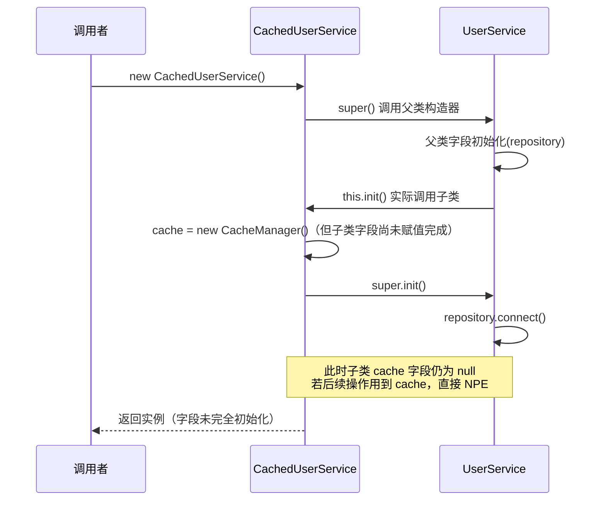
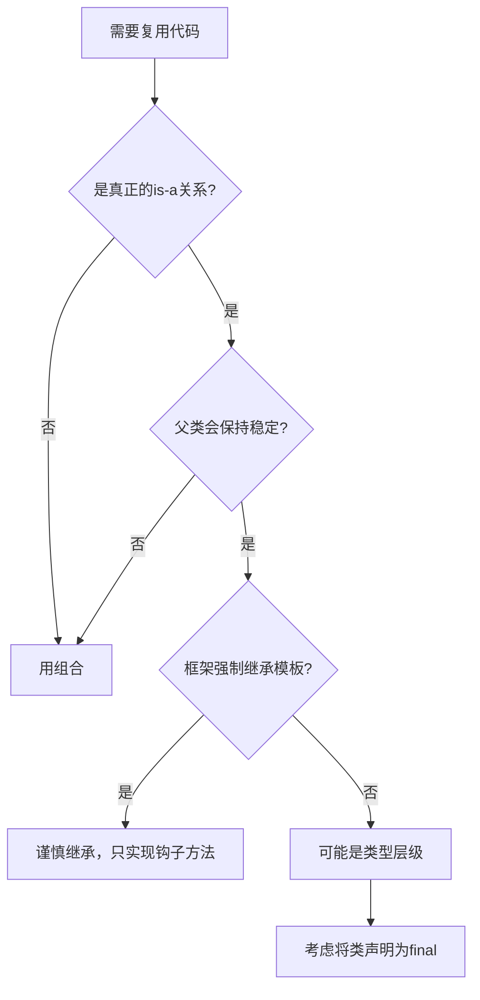

你在一个协作项目里写了个 `UserService`，后来需要加缓存，你写了 `CachedUserService extends UserService`。再后来需要加审计日志，你对着屏幕僵住了——Java 只支持单继承。更糟的是，两周后同事重构了父类的 `private` 字段初始化顺序，你的缓存功能静默失效，测试全绿，生产崩了。这不是你写错了代码，**这是你选择了继承来复用功能，而继承根本就不是为这个目的设计的。**

**记忆锚点：继承绑定的是实现细节，组合绑定的是抽象契约。**

---

## 继承的本质：编译期强绑定

当你在 Java 里写下 `extends`，你建立的不是“我使用你”的合作关系，而是“我就是你，只是多了点东西”的寄生关系。子类不仅是父类接口的消费者，更是父类实现细节的寄生者——父类的 `private` 字段怎么初始化、构造器执行顺序、`this` 逃逸时机，全都会穿透到子类。

这就引出一个被大多数教程忽略的关键问题：

```java
public class UserService {
    private UserRepository repository = new UserRepository();  // 字段初始化
    
    public UserService() {
        // 构造器里调用了可被重写的方法
        this.init();
    }
    
    protected void init() {
        repository.connect();  // 依赖 repository 已初始化
    }
    
    public User findById(Long id) {
        return repository.query(id);
    }
}

public class CachedUserService extends UserService {
    private CacheManager cache;  // 子类字段
    
    @Override
    protected void init() {
        cache = new CacheManager();  // 子类自己的初始化
        super.init();  // 此时父类的 repository 还没初始化完！
    }
}
```

父类构造器执行 `this.init()` 时，子类构造器还没执行，子类的 `cache` 字段还是 `null`，但子类的 `init()` 方法已经被调用了——因为 `this` 指向的是子类实例。这就是**构造器里的虚方法调用**：父类在构造器里调了一个方法，实际执行的是子类的重写版本，而子类的字段还没初始化。

**继承构造器陷阱：父类在构造中调用可重写方法，导致子类字段未初始化**



这个 bug 在单测里不一定触发（数据量小，缓存不命中走数据库也能跑），到了生产环境，并发上来了，`NullPointerException` 随机爆发。**继承让你对父类的每行代码都负有认知责任，而你不可能逐行审查框架和同事的父类实现。**

---

## 组合怎么解这个问题：从“我是你”到“我持有你”

组合不会魔法般地消除 bug，但它把“我是你”的强绑定降级为“我持有你”的弱依赖。类通过 `private final` 字段持有功能模块，这些模块是自己独立创建的对象，不是你寄生在身上的父类。

```java
// ✅ 组合方式：每个功能都是独立组件，没有穿透风险
public class UserService {
    private final UserRepository repository;
    private final CacheManager cache;
    private final AuditLogger audit;
    
    // 构造器注入：依赖从外部传入，类不负责创建依赖
    public UserService(UserRepository repository, 
                       CacheManager cache, 
                       AuditLogger audit) {
        this.repository = Objects.requireNonNull(repository);
        this.cache = Objects.requireNonNull(cache);
        this.audit = Objects.requireNonNull(audit);
    }
    
    public User findById(Long id) {
        User cached = cache.get(id);
        if (cached != null) {
            return cached;
        }
        User user = repository.findById(id);
        cache.put(id, user);
        audit.log("查询用户", id);
        return user;
    }
}
```

关键差异有三层：

**1. 初始化顺序由你控制。** 构造器注入保证所有依赖在对象创建时一次性赋值，不存在父类-子类的初始化时序问题。`Objects.requireNonNull` 在入口处拦截 null 依赖，失败立即抛出，不会静默运行八个月后随并发量爆发。

**2. 依赖显式化。** 看一眼构造器参数就知道这个类依赖哪些组件。继承链里你得从当前类跳到父类、再跳到父类的父类，用 IDE 的 "Find Usages" 一层层翻。组合的依赖清单就是构造器签名，一行代码就是一张契约列表。

**3. 隔离性。** 缓存模块的 bug 只影响缓存功能。`CacheManager` 内部重构、换 Redis 实现、调整淘汰策略，`UserService` 不用改一行代码。继承场景下，父类任何一个 `private` 方法的改动都可能通过重写的方法穿透到子类，触发“彼岸的蝴蝶”效应——父类改名一个私有变量，孙类的线上功能崩了。

**记忆锚点：继承暴露实现，组合暴露契约。**

---

## 前端看一眼就懂：Vue 3 的组合式函数

如果你写过 Vue 3，你一定经历过从 Vue 2 的 **mixins** 到 Vue 3 的 **Composables（组合式函数）** 的转变。这个转变背后的工程痛苦和 Java 社区从继承转向组合完全一致。

Vue 2 的 mixins 本质上就是“功能继承”——组件通过 `mixins: [cacheMixin, auditMixin]` 获取缓存和审计能力。当两个 mixin 都定义了同名的 `data`、`methods` 或生命周期钩子时，Vue 用一套优先级规则合并它们。你在组件里看到一个 `this.user`，根本不知道它来自哪个 mixin，想调试时只能全局搜索，期望别搜到十几个同名变量。

Vue 3 的组合式函数（Composables）是和 Java 组合模式设计动机完全一致（契合度 85%）的解决方案：

```javascript
// ✅ Vue 3 组合式函数：和 Java 构造器注入同理
import { useCache } from './composables/useCache'
import { useAudit } from './composables/useAudit'

export default {
  setup() {
    const cache = useCache()       // 像 Java 的 cache 字段
    const audit = useAudit()       // 像 Java 的 audit 字段
    
    async function findUser(id) {
      const cached = cache.get(id)
      if (cached) return cached
      const user = await fetchUser(id)
      cache.set(id, user)
      audit.log('查询用户', id)
      return user
    }
    
    return { findUser }  // 只暴露方法，不暴露内部状态
  }
}
```

`useCache()` 返回你需要的缓存能力，`useAudit()` 返回审计能力，它们的内部状态彼此隔离，不会像 mixin 那样污染同一个命名空间。这等价于 Java 里你 `new UserService(repo, cache, audit)`——每个依赖都显式声明，谁提供什么功能一目了然。

**但必须指出一个关键差异：** Vue/React 的组合是**逻辑层级的**——`useCache()` 返回的是响应式状态或函数，它可能被多个组件通过全局状态共享。Java 的组合是**对象层级的**——你注入的 `CacheManager` 是一个有完整生命周期的对象实例，它的生命周期跟随持有它的 `UserService` 实例。前端组合的是逻辑，Java 组合的是对象，这决定了在 Java 里你能对依赖做更精确的生命周期控制（例如 Spring 的 `@Scope("prototype")` 为每次注入创建新实例）。

React 的 Hooks 经历了同样的故事：社区被“高阶组件（HOC）地狱”折磨——为了给组件加认证、主题、日志，一层层包装，最后 props 来源散落一地。React Hooks 用 `useAuth()`、`useTheme()` 这类自定义 Hook 把可复用逻辑封装成独立函数，组件组合它们时不会产生层级嵌套。

> 🔍 精确说明：Vue 的组合式函数和 Java 的构造器注入在“依赖显式化”这一点上完全等价；但在生命周期管理上，Java 的组合对象是跟随宿主对象创建和销毁的，Vue 的组合式函数生命周期跟随组件实例。这个差异在你考虑线程安全和资源释放时需要特别注意。

---

## Spring Boot 中的继承陷阱：为什么框架都在规避继承

Spring 是一个用组合理念构建的框架，但你在日常使用中可能被引导进继承坑。下面这个场景，任何写过 3 个月以上 Spring Boot 的人都会遇到。

### 故障：AOP 代理在继承链上失效

Spring 的 `@Transactional` 和 `@Cacheable` 依赖 AOP 动态代理工作——Spring 为你的类生成一个代理对象，拦截方法调用，在方法执行前后织入事务管理和缓存逻辑。

当你用继承方式叠加功能时，代理行为会变得不确定：

```java
@Transactional
public class BaseUserService {
    public User findById(Long id) {
        return database.query(id);
    }
}

public class ExtendedUserService extends BaseUserService {
    @Override
    @Cacheable("users")
    public User findById(Long id) {
        return super.findById(id);
    }
}

// Spring 容器里存在两个 UserService 类型的 Bean：
// - baseUserService（被事务代理包裹）
// - extendedUserService（被事务 + 缓存双重代理包裹）
//
// 当 Controller 里 @Autowired UserService userService 时，
// Spring 按类型匹配，可能注入 baseUserService，也可能注入 extendedUserService。
// 如果注入的是 baseUserService，缓存注解根本不会生效——
// 因为调用的是 BaseUserService 的代理，不是 ExtendedUserService 的代理。
// 不会报任何错误，日志里也找不到线索，性能就是慢得莫名其妙。
```

这不是 Spring 的 bug。Spring 的 `@Primary`、`@Qualifier` 注解就是为了解决这种类型冲突，但根本问题在于**你用继承把两个 Bean 放在同一个类型层级里，然后在不同层级打了不同的 AOP 注解，代理生成行为依赖于 Spring 内部实现细节。**

**记忆锚点：不要把需要不同代理策略的类放进同一个继承链。**

用组合重写，职责边界清晰，代理目标明确：

```java
@Service
public class UserService {
    private final UserRepository repository;
    private final CacheService cacheService;
    
    public UserService(UserRepository repository, CacheService cacheService) {
        this.repository = repository;
        this.cacheService = cacheService;
    }
    
    // 核心查询不加任何 AOP 注解，保持纯粹
    public User findById(Long id) {
        return cacheService.getOrFetch(id, () -> repository.findById(id));
    }
}

@Service
public class CacheService {
    @Cacheable(value = "users", key = "#id")
    public User getOrFetch(Long id, Supplier<User> fetcher) {
        User cached = /* 查缓存 */;
        if (cached != null) return cached;
        return fetcher.get();  // 未命中时执行查询
    }
}
```

`@Cacheable` 注解打在 `CacheService` 上，而不是 `UserService` 上。Spring 为 `CacheService` 生成的代理只负责缓存逻辑，`UserService` 不需要任何 AOP 注解。**事务用同样的模式：把 `@Transactional` 打在独立的 Repository 组件上，或者用编程式事务管理，不要让继承层次决定代理边界。**

---

## 决策指南：什么时候可以忍受继承

组合不是教条。以下是你将决策规则化为动作时的明确路径。

**是否使用继承的决策流程**



**用继承的唯二正当理由：**

1. **你定义的是真正的类型层级。** `class Cat extends Animal`——猫是动物的一种，这个关系不会因为产品加了“缓存猫”的需求而改变。判断标准：你能坚定地说“B 是一种特殊的 A”，且这句话在未来三年不会变。

2. **框架强制你继承抽象基类，且框架明确承诺模板方法模式。** 例如 Spring 的 `AbstractController`（现在已不推荐，但你会在老项目里看到）。框架通过 `abstract` 基类定义稳定算法骨架，你只需要实现钩子方法，子类不接触框架内部状态。

判断标准就是一句话：**如果你写 `class B extends A` 时，功能叠加是你的真实目的，那继承用错了。功能修饰词不该成为类型名——`CachedUserService`、`AuditedUserService` 命名本身就暴露了设计问题。**

**团队强制执行建议（直接放进 Checkstyle 配置）：**

- 所有公开的 Service 类声明为 `final`，阻止意外继承。理由写在 JavaDoc 里：“此类设计为最终类，如需扩展请使用组合模式注入替代实现。”
- Checkstyle 配置 `<property name="max" value="1"/>` 限制继承深度。超过 1 层的继承链在 CI 阶段拒绝合并。
- 代码审查清单：Review 时看到 `extends`，要求提交者回答“这是一个类型层级还是功能复用？”不能 3 秒内给出明确答案的，标记为需要重构。

IntelliJ IDEA 的右键菜单里藏着一个利器：**Refactor → Replace Inheritance with Delegation**。它能自动把继承转成组合——生成委托字段、生成转发方法、用构造器注入替代 `super()` 调用。但自动重构后的代码需要你检查：IDE 生成的委托默认是成员字段的直接赋值，记得改成 `private final` + 构造器注入，保持依赖显式化。

---

组合让你付出的代价是**更多的类、更长的堆栈、更多的转发代码**。但这些代价是线性的——3 个功能就是 3 个组件。继承让你付出的代价是指数级的——N 层继承链上任意一层的改动都可能触发 N 个子类的静默故障。**在活过十个版本的商业项目里，继承链深度超过 2 层的模块，重构成本通常是组合方案的 3-5 倍。** 你现在多写三行委托代码，就是为你三个月后的自己省下一次凌晨三点的故障排查。