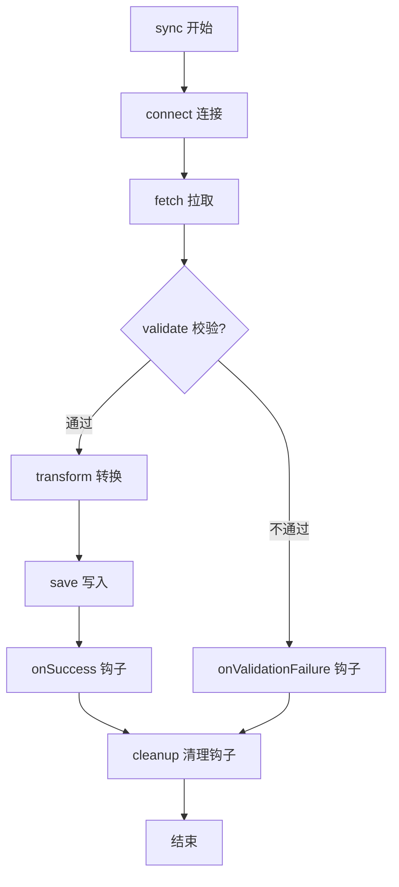

在一个多人协作的项目里，抽象类如何用编译期强制力锁定核心流程，同时允许每个开发者定制差异步骤？

```java
// 你的同事 A 写的代码
public class DbSyncProcessor extends DataSyncProcessor {
    // 忘了 override validate()，脏数据直接入库
    // 把 error 吞掉，日志也没打
    // 顺序？他觉得先 save 再 transform 也行
}
```

结果：脏数据进了生产库，凌晨三点你被报警叫起来排查。核心原因只有一句话：**当一个流程的骨架必须被多人遵守时，靠文档约定是靠不住的——你需要在编译期就把纪律写死。**

这就是 Java 抽象类要解决的根本问题：**强制边界，编译器替你兜底。**

---

## 骨架不可破坏：`final` 的锁死意义

多人协作时最大的痛点不是“别人写了烂代码”，而是“别人用一种你完全预料不到的方式破坏了你设计好的流程”。假设你设计的数据同步流程是：连接 → 拉取 → 校验 → 转换 → 写入。这个顺序之所以重要，可能是因为校验依赖原始格式、转换依赖校验通过后的数据完整性、写入依赖转换后的标准结构。

如果是一个普通的父类加上一堆可重写的普通方法，任何子类都可以轻松覆写 `sync()` 方法：

```java
// 危险：普通方法可以被子类任意重写
public class BaseSyncProcessor {
    public void sync() {  // 没有 final
        connect();
        fetch();
        // ...
    }
}

public class BadSyncProcessor extends BaseSyncProcessor {
    @Override
    public void sync() {
        // 呵呵，我觉得先写库再校验更快
        save(something);
        validate(something);  // 晚了，脏数据已经落库
    }
}
```

`final` 关键字就是专门解决这个问题的。当你用 `final` 修饰模板方法时，编译器会明白无误地告诉任何试图重写它的人：**这个流程结构不允许改动**。

```java
public abstract class DataSyncProcessor {
    // final = 流程骨架的不可篡改性写进了字节码
    public final void sync() {
        connect();
        Object rawData = fetch();
        if (validate(rawData)) {
            Object transformed = transform(rawData);
            save(transformed);
        }
    }
    // 子类只能实现这些，不能动 sync 的结构
    protected abstract void connect();
    protected abstract Object fetch();
}
```

这不是代码风格的选择，这是**架构约束的物理实现**。你在代码里表达的不再是建议或约定，而是一条规则——任何违反它的企图都会在编译期被阻止。

---

## 三步分层：`abstract`、`final`、`protected` 钩子的职责分工

理解了 `final` 锁死流程的意图，下一步就是定义流程中每个步骤的“自由度”。这正是 Java 抽象类设计最精妙的地方——它提供了三种访问级别，恰好对应三种协作角色。

**第一层：`abstract` —— 你必须做，而且必须用你自己的方式做**。  
抽象方法没有方法体，编译期会强制每个具体子类提供实现。这一步通常对应流程中“每个数据源完全不同”的环节，比如连接数据库和连接 REST API 的方式就没有任何共同点。

**第二层：`final` —— 你最好别动，这个流程我说了算**。  
这就是上面说的模板方法本身，它的顺序、条件判断逻辑、异常处理的外壳，都是架构师级别的决策，不允许子类介入。

**第三层：`protected` 钩子 —— 你可以插手，但只能在我允许的地方**。  
钩子方法（hook method）通常声明为 `protected`，提供一个默认空实现或默认行为。子类可以**选择性**地重写它们，但这不是强制的。

> 🔍 **精确说明**：`protected` 和 `abstract` 的核心区别在于**默认行为是否存在**。`protected` 钩子已经在父类写好了“如果子类什么都不做会怎样”的逻辑；`abstract` 连这个默认都没有，父类直接说“我不管，你自己想”。

实际代码中这三层的分工如下：

```java
public abstract class DataSyncProcessor {

    // 第二层：final 锁死流程
    public final void sync() {
        try {
            connect();                     // 第一层
            Object rawData = fetch();      // 第一层
            if (validate(rawData)) {       // 第三层钩子
                Object transformed = transform(rawData); // 第一层
                save(transformed);         // 第一层
                onSuccess();               // 第三层钩子
            } else {
                onValidationFailure(rawData); // 第三层钩子
            }
        } catch (Exception e) {
            handleError(e);                // 第三层钩子
        } finally {
            cleanup();                     // 第三层钩子
        }
    }

    // === 第一层：子类必须实现 ===
    protected abstract void connect();
    protected abstract Object fetch();
    protected abstract Object transform(Object rawData);
    protected abstract void save(Object data);

    // === 第三层：有默认行为，可选重写 ===
    protected boolean validate(Object rawData) {
        return true;  // 默认不校验，相信数据源
    }

    protected void onSuccess() { }  // 默认不通知

    protected void onValidationFailure(Object rawData) {
        System.err.println("Validation failed for: " + rawData);
    }

    protected void handleError(Exception e) {
        System.err.println("Error: " + e.getMessage());
    }

    protected void cleanup() { }
}
```

**下面这张图展示了 `sync()` 方法的固定骨架：调用顺序和决策点已被 `final` 锁死，子类只能实现空白步骤或重写钩子，无法改动流程结构。**



这个结构给团队协作带来的好处是：新人只需要读懂四个 `abstract` 方法的契约（连接、拉取、转换、写入），就可以上手写一个新数据源的接入，而完全不用理解后面的钩子系统。当他需要自定义校验或通知时，自然会去翻父类里有哪些 `protected` 方法可以重写。**母类的暴露面被精确控制了。**

这就是模板方法模式的精髓，也是抽象类在工程上最实际的用途。你给子类开发者的是一个“填空题”而不是“论述题”——框架问好了问题，他填答案即可。

---

## 如果你写过 Vue/React：流程壳子的另一种实现

如果你有前端背景，可能直觉上会觉得这种“固定流程骨架 + 填充差异步骤”的模式很像 Vue 的 Renderless 组件或者 React 的自定义 Hook。

以 Vue 3 的无渲染组件（它只提供逻辑，不渲染任何 UI）为例：

```vue
<!-- DataSyncWrapper.vue ———— 无渲染组件，只提供流程壳 -->
<script setup>
const props = defineProps({
  connect: { type: Function, required: true },   // 必须提供，类似 abstract
  fetch: { type: Function, required: true },
  transform: { type: Function, required: true },
  save: { type: Function, required: true },
  validate: { type: Function, default: (raw) => true }, // 有默认值，类似 protected 钩子
  onSuccess: { type: Function, default: () => {} }
})

// 骨架方法：步骤顺序固定
const performSync = async () => {
  props.connect()
  const rawData = await props.fetch()
  if (props.validate(rawData)) {
    const transformed = props.transform(rawData)
    await props.save(transformed)
    props.onSuccess()
  }
}
</script>

<template>
  <slot :sync="performSync" />  <!-- 把流程控制权暴露给使用者 -->
</template>
```

业务方使用时，只需要把自己的实现函数以 props 形式传入：

```vue
<template>
  <DataSyncWrapper
    :connect="connectToApi"
    :fetch="fetchFromApi"
    :transform="transformData"
    :save="saveToTarget"
  >
    <template #default="{ sync }">
      <button @click="sync">一键同步</button>
    </template>
  </DataSyncWrapper>
</template>
```

从这个角度看，前端和后端都解决了同一个问题：**把一个多步骤的复杂流程封装起来，让使用者只关注差异化部分。**

但类比到此为止。一旦你深入，就会发现本质差异：

**Java 的 `abstract` 在编译期强制，前端的 `required: true` 在运行时才发现**。如果你的同事忘了在 Vue 组件上传 `fetch` 这个 prop，只有等到用户点下“一键同步”按钮、代码执行到调用 `props.fetch()` 那一行时才会报错。而 Java 在写 `class RestApiSyncProcessor extends DataSyncProcessor` 时，如果没有实现 `fetch()` 方法，IDE 会立刻标红，编译直接失败。

**Java 抽象类可以有实例字段，前端组件之间没有“状态继承”**。抽象父类可以定义一个 `protected ConnectionPool pool` 字段，在 `connect()` 中初始化，在 `fetch()` 和 `save()` 中复用。所有子类自动拥有这个字段，且不需要额外传参。而 Vue 组件之间是纯粹的组合关系，没有任何共享的实例状态——如果多个 props 函数需要共用同一份连接，使用方必须自己在外部管理它。

**Java 的 `final` 从字节码层面锁死了流程，前端的函数壳子可以被轻易绕过**。Vue 的 `DataSyncWrapper` 提供了一个 `performSync` 方法，但使用方完全可以不调用它，而是自己重新写一个流程。Java 的 `final` 方法则让这个念头在编译期就被掐灭。

这就是契合度 65% 的含义：前端类比可以帮你**快速建立直觉**（“原来就是一个流程壳子”），但不适合用来解释抽象类更深层的继承语义和编译期安全性。这两个特性，正是 Java 设计者选择“继承”而不是“组合”来实现模板方法的原因。

---

## 设计决策：什么时候该掏出抽象类

上面讲的是“抽象类怎么用”，接下来是更关键的问题——“什么时候该用”。这个决策如果做错，代码要么过度约束导致难扩展，要么约束不足导致流程碎片化。

**该用抽象类的场景：**

- **流程本身是核心资产**。数据同步、支付路由、审批流转这类流程，顺序和步骤本身就是业务规则，不允许被歪曲。把流程锁死在抽象父类里，等同于把业务规则写成了可执行代码而非文档。
- **多个步骤需要共享状态**。比如一个连接池在 `connect()` 中初始化，在 `fetch()` 和 `save()` 中使用——这些状态天然属于父类，子类通过继承自动获得，无需通过构造器或 setter 层层传递。
- **你需要给子类明确的“允许修改/禁止修改”指令**。接口不具备这个能力——接口的任何方法都是公开可实现的，没有 `final`，没有 `protected` 的粒度。

**不该用抽象类的场景：**

- **只需要行为契约，没有共享流程或状态**。比如你自己项目里定义了一个 `PaymentService`，不同支付渠道的实现之间没有共同的流程骨架，只有“都得有支付和退款方法”这个约定。这时用接口，让实现类自己决定内部结构。
- **继承链已经占用**。Java 单继承，如果一个类已经继承了其他父类，你就无法再让它继承你的抽象模板。此时两个选择：要么把模板逻辑抽到一个独立的策略对象中，用组合方式接入；要么重新审视继承层次，看看是不是父类本身就不该占用唯一的继承位。
- **流程的动态性太高**。比如步骤的顺序、数量、组合完全由运行时配置决定，不同场景差异极大。这种情况下，把一个固定的骨架刻进抽象类反而会成为阻碍——你每次改动流程都得修改父类，而父类的变更又会强制所有子类重新编译和测试。此时应该考虑责任链、工作流引擎或组合+策略模式。

下表汇总了决策时最关键的几个维度，帮助你快速判断此时该用抽象类还是接口：

| 决策维度 | 使用抽象类 | 使用接口 |
|----------|-----------|---------|
| 需要强制流程骨架 | ✅ `final` 锁死步骤顺序 | ❌ 无法约束调用流程 |
| 多个步骤共享实例状态 | ✅ 通过继承获得字段 | ❌ 接口不允许实例字段 |
| 明确约束子类可改/不可改的部分 | ✅ 三级访问控制 | ❌ 所有方法默认公开 |
| 仅需行为契约，无共享实现 | ❌ 过度设计 | ✅ 纯粹的抽象契约 |
| 类已继承其他父类 | ❌ Java 单继承限制 | ✅ 可实现多个接口 |
| 流程动态多变 | ❌ 固定骨架成为阻碍 | ✅ 组合+策略更灵活 |

---

## 真实踩坑：钩子调用时机的隐式契约

即使抽象类设计得再完美，还有一个几乎所有初学者都会忽视的问题：钩子方法的**调用时机**在父类里是写死的，但**子类在重写钩子时可能对调用时机有错误的假设**。

看一个真实例子：

```java
public abstract class AbstractImporter {
    private List<String> errors = new ArrayList<>();

    public final void importData() {
        preValidate();  // 钩子，子类可能在这里初始化一些资源
        parseFile();
        postValidate(); // 钩子，子类可能依赖某些状态已就绪
    }

    protected void preValidate() { }  // 默认空实现
    protected abstract void parseFile();
    protected void postValidate() { }
}
```

某天子类开发者重写了这两个钩子：

```java
public class CsvImporter extends AbstractImporter {
    private CsvParser parser;

    @Override
    protected void preValidate() {
        // 他假设文件已经解析完了，可以校验 schema
        parser.getHeaders(); // 💥 NullPointerException，parser 还没初始化
    }

    @Override
    protected void parseFile() {
        parser = new CsvParser(...); // 这里才初始化
    }
}
```

错误原因：子类开发者在重写 `preValidate()` 时，没有去读父类 `importData()` 的流程代码，他凭直觉认为“校验嘛，肯定在解析之后”。但父类的设计者把 `preValidate` 放在了 `parseFile` 之前，意图是让子类做“文件格式检查”，而不是“数据内容校验”。

这个坑的根源在于：**钩子的语义是父类定义的，但实现是子类写的。** 桥接两者的只有父类的 Javadoc 或团队内部文档。而文档很容易被忽略。

**怎么避免：**
1. 在父类的每个钩子方法上写清楚 Javadoc，说明“这个方法在哪个步骤之前/之后被调用，此时哪些状态已经就绪，你不应该在这个方法里做什么”。
2. 阅读子类代码时，如果看到钩子被重写，第一时间检查它对调用时机的假设是否与父类一致。
3. 考虑给钩子方法命名时带上时序暗示，比如 `beforeParse()` 和 `afterParse()`，而不是模糊的 `preValidate()`。

---

**强制边界，编译器替你兜底**——这个记忆锚点可以帮你做决策。每当你在项目中设计一个需要多人遵循的流程时，不要写文档去解释顺序，直接在抽象类里用 `final` 把顺序刻死，用 `abstract` 标明差异点。剩下的，交给编译器。