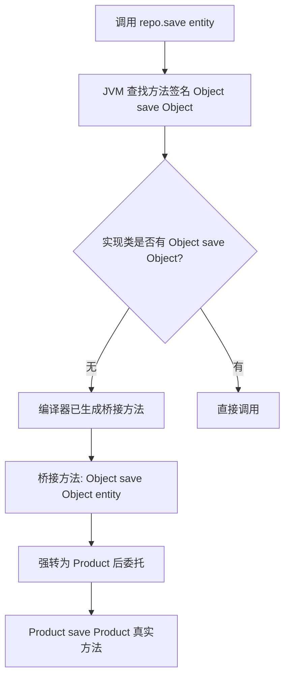

你正在观察一个 Spring Data JPA 项目的仓库接口。`UserRepo` 没有一行实现代码，但当你输入 `userRepo.findByName("zhangsan")` 时，IDE 自动补全返回类型就是 `Optional<User>`，而不是需要强转的 `Object`。这就是泛型类在 Java 工程中的核心魔术——**编译期，它帮你用强类型约束了一套通用逻辑；在运行时，这些约束几乎是零成本的。**

但你可能也踩过它的坑：无论如何尝试 `new T()` 都会编译失败，或者发现某个反编译器里多出两个名字一模一样的方法，一个是 `User save(User)`，另一个是 `Object save(Object)`。这些看似奇怪的行为，最终都指向 Java 泛型设计的一个根本决策：**用编译期验真置换运行时的类型自省**。

## 一个被类型擦除蒙住的 bug

这里有一个真实会发生的例子。考虑这段在 Spring 里很常见的代码：

```java
interface GenericRepository<T, ID> {
    <S extends T> S save(S entity);
    Optional<T> findById(ID id);
}
```

现在你为 `Product` 实体写一个实现：

```java
class ProductRepository implements GenericRepository<Product, Long> {
    @Override
    public Product save(Product entity) {
        System.out.println("Saving product: " + entity.name);
        return entity;
    }
    @Override
    public Optional<Product> findById(Long id) {
        return Optional.of(new Product(id, "default"));
    }
}
```

你可以像这样测试多态调用：

```java
GenericRepository<Product, Long> repo = new ProductRepository();
// 问题出在这一行：你存了一个 Product，它同时也必须是 Product 的子类型 S
Product saved = repo.save(new Product("测试商品"));
```

这里不会抛异常，但如果你试图让 `save` 方法在 `GenericRepository` 层面丢失类型信息，编译期就会直接拦截——这正是泛型的「前置断尾」机制。

但这个设计不止于此。用反射看一下实现类的方法表：

```java
for (Method m : ProductRepository.class.getDeclaredMethods()) {
    if (m.getName().equals("save")) {
        System.out.println(m);                        // 方法签名
        System.out.println(m.isBridge());             // 是不是桥接方法？
    }
}
```

你会看到两个 `save` 方法：一个返回 `Product`，一个返回 `Object`。后者被标记为桥接方法——不是手写的，而是编译器为了维持 JVM 层面的正确分派自动生成的。这里就引出一个核心记忆锚点：**类型擦除把 T 变成了 Object，桥接方法是 JVM 仍能正确调用你写的那个具体类型版本的唯一途径。**

## 为什么 Java 不把泛型留到运行时？

Java 1.4 时代，所有集合都是原始类型。你从 `ArrayList` 里取一个元素，必须写 `(User) list.get(0)`。一旦有人往同一个列表里塞了个 `Order` 对象，编译器不会吭声——崩溃要等程序跑到那行强转时才发生。这种「距放错对象十万八千里外才炸」的错误，是早期 Java 项目线上事故的重要来源。

解决思路有两种：
1. **C++ 模板路径**：为每种类型参数组合生成全新的类。`ArrayList<User>` 和 `ArrayList<Order>` 在运行时是两个不同的类，类型信息完整保留，代价是编译产物体积暴涨、编译速度慢。
2. **带擦除的泛型**：只在编译器维护类型参数，所有泛型类在运行时共享同一份字节码。`ArrayList<String>` 和 `ArrayList<Integer>` 在运行时都是同一个 `ArrayList` 类。

**两种泛型实现方案的对比**

| 对比维度 | C++ 模板路径 | Java 带擦除的泛型 |
|---------|-------------|------------------|
| 运行时类型信息 | 完整保留，每种参数化类型独立类 | 擦除，所有泛型类共享一份字节码 |
| 编译产物体积 | 体积膨胀，编译速度慢 | 几乎零开销，编译快 |
| 二进制兼容性 | 需重新编译所有依赖 | 向后兼容旧类库，平稳过渡 |
| 运行时反射 | 可获取具体类型参数 | 部分保留（通过 Signature 属性） |
| 使用限制 | 无 `new T()` 限制 | 无法 `new T()`、`instanceof` 或创建泛型数组 |

Java 团队选择路径 2，有一个特别工程化的考虑：**必须在运行时与 1.4 时代的类库做到二进制兼容。** 已经部署并运行的旧 `ArrayList` 代码不能因为引入泛型就崩溃。擦除方案让它能平稳过渡——新代码享受编译期安全，旧代码照常运行。

付出的代价是什么？运行时没有了 T 的具体信息，这就是为什么 `new T()` 永远是非法的。不能再 instanceof 检测泛型参数类型，也不能创建泛型类型的数组 `new T[10]`。

但 Java 的设计者并没有把所有信息都擦掉。每一处**泛型接口或超类上的具体类型参数都会被写入字节码的常量池**，存在 `Signature` 属性里。这正是 Spring 能通过 `ResolvableType` 在运行时反推出 `UserDao extends GenericDao<User, Long>` 中具体类型参数的原因。

## 桥接方法：多态遇上擦除的必然产物

当你写下 `GenericRepository<Product, Long> repo = new ProductRepository()` 并调用 `repo.save(...)`，JVM 内部的分派逻辑是：

- `GenericRepository` 里的 `save` 方法签名在编译后被擦除为 `Object save(Object)`
- `ProductRepository` 里你写的那个方法签名是 `Product save(Product)`
- 这两个在 JVM 眼中是**不同参数类型、不同返回值类型**的两个方法，根本没有重写关系

如果 JVM 不能在 `ProductRepository` 里找到与接口签名完全匹配的 `Object save(Object)`，它就会去父类实现里找，或者直接报 `AbstractMethodError`。

**桥接方法的工作原理**



所以编译器在字节码生成阶段做了一个手术：为你手写的 `Product save(Product)` 生成一个**合成方法**，也就是桥接方法：

```java
public Object save(Object entity) {
    return this.save((Product) entity); // 内部强转，然后委托给你手写的版本
}
```

这个方法的责任就是把 JVM 层面的分派无缝引导到你写的具体类型版本上。你不需要手动写它，但当你通过反射来解析注解或 AOP 织入时，会看到它的存在。Spring 在扫描 Repository 时，要正确地把 `isBridge()` 过滤掉，才能拿到真正业务关心的那个方法。

> 🔍 **精确说明**：桥接方法不仅处理参数类型，还处理返回类型的协变。当接口泛型声明 `<S extends T> S save(S entity)`，编译器在实现类中生成了返回类型为 `Object` 的桥接方法，它会内部调用了返回类型为 `Product` 的真实方法，然后又将结果向上转型交给调用方。

## TypeScript 的泛型类比：擦除的同与异

如果你写过 TypeScript，Java 泛型类的设计你几乎可以无缝上手。**两者的核心动机都一致：一套代码，多种类型，编译时保证安全**。

比如在 Vue 3 项目中，你会这样封装 API 层：

```typescript
class ApiRepository<T> {
  constructor(private baseUrl: string) {}
  async getAll(): Promise<T[]> {
    const res = await fetch(this.baseUrl);
    return res.json(); // TypeScript 锁定返回必须是 T[]
  }
}

// 绑定 User 类型——就像 JpaRepository<User, Long>
const userRepo = new ApiRepository<User>('/api/users');
const users = ref<User[]>([]);
userRepo.getAll().then(data => (users.value = data));
```

在 Java 中你写 `interface UserRepo extends JpaRepository<User, Long>`，Spring 通过 `Signature` 反射拿到 `User` 和 `Long`，自动生成实现。TypeScript 里 `new ApiRepository<User>` 后，所有方法的入参和出参都被锁定为 `User`，编译器在你传错类型的一瞬间就能报错。

但两者在**运行时的行为上有根本差异**。TypeScript 编译成 JavaScript 后，所有类型声明都擦除了。你在运行时不通过任何方法（除非手动传入类型标记）能知道 `repo` 里的 `T` 是什么。而 Java 保留了 `Signature` 属性，让 `UserDao extends GenericDao<User, Long>` 这段信息在字节码里依然可查。Spring 正是利用这一点，在容器启动时通过 `GenericTypeResolver` 读取这个属性，获取实体类型和 ID 类型，生成动态代理并校验自定义查询方法。

所以类比成立的部分是：编译期安全、消除强转、框架复用通用逻辑。不成立的部分是：运行时类型反射——Java 保留了局部信息，TypeScript 全部丢弃。如果你从 TypeScript 转到 Java，这个「运行时还有一部分信息残留」的反直觉之处，一定要记住。

## 这是强制约束，不是语法糖

回到最开始的场景。当你操纵一个 60 多个实体的中大型项目，某天产品经理要求「给所有具备软删除标记的实体，在仓库层统一提供一个 `findAllActive()` 方法」。有泛型类，你只需在基类里加 3 行代码：

```java
public interface ActiveableRepository<T, ID> extends JpaRepository<T, ID> {
    @Query("SELECT e FROM #{#entityName} e WHERE e.deleted = false")
    List<T> findAllActive();
}
```

让所有实体仓储继承它即可。没有泛型类，你需要逐个修改 60 个接口，并且类型安全要依赖大量的向下转型。

**泛型类的根本价值不是消除几个括号，而是让一套约束在编译期就覆盖了整个代码树。** 任何违反约束的操作都被挂起在 CI 阶段，不让它流到生产环境。

> 🔍 **设计权衡**：每当你在 Java 里为通用行为建模时，问问自己——这个类是应该用泛型，还是应该用继承？答案是：如果一组类型共享同一套算法逻辑，但各自操作的数据类型不同，泛型是正确选择。如果它们共享同一套字段和行为，但各自实现不同，那么继承和接口才是正确选择。泛型解决的是「相同的操作逻辑，不同的操作对象类型」问题。

## 实践中的三个告诫

1. **禁止任何原始的泛型类型出现在你的代码里**。在 IntelliJ IDEA 中把 "Raw use of parameterized class" 检查级别设置为 Error。一旦你写了 `List list = new ArrayList()` 而不是 `List<String> list = new ArrayList<>()`，IDE 就会拒绝编译。这是从工具层面切断 `ClassCastException` 来源的最有效办法。

2. **自定义 FactoryBean 或实现泛型接口时，确保正确返回泛型感知的类型。** 可以用 Spring 的 `ResolvableType` 来构建准确的返回类型描述，这样容器就能在启动时对依赖注入进行验证：
   ```java
   @Override
   public Class<?> getObjectType() {
       return ResolvableType.forClassWithGenerics(
           getClass(), GenericRepository.class
       ).resolve();
   }
   ```

3. **不要因为看到了桥接方法就去掉方法的泛型修饰。** 桥接方法是你多态性的保护罩，去掉 `<S extends T>` 会导致子类重写失效。如果你通过反射遍历方法时遇到重复，用 `Method.isBridge()` 过滤就好。

## 什么时候泛型不是答案

当你在写代码时，谨防两个陷阱：

- **深层嵌套的泛型签名**。`Map<String, List<Map<Integer, Future<String>>>>` 这样的签名，即便编译器接受，也会在代码评审会里被指出。可以适当引入包装类或中间类型来拆解它。
- **不要为了一两个实例就抽象出泛型**。如果你只有一处使用点，泛型只会让阅读者徒增认知负担。等到第三处同样的逻辑出现时再重构，这才是合理的时机。

一句话锁死本文的记忆锚点：**Java 泛型类通过编译期检查和类型擦除的妥协，给你零开销的类型安全，同时把错误从运行时移到了编码阶段——而桥接方法和 Signature 属性，是这个妥协方案下维持多态性与框架反射的工程保障。** 理解了这两个机制，你就能在写框架、排查线上异常、或审阅代码时，看清那些看似古怪的行为背后的必然逻辑。