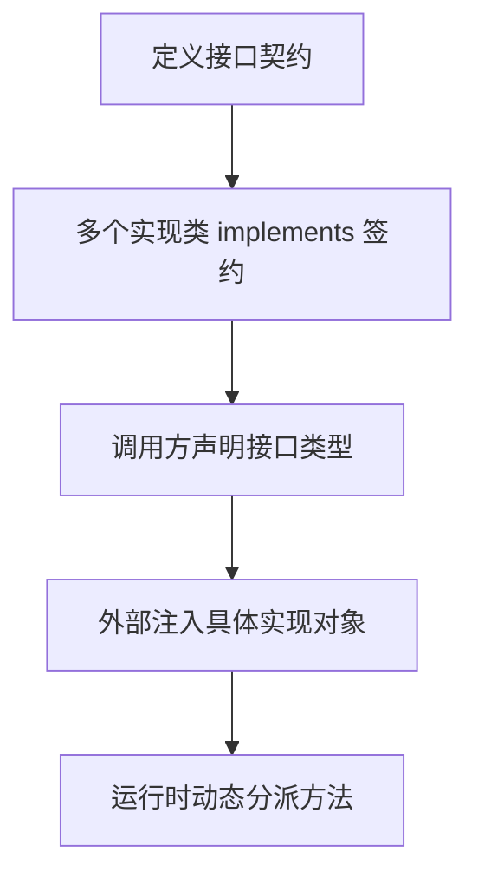

<!-- 控制性问题：Java 的接口多态和前端用 TypeScript 定义 props 传对象，到底是不是一回事？ -->

```java
// 一个脆弱的订单服务
public class OrderService {
    public void placeOrder() {
        System.out.println("订单已保存");
        new EmailSender().send("您的订单已生成！"); // 直接依赖具体类
    }
}
```

这段代码有个致命问题：明天产品经理让你加短信通知，你得改 `OrderService`；测试同事让你别真发邮件，你还得改 `OrderService`。**接口多态就是来解决这个的——让代码只依赖“能干什么”的约定，不依赖“谁来干”的具体实现。**

> **记忆锚点：强制边界，编译器替你兜底。** 接口划出一条红线，所有实现类必须在红线内行事，否则编译直接报错。

## 你在前端其实早就用过了

如果你写过 Vue 3 + TypeScript，下面的模式你一定不陌生：

```typescript
// 1. 定义契约
interface Notifier {
    notify(msg: string): void;
}

// 2. 组件只认接口，不认具体实现
const props = defineProps<{
    notifier: Notifier;  // 运行时谁传进来，就用谁的方法
}>();

function placeOrder() {
    props.notifier.notify('订单已生成');
}
```

这里的逻辑链条是：**组件声明它需要一个“能通知”的对象 → TypeScript 在编译期检查传入对象有没有 `notify` 方法 → 运行时浏览器根据传入的具体对象执行对应的 `notify`。** Java 的接口多态走完全相同的三步，只是语法不同。

## Java 怎么定义这个契约

Java 用 `interface`（接口——一套纯粹的方法签名约定，不含任何实现代码和状态）来干这件事：

```java
// NotificationService.java
public interface NotificationService {
    void sendNotification(String message); // 只声明能力，不实现
}
```

接口里只有方法签名，没有方法体，也没有成员变量。它就是一份纯合同——签字方必须实现这些方法，少一个编译器都不让过。

## 两种实现类，运行时随意换

有了合同，我们就可以写两个“签约方”。用 `implements`（实现——类对接口承诺“我会提供这些方法的具体代码”）关键字：

```java
// EmailNotificationService.java
public class EmailNotificationService implements NotificationService {
    @Override   // 告诉编译器：我在实现接口的方法，帮我校验签名对不对
    public void sendNotification(String message) {
        System.out.println("发送邮件: " + message);
    }
}

// SmsNotificationService.java
public class SmsNotificationService implements NotificationService {
    @Override
    public void sendNotification(String message) {
        System.out.println("发送短信: " + message);
    }
}
```

现在重写 `OrderService`，让它只依赖接口：

```java
public class OrderService {
    private final NotificationService notifier;  // 声明为接口类型

    public OrderService(NotificationService notifier) {
        this.notifier = notifier;  // 具体谁来做，由外部决定
    }

    public void placeOrder() {
        System.out.println("订单已保存");
        notifier.sendNotification("您的订单已生成！");
    }
}
```

运行时传入不同实现，行为自动改变：

```java
// Main.java
public class Main {
    public static void main(String[] args) {
        // 用接口类型接收一个具体实现类
        NotificationService emailService = new EmailNotificationService();
        OrderService order1 = new OrderService(emailService);
        order1.placeOrder();  // 输出：发送邮件...

        NotificationService smsService = new SmsNotificationService();
        OrderService order2 = new OrderService(smsService);
        order2.placeOrder();  // 输出：发送短信...
    }
}
```

> 🔍 精确说明：变量 `emailService` 的声明类型是 `NotificationService`（编译期看这个），但它实际指向的是 `EmailNotificationService` 对象（运行期看这个）。调用 `sendNotification` 时，JVM 会根据实际对象的类型动态找到并执行对应的方法——这就是多态。

## 测试替身：接口多态最实在的好处

不需要改 `OrderService` 一行代码，就能注入一个假的实现来跑单元测试：

```java
public class MockNotificationService implements NotificationService {
    @Override
    public void sendNotification(String message) {
        System.out.println("Mock 通知: " + message); // 不发真实消息
    }
}

// 测试时
OrderService testService = new OrderService(new MockNotificationService());
testService.placeOrder();  // 只输出 Mock 通知，不连外部系统
```

**强制边界，编译器替你兜底**——任何实现了 `NotificationService` 的类，编译器都强制它必须提供 `sendNotification` 方法。你不可能传进一个“假装实现了但实际没有这个方法”的对象。

**接口多态的核心流程：从契约定义到运行时派发**



## 和前端做一次精确对照

| 前端（Vue 3 + TypeScript） | Java 接口多态 |
|---|---|
| `interface Notifier { ... }` | `interface NotificationService { ... }` |
| `const alertNotifier: Notifier = { ... }` | `class EmailNotificationService implements NotificationService` |
| `defineProps<{ notifier: Notifier }>()` | `private final NotificationService notifier` |
| `<MyComponent :notifier="alertNotifier" />` | `new OrderService(new EmailNotificationService())` |
| 传 `jest.fn()` 做 mock | 注入 `MockNotificationService` |

一个区别需要注意：Java 要求用 `implements` 关键字显式声明“这个类实现了哪个接口”，编译器才能做校验。前端中对象字面量只要形状匹配就算是通过，不需要显式声明。但运行时分派的效果完全一致。

## 一个初学者必踩的坑

你可能想：“既然接口可以多实现，那我把 `NotificationService` 声明成变量直接用行不行？”

```java
NotificationService notifier = new NotificationService(); // ❌ 编译错误！
```

**接口不能实例化。** 它只是一纸合同，不是能够干活的对象。你必须 `new` 一个实现了该接口的具体类（叫实现类），然后用接口类型的变量去接收它。编译器阻止你直接 `new` 接口，也正是为了保证运行时分派永远不会落空——变量指向的必然是一个包含实际方法代码的对象。

修正：

```java
NotificationService notifier = new EmailNotificationService(); // ✅
```

## 什么时候该用，什么时候别硬套

**该用的信号：**
- 一个行为明确存在多种实现（发邮件 / 发短信 / 测试替身）
- 你需要模块之间解耦，让上下游团队根据合同并行开发
- 即使只有一种实现，但测试时必须替换掉外部依赖

**不该用的信号：**
- 永远只有一种实现，且测试不需要 mock（比如纯数据转换工具类）
- 小项目内部工具，抽接口后理解成本明显上升而收益极低

回到开篇的问题：**Java 的接口多态和前端用 TypeScript 定义 props 传对象，是不是一回事？** 工程动机 100% 一致——都是“把做什么和谁来做彻底分开”，编译期检查契约，运行期动态分派。Java 多了一层 `implements` 的显式声明和“接口不能实例化”的编译器强制，但底层思想你早已掌握。

**强制边界，编译器替你兜底。** 你只管声明要什么能力，至于谁来提供这个能力，运行时再说。