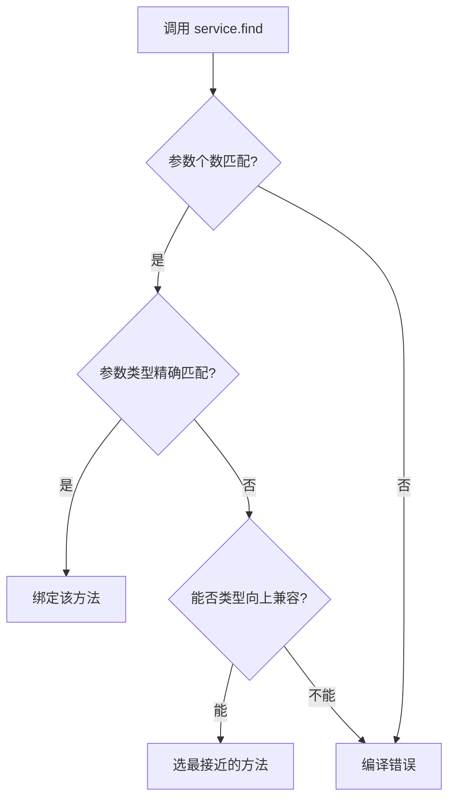

做订单服务时，你一定会写出这种需求：同一个“查询订单”操作，要支持按订单 ID 查、按用户 ID 查，甚至按用户 ID 加时间范围查。  
如果每个变体都起不同名字——`findById`、`findByUserId`、`findByUserIdAndTimeRange`——调用方很快就被淹没在名字海洋里，新同事接入得翻半天文档。  
**Java 给出的解是方法重载：同名方法，不同参数列表，编译器在编译期就替你选好该调哪个版本。** 它没有选默认参数那条路，而是让每套参数都显式定义一个独立方法——这本质上是一份**编译期的静态合同**，把参数检查从运行时提前到了编译期，让团队协作中的隐式耦合无处藏身。

## 为什么是重载而不是默认参数？

你如果写过 Python 或者 TypeScript，可能习惯了在函数签名里给参数设默认值：`def find(user_id, start=None, end=None)`，调用时可以省掉 start 和 end，看上去很省事。Java 的设计者当年故意不做这个。不是因为懒，而是因为**默认参数会把方法签名和默认行为绑死**。

设想一个真实场景：你的 `find(Long userId, Date start, Date end)` 最初让 end 默认取当前时间。几十个调用方都依赖这个默认行为。后来产品说“默认 end 要改成 null 表示不限制结束时间”——你怎么办？改默认值会悄悄改变所有那些调用方的语义，编译器还不会报错，只能靠测试或线上故障发现。这在一个多人协作的 Spring Boot 项目里，几乎等于埋了一颗雷。

Java 的选择是：**重载方法之间可以独立演化，每个方法的签名就是它的完整契约，不隐藏任何默认动作。** 你要支持省略 end 参数？那就再写一个 `find(Long userId, Date start)` 重载，内部可以转发到三参数版本，也可以有完全不同的实现。调用方只要一看方法签名，就知道自己传了什么，编译器还会强制帮你校验参数个数和类型——这就是那句记忆锚点：**重载是编译期的静态合同，编译器替你兜底。**

> 🔍 精确说明：这里“静态合同”指的是，调用 `service.find(1001L)` 的那一刻，编译器依据引用类型和参数列表就选定了具体的方法版本，这个绑定过程不依赖运行时数据，所以叫静态绑定（static dispatch）。对比之下，方法重写是运行时动态绑定，这是两个容易搞混的概念，后面会用一个陷阱讲清楚。

## 编译器怎么选你那个方法？

Java 重载的匹配规则很机械但很可靠，执行三步走：

1. **参数数量**：先过滤出参数个数完全一致的候选。
2. **参数类型精确匹配**：在候选中找类型一模一样的方法。
3. **类型向上兼容**：如果没精确匹配，编译器会自动做基本类型拓宽（`int` → `long`）或自动装箱、子类向父类转换，挑一个“最接近”的。

整个过程发生在编译期，不依赖运行时的实际对象。下面这个订单服务的例子，展示了三个独立的方法体如何被自动选中：

**编译器选择重载方法的三步匹配流程：**



```java
public class OrderService {
    
    // 重载1：按订单ID精确查
    public Order find(Long orderId) {
        System.out.println("编译期决定：调用 find(Long)");
        return queryByKey("id", orderId);
    }
    
    // 重载2：按用户ID查所有订单（用布尔标记区分，只是为了演示签名）
    public List<Order> find(Long userId, boolean isUserId) {
        System.out.println("编译期决定：调用 find(Long, boolean)");
        return queryByKey("userId", userId);
    }
    
    // 重载3：按用户ID+时间范围查
    public List<Order> find(Long userId, Date start, Date end) {
        System.out.println("编译期决定：调用 find(Long, Date, Date)");
        return queryByKeyAndTimeRange("userId", userId, start, end);
    }
    
    private Order queryByKey(String key, Object value) { return new Order(); }
    private List<Order> queryByKeyAndTimeRange(String key, Object value,
                                               Date start, Date end) {
        return List.of();
    }
}

// 调用方
public class Client {
    public static void main(String[] args) {
        OrderService service = new OrderService();

        service.find(1001L);                    // 自动选 find(Long)
        service.find(2001L, true);              // 自动选 find(Long, boolean)
        service.find(2001L, new Date(), new Date()); // 自动选 find(Long, Date, Date)
    }
}
```

只要参数数量或类型不匹配，编译直接报红，根本不会跑到线上才爆炸。这就是“编译器兜底”的第一层价值。但你会发现 `find(Long, boolean)` 这个设计很别扭——它引入了一个多余的布尔参数，纯粹为了区分重载签名。这正是 Java 重载放大了的一个信号：**当参数组合的业务含义已经不能用一次性区分时，硬凑重载不如用不同方法名。** 团队约定的一个实践铁律是：不要用布尔值或无意义的标记参数来强行重载，因为调用方看到 `find(2001L, true)` 根本不知道这个 `true` 是什么意思。

## 最容易踩的坑：重载是静态的，重写是动态的

很多从 JavaScript 转到 Java 的开发者，会把“子类写一个同名但参数类型不同的方法”误认为是对父类方法的重写，结果调试半天发现调的还是父类版本。这恰恰暴露出重载的静态绑定本质。

```java
class Parent {
    public void process(String data) {
        System.out.println("Parent.process(String)");
    }
}

class Child extends Parent {
    // 这不是重写父类的 process(String)！参数类型变成了 Object，这是重载！
    public void process(Object data) {
        System.out.println("Child.process(Object)");
    }
}

// 陷阱
public class OverloadOverrideTrap {
    public static void main(String[] args) {
        Parent ref = new Child();
        ref.process("hello");   // 输出：Parent.process(String)

        Child child = new Child();
        child.process("hello"); // 输出：Child.process(Object)
    }
}
```

当你用 `Parent` 类型的引用去指向一个 `Child` 对象时，**编译器只看 `Parent` 里有哪些方法签名**。`Parent` 只有 `process(String)`，所以它把那个字符串参数匹配过去，运行时就在 `Child` 里找重写的方法——但 `Child.process(Object)` 根本不是重写 `process(String)`，因为参数类型不同，它只是一个重载。运行时发现没有重写，只好调用父类的版本。  
只有把 `Child` 的方法签名改成 `@Override public void process(String data)`，才会触发真正的动态绑定，输出 `Child` 的行为。

**重载与重写的核心差异：**

| 对比维度 | 方法重载（Overload） | 方法重写（Override） |
|---------|---------------------|---------------------|
| 绑定时机 | 编译期静态绑定 | 运行时动态绑定 |
| 依据 | 引用类型 + 参数列表 | 实际对象类型 |
| 方法签名 | 同名，参数必须不同 | 同名，参数必须完全一致 |
| 返回类型 | 可以不同 | 必须相同或协变 |
| 检查工具 | 编译器直接报错 | `@Override` 注解验证 |
| 口诀 | 重载看左边（引用类型） | 重写看右边（实际对象） |

> 🔍 精确说明：重载由编译器根据引用类型（`Parent`）做决定，这叫静态绑定；重写由 JVM 根据实际对象类型（`Child`）在运行时查找方法，这叫动态绑定。二者机制不同。你可以记住这条口诀：**“重载看左边（引用类型），重写看右边（实际对象）。”**

这个陷阱在团队协作中杀伤力极大，因为你可能只是改了个子类方法，以为覆盖了父类行为，结果线上流量仍然走父类逻辑。**重载的静态合同在这里变成了双刃剑：它帮你早发现参数错误，但也要求你对“签名完全一致”这件事保持绝对警醒。**

## 如果你写过 TypeScript，可以这样理解

如果你熟悉 Vue 3 + TypeScript，可能用过函数重载声明：

```typescript
function find(orderId: number): Order;
function find(userId: number, isUser: true): Order[];
function find(id: number, flag?: true): Order | Order[] {
  // 运行时只有一个函数体，手动判断
}
```

编译器会根据调用参数的数量和类型，从上面的重载签名里挑一个匹配的来检查类型，这和 Java 重载在编译期的匹配逻辑很像。但**本质差异在于：TypeScript 的重载只是给一个函数体配了多个类型签名，运行时你自己写 `if/else` 分发；Java 的重载是多个真正独立的方法体，编译期就直接绑定到了不同的代码块，没有运行时判断。** 正因为如此，Java 才能做到每个重载版本独立演化，互不影响——比如 `find(Long)` 直接查主库，`find(Long, Date, Date)` 走从库，实现完全不同，而 TypeScript 必须在一个大函数里揉合所有逻辑。

## 什么时候该用重载，什么时候赶紧停手？

**该用重载的典型场景：**
- 构造器重载，比如 `new File(String path)` 和 `new File(String parent, String child)`——同一个概念“文件路径”，不同表示方式。
- 工具类的同名操作，如 `println(int)`、`println(String)`、`println(double)`，参数类型就是同一个行为“输出”的不同数据源。
- Fluent API 链式调用的中间步骤，需要保持方法名一致。

**绝不该用重载的场景：**
- 参数语义完全不同，比如 `process(Order)` 和 `process(User)`。处理订单和处理用户是两个完全不同的业务流程，硬塞成重载只会误导调用方，应该直接用 `processOrder` 和 `processUser`。
- 用布尔标记强行区分，如 `find(Long, boolean isUserId)`。这就是为了重载而重载，调用方可读性极差，**团队规约应该直接禁止**。
- 子类里写一个同名但参数类型不同的方法，企图覆盖父类行为。正确的做法是方法签名一字不差，加上 `@Override` 注解，让编译器帮你检查——如果 `@Override` 报红，说明你在写重载，不是重写。

## 实践中的三条保命法则

1. **加 `@Override` 就像系安全带**：写子类方法时，先把父类方法签名完整复制，加上 `@Override`，立刻就能判断到底是在重写还是不小心写了个重载。
2. **别在重载里混用基本类型和包装类型**：比如同时有 `method(int)` 和 `method(Integer)`，再引入可变参数，编译器很容易挑出歧义导致编译错误。团队可以配置 Sonar 规则，标记参数个数相同但类型太接近的重载。
3. **API 命名优先反映业务含义**：对于 `findById` vs `findByUserId` 这种参数组合已经需要靠名字区分的情形，直接用不同方法名更清晰。重载适合的场景是：参数是同一个抽象的不同表示，而不是不同抽象。

说到底，Java 方法重载教会我们一件事：**在大型项目里，编译器能替你做的检查，永远不要留给代码评审或测试。** 每一个 `find(Long)`、`find(Long, Date, Date)` 都是你和编译器签署的一份静态合同，它保证了参数匹配会在最早期就被验证，也让每个重载版本拥有独立演化的自由。下次当你忍不住想给某个参数加默认值的时候，先问问自己：这个默认行为能独立维护三年吗？如果不能，写一个新的重载方法。