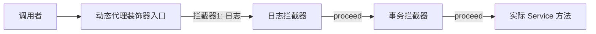

```markdown
<!-- 控制性问题：当业务需要在不修改已有代码的情况下动态叠加多个横切功能（如日志、权限、缓存）时，如何避免“继承爆炸”，并让这些功能的组合顺序可以在运行时自由决定？ -->

```java
// 你对这个结构一定不陌生：一个干净的业务接口，和它的唯一实现
public class OrderServiceImpl implements OrderService {
    public void placeOrder(Order order) {
        // 几百行业务代码，日复一日地跑着
    }
}
```

有一天产品经理告诉你：所有下单操作，必须先记日志 — 简单。然后又说：还得做权限校验 — 也能改。接着是调用链监控、缓存、租户隔离...而且这些功能要在不同客户环境里**按不同顺序**动态开关。

你不可能在每个方法里塞满 `if (loggerEnabled)`，更不可能去写 `OrderServiceWithLogAndCacheAndAuth` 这样的子类 — 八个功能组合出两百多种可能，难道要建两百多个子类？这就是**继承爆炸**。

**装饰器模式给你的答案就一句话：不修改原对象，而是用"壳"一层层包上去，每个壳只加一项功能，壳壳之间自由排序。**

---

## 一、你其实已经在用了：Spring AOP 就是装饰器引擎

如果你写过 Spring Boot 项目，这段代码大概率出现在你的项目里：

```java
@Around("@annotation(com.example.Logged)")
public Object logMethodCall(ProceedingJoinPoint joinPoint) throws Throwable {
    log.info("调用前: " + joinPoint.getSignature().getName());
    Object result = joinPoint.proceed(); // 交还给下一个拦截器
    log.info("调用后: " + result);
    return result;
}
```

这个切面在干什么？它拦住了对目标方法的调用，在调用前后加了自己的逻辑，然后通过 `proceed()` 把控制权交给链上的下一个节点。**这就是一个装饰器** — 只是这个装饰器的类名不是手写的，而是 JVM 动态生成的，它内部持有一个目标对象引用和一个拦截器链。

整条调用链本质上是这样：

```
调用者 → 代理对象(装饰器入口)
       → 拦截器1(日志) → proceed()
         → 拦截器2(事务) → proceed()
           → target.placeOrder()
```

**装饰器链的调用流程**



每一步的拦截器都可以决定要不要调用下一个节点 — 和一条手写的装饰器链（每个装饰器决定调不调用 `decorated.xxx()`）完全相同。Spring AOP 就是一个**基于动态代理的装饰器引擎**。

理解这一点后，你会立刻明白两件事：
1. 为什么 AOP 只能拦截 `public` 方法？因为动态代理实现的是目标接口，接口里没有 `private` 方法；CGLIB 基于子类继承，子类也覆盖不到 `private`。
2. 为什么 `Interceptor` 调用的顺序是有意义的？因为它就是装饰器的包裹顺序 — 最外层的先执行，最内层的最后执行。

---

## 二、拆开看：三层结构一次讲透

装饰器模式并不复杂，它只由三个角色构成。用咖啡订单这个直观场景来看：

```java
// 1. 组件接口 —— 契约。你的 OrderService 也是这个角色
public interface Coffee {
    String getDescription();
    double cost();
}

// 2. 具体组件 —— 只做核心逻辑，不沾任何横切代码
public class SimpleCoffee implements Coffee {
    @Override
    public String getDescription() { return "黑咖啡"; }

    @Override
    public double cost() { return 10.0; }
}

// 3. 装饰器基类 —— 实现接口 + 持有被装饰对象引用（一把钥匙）
public abstract class CoffeeDecorator implements Coffee {
    protected final Coffee decoratedCoffee;

    public CoffeeDecorator(Coffee coffee) {
        this.decoratedCoffee = coffee;
    }

    // 默认全部委托，子类选自己关心的方法覆盖
    public String getDescription() {
        return decoratedCoffee.getDescription();
    }
    public double cost() {
        return decoratedCoffee.cost();
    }
}
```

这个基类的关键就在于它**既是 Coffee（实现接口），又持有 Coffee（内含引用）**。这种"既是...又是..."的结构，是装饰器链能够形成的根本原因。

接下来就是具体装饰器，每一个只关心一种横切功能：

```java
// 加牛奶的壳
public class MilkDecorator extends CoffeeDecorator {
    public MilkDecorator(Coffee coffee) { super(coffee); }

    @Override
    public String getDescription() {
        return decoratedCoffee.getDescription() + ", 加牛奶"; // 增强描述
    }
    @Override
    public double cost() {
        return decoratedCoffee.cost() + 2.0; // 叠加价格
    }
}

// 加糖的壳
public class SugarDecorator extends CoffeeDecorator {
    public SugarDecorator(Coffee coffee) { super(coffee); }

    @Override
    public String getDescription() {
        return decoratedCoffee.getDescription() + ", 加糖";
    }
    @Override
    public double cost() {
        return decoratedCoffee.cost() + 1.0;
    }
}
```

使用时，调用方可以自由决定包多少层、按什么顺序包：

```java
Coffee order = new SugarDecorator(
                    new MilkDecorator(
                        new SimpleCoffee()));
System.out.println(order.getDescription()); // 黑咖啡, 加牛奶, 加糖
System.out.println(order.cost());           // 13.0

// 顺序反过来完全成立，效果不同
Coffee reverseOrder = new MilkDecorator(
                        new SugarDecorator(
                            new SimpleCoffee()));
System.out.println(reverseOrder.getDescription()); // 黑咖啡, 加糖, 加牛奶
```

> 记忆锚点：**装饰器通过"实现同一接口 + 持有被装饰者引用"这两个动作，把功能扩展从"改代码"变成了"传参数般的组合"**。

---

## 三、如果你熟悉前端，这是高阶组件的后端翻版

Vue 和 React 都提供了一个"不修改原组件，通过包装叠加功能"的手段。React 叫高阶组件（HOC），Vue 3 也可以写等价的组件包装函数。它们和 Java 装饰器模式的结构完全对应。

**Vue 3 的组件包装函数**：

```vue
<!-- withLogger.ts —— 相当于 Java 的抽象装饰器 -->
<script setup lang="ts">
import { defineComponent, h } from 'vue'

export function withLogger(WrappedComponent) {
  return defineComponent({
    setup(props, { slots }) {
      return () => {
        console.log(`[LOGGER] 即将渲染 ${WrappedComponent.name}`) // 前置增强
        return h(WrappedComponent, props, slots) // 委托给原始组件
      }
    }
  })
}
</script>

<!-- 使用：和 Java 一样的自由组合 -->
import SimpleComponent from './SimpleComponent.vue'
const Enhanced = withCache(withLogger(SimpleComponent)) // 顺序可换
```

**React 的高阶组件**：

```typescript
// withAuth.tsx —— 结构对应 Java 装饰器基类
function withAuth(Component: React.ComponentType) {
  return function AuthenticatedComponent(props: any) {
    if (!useAuth()) return <div>请先登录</div> // 前置检查
    return <Component {...props} /> // 委托给原组件
  }
}

// 组合使用就像 new AuthDecorator(new LogDecorator(new Service()))
const ProtectedPage = withAuth(withLogger(Page))
```

对比一下三者的核心结构，你会发现是同一套设计蓝图：

| 要素 | Java 装饰器 | React HOC | Vue 3 包装 |
|------|------------|-----------|------------|
| 契约 | `Coffee` 接口 | `React.ComponentType` | 组件 Props 类型 |
| 原对象 | `SimpleCoffee` | `Page` 组件 | `SimpleComponent` |
| 装饰器 | `MilkDecorator implements Coffee` | `withAuth(Component)` 返回组件 | `withLogger(Component)` 返回组件 |
| 委托 | `decoratedCoffee.cost()` | `<Component {...props} />` | `h(WrappedComponent, props, slots)` |
| 组合 | `new SugarDecorator(new MilkDecorator(...))` | `withAuth(withLogger(Page))` | `withCache(withLogger(SimpleComponent))` |

**共同本质**：通过"保持接口/组件签名一致 + 持有被装饰者引用 + 在委托调用前后叠加逻辑"，实现了横切功能的透明织入和动态组合 — 完美践行开闭原则。

唯一的小差别在于语言层面的限制：Java 是静态类型语言，装饰器必须严格实现接口的所有方法；而 JavaScript/TypeScript 的前端组件包装函数没有这个硬约束，但 TypeScript 的类型约束也可以起到类似作用。

---

## 四、和继承比，它到底好在哪里？

假设你选择了**继承**来解决同样的问题。你的代码会长这样：

```java
public class OrderServiceWithLog extends OrderServiceImpl {
    @Override
    public void placeOrder(Order order) {
        log.info("开始");
        super.placeOrder(order);
        log.info("结束");
    }
}
```

现在要加缓存，你必须再建一个子类：

```java
public class OrderServiceWithLogAndCache extends OrderServiceWithLog {
    @Override
    public void placeOrder(Order order) {
        checkCache();
        super.placeOrder(order);
        updateCache();
    }
}
```

三个功能（日志、缓存、权限）按不同顺序排列，用继承的话总共需要 **2³ - 1 = 7 个类**。四个功能就是 15 个。而且继承是编译期决定的 — `OrderServiceWithLogAndCache` 必须先有 Log 再有 Cache，不能运行时换成先 Cache 后 Log。

装饰器模式把这个问题从 **O(2ⁿ)** 降到 **O(n)**。n 个功能 = n 个装饰器类，然后按需组装。

更重要的是，继承让子类依赖父类的实现细节。如果 `OrderServiceImpl` 里某个 `protected` 方法的签名被改了，所有子类都可能编译不过。装饰器只依赖接口 — 它持有一个 `OrderService` 引用，**这个引用的实现类怎么变，装饰器都不受影响**。

**继承 vs 装饰器对比**

| 对比维度 | 继承方式 | 装饰器模式 |
|---------|---------|------------|
| 类数量增长 | 功能组合呈指数爆炸 O(2ⁿ) | 线性增长 O(n)，每个功能一个装饰器 |
| 组合时机 | 编译期固定，无法运行时动态改变 | 运行时自由组合，顺序可调 |
| 依赖关系 | 子类依赖父类实现，耦合度高 | 只依赖接口，实现类变化不影响装饰器 |
| 横切功能分离 | 功能耦合在子类中，难以复用 | 每个装饰器独立，可复用 |
| 调试/调用栈 | 单层继承，栈浅 | 多层嵌套，调用栈较深（可接受） |
| 开闭原则 | 不符合：新增功能需修改已有子类或新建 | 符合：对扩展开放，对修改关闭 |

> 记忆锚点：**装饰器让你把"功能组合"从编译期搬到运行期，从硬编码变成传参数。**

---

## 五、代价与决策：什么时候别用

装饰器不是免费的。你得清楚它付出什么：

**小对象多**：每包一层都 `new` 一个新对象。在 Java 里这还好 — 短生命周期的对象会被 Minor GC 快速回收，现代 JVM 对这种模式优化得不错。但如果包了十几层，每次调用都要创建十几个对象，在高并发下确实会产生 GC 压力。不过这种情况很少见，而且 Spring AOP 的方式（生成单个代理对象而非多层嵌套）已经帮你避开了这个问题。

**调用栈变深**：`decoratedCoffee.cost()` → `nextDecorator.cost()` → `next.cost()`... 调试时可能会在栈里跳好几层。但这点成本相对于它带来的灵活性，几乎可以忽略。

**接口必须稳定**：这是最容易忽视的代价。所有装饰器和组件都依赖同一个接口。一旦给接口加一个新方法，所有装饰器类都得跟着改 — 抽象基类可以用默认委托来兜底，但每个具体装饰器是否需要增强这个新方法，需要逐一评估。

**什么时候该用**：
- 有多个维度的横切功能要动态组合（日志、权限、缓存、监控）
- 希望在核心业务代码零侵入的前提下扩展功能
- 接口本身稳定，不太会变更

**什么时候不该用**：
- 装饰器需要访问被装饰对象的内部状态（比如某个 `private` 字段）。装饰器只能看到接口行为，不应耦合到具体实现的内部细节。如果需要这么做，说明职责切分有问题，应该重新设计接口。
- 接口本身不断变更，签名频繁调整 — 所有装饰器都得跟着动，维护成本太高。
- 装饰逻辑极其简单且固定 — 直接写一个包装类或用 AOP 声明式切入就行，没必要拉出完整模式。

> 🔍 精确说明：装饰器和代理模式长得很像，区别是意图。装饰器侧重"增强功能"，通常是客户端主动组合；代理侧重"控制访问"（延迟加载、权限校验），往往对客户端透明。Spring AOP 的代理实质上偏向装饰器意图，因为它是在增强业务逻辑，而非单纯做访问控制。

---

## 六、在你的 Spring 项目里落地

三种层次，按复杂度递进：

**第一层：手写装饰器（适合少数类的精细控制）**

如果你的横切逻辑只影响两三个 Bean，且组合方式比较固定，直接写装饰器类是最清晰的：

```java
@Service
public class LoggedOrderService implements OrderService {
    private final OrderService delegate; // 持有原始 Bean
    
    public LoggedOrderService(@Qualifier("orderServiceImpl") OrderService delegate) {
        this.delegate = delegate;
    }
    
    public void placeOrder(Order order) {
        log.info("下单: " + order.getId());
        delegate.placeOrder(order); // 委托
    }
}
```

通过 Spring 的 `@Qualifier` 和 `@Primary` 来控制哪个 Bean 作为实际暴露的实例，干净可控。

**第二层：声明式 AOP（适合多个 Bean 共享横切逻辑）**

当你的日志/缓存/权限逻辑要应用于几十个 Bean 时，声明式 AOP 最合适：

```java
@Aspect
@Component
public class LoggingAspect {
    @Around("@annotation(com.example.Logged)")
    public Object log(ProceedingJoinPoint joinPoint) throws Throwable {
        log.info("调用: " + joinPoint.getSignature());
        Object result = joinPoint.proceed(); // 把控制权还给链上的下一个
        log.info("返回: " + result);
        return result;
    }
}
```

它底层就是装饰器链的动态代理实现。`proceed()` 相当于调用 `decoratedCoffee.cost()` — 你只是在声明式地告诉 Spring："把这个逻辑织入到调用链里"。

**第三层：编程式代理（适合运行时按配置动态决定装饰组合）**

当你需要根据租户配置决定是否开启日志、缓存，或者在运行时动态改变装饰器顺序：

```java
ProxyFactory factory = new ProxyFactory(targetBean);
factory.addAdvice(new LogInterceptor());
factory.addAdvice(new CacheInterceptor());
factory.addAdvice(new AuthInterceptor());
OrderService proxy = (OrderService) factory.getProxy();
```

这三行代码的本质是：**在 `targetBean` 外面包了三层装饰器壳，分别负责日志、缓存、权限，顺序由 `addAdvice` 的顺序决定**。你甚至可以读取配置文件来决定 `if (config.isLogEnabled()) { factory.addAdvice(...); }` — 这才是装饰器模式"动态组合"精神的完整落地。

---

装饰器模式教会你的是：**别动已有的代码，叠一层壳上去。** 每一个壳只做一件事，壳壳之间互不干扰，顺序由你决定。这套思想贯穿了 Spring AOP 的拦截器链、Java I/O 的 `BufferedInputStream` 嵌套，也贯穿了前端的 HOC 和组件包装。

当你下一次想通过继承新建一个子类来加功能时，先停一秒，问自己：**这个功能，能不能用一个壳来包？**
```