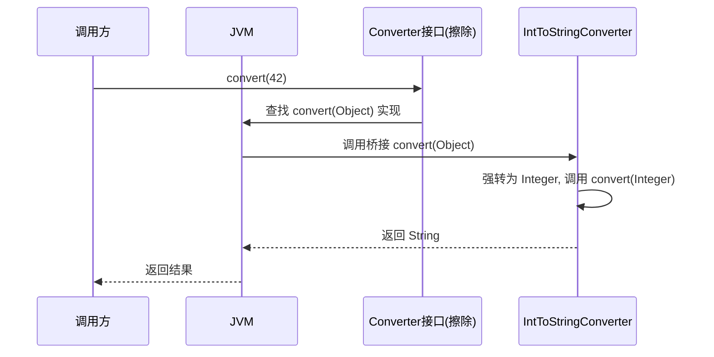

```markdown
<!-- 控制性问题：为什么泛型方法是解决“既要通用、又要类型安全”这两难问题的唯一正解，它凭什么让编译器替你验证类型关系，而不只是靠程序员脑子记？ -->

`ConvertUtils.convert(orderMsg)` 返回一个 `Object`，调用方强转成 `Order` ——这段代码在编译期一声不吭，但在某个深夜的 `ClassCastException` 里炸得干干净净。**泛型方法要解决的问题只有一个：让一个方法的返回类型，与它的参数类型之间建立编译期可验证的依赖关系**，并且这个关系不必拖累整个类的声明。

当你写的转换工具既要处理 `OrderMessage → Order`，也要处理 `AccountMessage → Account`，甚至是 `List<OrderMessage> → List<Order>`，摆在面前的三条路里，只有一条走得通：
- 为每种组合写一个重载方法 → 维护地狱，每多一种类型就得加一个方法
- 全部用 `Object` → 丢弃类型信息，强制转型全靠人肉记忆
- **泛型方法：一次实现，编译期约束所有合法的输入输出组合**

这就是本文的记忆锚点——**“延迟类型绑定，编译期兜底”**。你不需要在方法内部知道 `T` 具体是什么，但调用方获得的结果类型，编译器已经帮你严丝合缝地验证过了。

---

## 一、从工程灾难到编译期安全

先看看没有泛型方法时，团队协作会发生什么。你的同事小李写了一个通用转换工具：

```java
public class ConvertUtils {
    public static Object convert(Object source) {
        // ... 转换逻辑
        return target;
    }
}

// 调用方某处
Order order = (Order) ConvertUtils.convert(message);
```

评审时你能看出什么？什么也看不出来。从方法签名里，你不知道 `source` 应该是什么类型，不知道返回值应该是什么类型，不知道这个强转安不安全。唯一的信息在注释里——如果小李写了注释的话。

三个月后，小王改了 `convert` 的实现逻辑，让它也能处理 `AccountMessage`。某处原本传入 `OrderMessage` 的代码，因为一个复制粘贴错误传入了 `AccountMessage`，编译通过、上线、炸在运行时。这种事故的根源不是“程序员不细心”——**在一个 50 万行代码的项目里，要求所有人记住每个方法内部的类型约定，本身就是系统设计失败**。

泛型方法的解法：

```java
public class ConvertUtils {
    public static <T, R> R convert(T source, Function<T, R> converter) {
        return converter.apply(source);
    }
}

// 调用方
Order order = ConvertUtils.convert(message, OrderMessage::toOrder);
// 下面这行直接编译报错：期望 OrderMessage，传入了 AccountMessage
// Order broken = ConvertUtils.convert(accountMsg, OrderMessage::toOrder);
```

`<T, R>` 就是方法的局部类型变量——它们只属于这个方法，不污染类的声明。编译器在调用处根据传入的 `Function<T, R>` 类型，自动推断出 `T = OrderMessage, R = Order`，然后严查所有赋值是否符合这个约束。类型验证从“人脑记忆”变成了“编译器强制执行”。

> 🔍 精确说明：泛型方法的类型参数写在方法修饰符与返回类型之间（`<T, R> R convert(...)`），即使类本身有同名的类型参数，方法上的 `<T>` 也会**隐藏**类的 `T`，形成独立的局部作用域。这个遮蔽效应是经验丰富的开发者最常踩的坑——你以为是同一个 `T`，实际上已经是两个不同的类型变量了。

---

## 二、类型擦除：Java 的兼容性代价

理解了泛型方法“做了什么”，下一个问题是：**编译器怎么做到这一点的？答案会颠覆你对“类型安全”的理解——它在运行时，根本没有 `T` 这个类型。**

Java 在 2004 年引入泛型时面临一个强约束：**已有的大量字节码必须能在新 JVM 上直接运行，不用重新编译。** 这意味着泛型不能像 C++ 模板那样为每种 `T` 生成全新的机器码，也不能像 C# 那样在运行时保留具体泛型类型——这两种方案都需要“打破二进制兼容”，让老代码无法在新环境下执行。

Java 选择的路线叫做**编译时擦除**：所有泛型类型参数（`<T>`, `<R>`）在编译后的字节码中，全部被替换为它们的**上界**（如果没有显式声明 `extends`，默认上界就是 `Object`）。同时，编译器在字节码的元数据区（Signature 属性）里保留原始泛型信息，供 IDE 提示和反射使用——但真正的 JVM 执行引擎根本看不到泛型。

这对泛型方法意味着两件事，直接影响你写框架时的行为：

### 2.1 运行时 `T` 不可用

```java
public <T> T genericMethod(String input) {
    // 这样写编译报错：T 在运行时已被擦除，无法用于 instanceof
    // if ("hello" instanceof T) { ... }
    
    // 这样写只有编译警告，运行时 T 就是 Object，这个转型永远“成功”
    T result = (T) input;
    return result;
}
```

在方法体内部，`T` 只是一个编译期的约束，**你不能拿它做 `instanceof` 检查，不能拿它创建实例（`new T()`），不能拿它访问静态成员**。如果你确实需要运行时类型信息，必须显式传入 `Class<T>` 参数：

```java
public <T> T safeConvert(Class<T> targetType, Object source) {
    return targetType.cast(source); // 运行时真正进行类型检查
}
```

### 2.2 桥接方法：为多态搭桥

这是泛型方法最精妙（也最容易让人懵逼）的设计。考虑这个接口和实现：

```java
public interface Converter<K, V> {
    V convert(K source);
}

public class IntToStringConverter implements Converter<Integer, String> {
    @Override
    public String convert(Integer source) {
        return source.toString();
    }
}
```

擦除后，`Converter` 接口的字节码描述是 `(Object)Object`——参数是 `Object`，返回也是 `Object`。但 `IntToStringConverter` 里你写的方法签名是 `(Integer)String`。当调用方通过接口引用调用时：

```java
Converter<Integer, String> c = new IntToStringConverter();
String result = c.convert(42); // 这里 JVM 实际调用的是 convert(Object)
```

JVM 按照字节码签名 `(Object)Object` 去 `IntToStringConverter` 里找方法——找不到！你写的是 `convert(Integer)`，不是 `convert(Object)`。如果不做任何处理，这一步会触发 `NoSuchMethodError`。

**编译器的解法：自动生成一个桥接方法**。

```java
// 反编译后的 IntToStringConverter 等效伪代码
public class IntToStringConverter implements Converter {
    // 你写的实际方法
    public String convert(Integer source) {
        return source.toString();
    }
    
    // 编译器偷偷生成的桥接方法
    public Object convert(Object source) {
        return convert((Integer) source); // 强转后委派给实际方法
    }
}
```

JVM 调用 `convert(Object)` 时，实际派发到桥接方法；桥接方法把 `Object` 强转成 `Integer`，然后调用你写的真正实现。这一层桥接，让“擦除后的多态”能够正常工作。

**桥接方法调用时序**



但这层设计留下了两个工程陷阱：

**陷阱一：反射时出现“幽灵方法”**

```java
for (Method m : IntToStringConverter.class.getMethods()) {
    System.out.println(m.getName() + " -> " + m.getParameterTypes()[0]);
}
// 输出：
// convert -> class java.lang.Integer  （你写的方法）
// convert -> class java.lang.Object   （编译器生成的桥接方法）
```

如果你在用反射批量调用方法时没有过滤桥接方法（`if (!method.isBridge())`），可能意外拿到 `convert(Object)` 版本，再往里传参数时类型就走岔了。

**陷阱二：方法重载时的签名冲突**

```java
public class ConflictExample {
    public <T> void process(T input) { }
    public void process(Object input) { } 
    // 编译报错：两个方法擦除后签名相同 process(Object)
}
```

两个泛型方法，如果擦除后签名一样，即使类型变量不同，也无法共存。这个限制在写工具类或 DSL 时可能突然冒出来，让你想通过重载区分不同泛型行为的想法落空。

---

## 三、实战：构建一个生产级的缓存转换器

下面这段代码完整展示了泛型方法在真实项目中的用法——一个同时使用类的泛型参数和方法的泛型参数的缓存服务。注意区分什么属于类、什么属于方法、以及在反射和序列化场景下需要额外绕过的坑。

```java
import java.util.Optional;
import java.util.concurrent.ConcurrentHashMap;
import java.util.concurrent.ConcurrentMap;
import java.util.function.Function;

/**
 * 通用缓存服务。
 * 类参数 K, V：代表整个缓存实例的键值类型，影响实例状态。
 * 方法参数 R：仅在本方法内需要，方法结束就消失，不污染类签名。
 */
public class CacheService<K, V> {
    private final ConcurrentMap<K, V> cache = new ConcurrentHashMap<>();
    private final Function<K, V> loader;

    public CacheService(Function<K, V> loader) {
        this.loader = loader;
    }

    // 实例方法：直接使用类的类型参数 V
    public V getOrLoad(K key) {
        return cache.computeIfAbsent(key, loader);
    }

    /**
     * 泛型方法：引入独立类型变量 R，将缓存值转为另一种表示。
     * @param key 缓存键
     * @param transformer 转换函数 V -> R
     * @param <R> 返回类型，调用时由 transformer 参数推断
     */
    public <R> Optional<R> transformValue(K key, Function<V, R> transformer) {
        V value = cache.get(key);
        if (value == null) {
            return Optional.empty();
        }
        return Optional.ofNullable(transformer.apply(value));
    }

    /**
     * 需要运行时类型信息的泛型方法：额外接收 Class<R> 参数，
     * 以绕过类型擦除限制，进行真正的安全转型。
     */
    @SuppressWarnings("unchecked")
    public <R> Optional<R> transformValueSafe(
            K key, 
            Function<Object, Object> rawTransformer, 
            Class<R> targetType
    ) {
        Object value = cache.get(key);
        if (value == null || !targetType.isInstance(value)) {
            return Optional.empty();
        }
        return Optional.ofNullable((R) rawTransformer.apply(value));
    }

    public static void main(String[] args) {
        CacheService<String, Integer> cache = 
            new CacheService<>(Integer::parseInt);
        
        Integer val = cache.getOrLoad("42"); // val 类型为 Integer
        
        // transformValue 的 <R> 被推断为 String
        Optional<String> transformed = 
            cache.transformValue("42", i -> "Score: " + i);
        
        // 编译期拦截：下面这行会直接报类型不匹配错误
        // Optional<Integer> wrong = 
        //     cache.transformValue("42", String::valueOf);
        
        transformed.ifPresent(System.out::println); // Score: 42
    }
}
```

注意点：
1. **`<R>` 写在 `Optional<R>` 之前**：这是泛型方法的标志，告诉编译器“这里的 R 是我新引入的局部类型变量”。
2. **类的 `V` 不需要在方法上重新声明**：`getOrLoad` 返回 `V`，直接复用类的参数；如果你写了 `<V> V getOrLoad(...)`，这里的 `<V>` 会新建一个局部变量，**遮蔽**类的 `V`，导致类型不一致。
3. **运行时类型检查需要显式传入 `Class<R>`**：`transformValueSafe` 的方法签名里多了 `Class<R> targetType`，这是为了在方法体内安全地调用 `targetType.isInstance(value)`。没有这个参数，你只能依赖 `@SuppressWarnings("unchecked")` 和对输入的绝对信任。

---

## 四、设计决策：什么时候用、什么时候不用

泛型方法不是银弹。它的取舍在大型项目中体现得尤其明显。

**你得到的是：**
- **编译期保证的类型关系**：输入 `OrderMessage` 就返回 `Order`，这层关系不是靠注释或变量名暗示的，编译器替你盯着。任何试图传入错误类型参数或接收错误返回类型的地方，都会在编译时亮红灯。
- **单一实现，零维护膨胀**：不管你的系统有多少种 DTO 互转需求，一个泛型方法搞定，不需要为每种组合手写重载。
- **API 的流畅性**：调用方可以写出 `cache.transformValue(key, mapper).map(this::enrich).orElse(defaultValue)` 这样的链式调用，每个中间步骤的类型都在编译期确定。

**你付出的是：**
- **运行时类型信息丢失**：凡是需要在方法体内部根据 `T` 做分支判断的（如 `if (T == String.class)`），必须额外传入 `Class<T>` 参数。这增加了方法签名的复杂度，也让调用方必须显式提供类型令牌。
- **桥接方法的反射干扰**：用反射遍历方法时，必须始终过滤 `method.isBridge()`，否则你在调试时可能看到方法被“调用了两次”的诡异现象。
- **擦除后的重载限制**：两个泛型方法如果擦除后签名相同，无法共存——这个限制在某些 DSL 设计场景中可能让你的 API 表达力打折扣。

**决策清单：**
- ✅ **用泛型方法**：方法逻辑与类型无关，但需要建立参数-返回值的编译期契约。典型场景：集合工具方法、流式转换、基于 `Class<T>` 的动态反序列化。
- ✅ **提升到类的泛型参数**：同一个类型变量在多个方法之间传递。比如 `CacheService<K, V>` 里，`K` 和 `V` 同时被 `getOrLoad` 和 `transformValue` 使用——这就该是类参数，而不是每个方法自己声明一个局部版本。
- ❌ **不用泛型方法**：方法内部必须根据类型做不同处理（如对 `Integer` 走缓存、对 `String` 走数据库），此时泛型方法只会让你写出大量的 `instanceof` 分支，既不安全也不优雅。改为各自的重载方法或用策略模式。

---

## ⚠️ 最容易踩的 3 个坑

**坑 1：方法上的 `<T>` 遮蔽了类上的 `<T>`**

```java
public class Box<T> {
    T content;
    
    // 这个 <T> 是新的局部类型变量，不是 Box 的 T！
    public <T> T extract() {
        return (T) content; // 这里的 (T) 转型在运行时根本无效
    }
}
```

**正确写法**：如果你要引用类的 `T`，方法上就不要再加 `<T>`，直接 `public T extract()` 即可。如果在 Code Review 中看到方法上的类型参数与类参数同名但无注释说明遮蔽意图，**直接判定为缺陷**。

**坑 2：通过接口引用调用时忽略桥接方法的类型强转风险**

如果子类实现泛型接口时，错误地“放宽”了参数类型（通过原始类型或泛型边界漏洞），桥接方法内部产生的强转会在运行时抛出 `ClassCastException`。这个问题调试极其困难，因为异常栈指向的是编译器生成的代码。**强制要求：实现泛型接口的类，必须编写通过父接口引用调用的单元测试。**

**坑 3：以为 `List<T>` 的运行时类型信息可用**

```java
public <T> List<T> filter(List<T> input) {
    // 运行时无法知道 T 是什么，这个判断永远不成立
    if (input.get(0) instanceof T) { ... } // 编译报错或无效
    return input;
}
```

泛型在 List 里同样是擦除的。`List<Integer>` 在运行时的真实类型只是 `ArrayList`。如果你需要运行时类型检查，**必须**在方法签名中要求 `Class<T>` 参数。

---

## 五、如果你从 TypeScript 过来

Java 的泛型方法与 TypeScript 的泛型函数在**设计动机上高度一致**——都是通过引入类型参数，在单一实现的前提下，建立参数类型与返回类型的编译期契约。两者的写法对比：

```typescript
// TypeScript 泛型函数
function convert<T, R>(source: T, transformer: (input: T) => R): R {
    return transformer(source);
}

// 调用时类型自动推断
const result = convert(42, (n: number) => n.toString()); 
// result 的类型被推断为 string
```

```java
// Java 泛型方法
public static <T, R> R convert(T source, Function<T, R> transformer) {
    return transformer.apply(source);
}

// 调用时类型同样自动推断
String result = convert(42, n -> Integer.toString(n));
```

两者都做到了**“延迟类型绑定”：函数定义时不知道 T 和 R 具体是什么，调用时由编译器根据实参和目标上下文自动推导**。有前端背景的开发者，可以直接把这个心智模型搬过来。

但接下来是两个关键差异，正是 Java 泛型方法“高级”的地方：

**差异 1：桥接方法——Java 独有**

TypeScript 没有“擦除后接口签名不一致”的问题，因为它的类型系统在编译后完全消失，不存在一个“父接口的字节码签名”需要匹配。你在 TypeScript 里写 `class Impl implements Converter<number, string>`，编译后就是普通的 JavaScript 类，不会生成额外的桥接函数。Java 需要桥接方法，恰恰是因为它要同时满足**运行时多态**和**编译后类型擦除**这两条互相矛盾的要求。

**差异 2：运行时类型信息获取方式不同**

TypeScript 在运行时要想判断类型，通常用**类型守卫**或**判别联合**：

```typescript
function process(input: string | number) {
    if (typeof input === 'string') { /* ... */ }
}
```

Java 没有 `typeof`（擦除导致的），你必须显式传入 `Class<T>` 来做同样的事：

```java
public <T> T safeCast(Object obj, Class<T> type) {
    return type.cast(obj);
}
```

前端转 Java 的工程师最容易犯的错，就是在泛型方法体内直接写 `if (value instanceof T)`——这在 TypeScript 里不行（类型只在编译期存在），在 Java 里同样不行（类型被擦除了），**但两者的原因不同**：TypeScript 是因为类型信息本来就是假的；Java 是因为类型信息真的丢了。

---

## 六、工程落地：让编译器替你打工

裸写泛型方法只是第一步。要在一个多人协作的项目里让它真正产生价值，还需要工具链的配合：

- **IDE 检查级别**：将 `Unchecked call` 和 `Raw use of parameterized class` 设为 **Error**，而非 Warning。任何对泛型方法的原始类型调用必须在 CI 阶段就拦截。
- **反射工具封装**：团队内部维护一个 `MethodUtils`，所有 `getMethods()` 调用自动过滤桥接方法（`stream().filter(m -> !m.isBridge())`），避免新人写反射代码时被幽灵方法坑到。
- **编码约定**：凡需要运行时类型信息的泛型方法，必须显式接收 `Class<T>` 参数，不允许用 `@SuppressWarnings("unchecked")` 硬压——这是 Code Review 的一条红线。
- **测试模板**：实现泛型接口的类，强制包含一条通过父接口引用调用的测试用例：

```java
// 父接口引用调用
Converter<Integer, String> converter = new IntToStringConverter();
assertEquals("42", converter.convert(42));
// 验证桥接方法正常生成，不会抛 ClassCastException
```

回到开篇的那行崩溃日志。在泛型方法的设计哲学里，类型安全不该是“你小心翼翼地写、我战战兢兢地审”，而应该是**“让编译器在每一个赋值点、每一个参数传递点，自动验证你承诺的类型关系是否成立”**。

> 一句话回扣锚点：泛型方法的价值不在于“代码更短”，而在于**把类型验证从人脑外包给编译器**。延迟绑定决定了它能用一个实现覆盖千变万化的类型组合，编译期兜底决定了它不会在深夜里用 `ClassCastException` 给你打电话。你愿意为了这个保证多写一行 `<T, R>` 吗？在 50 万行代码的项目里，答案不言自明。


```