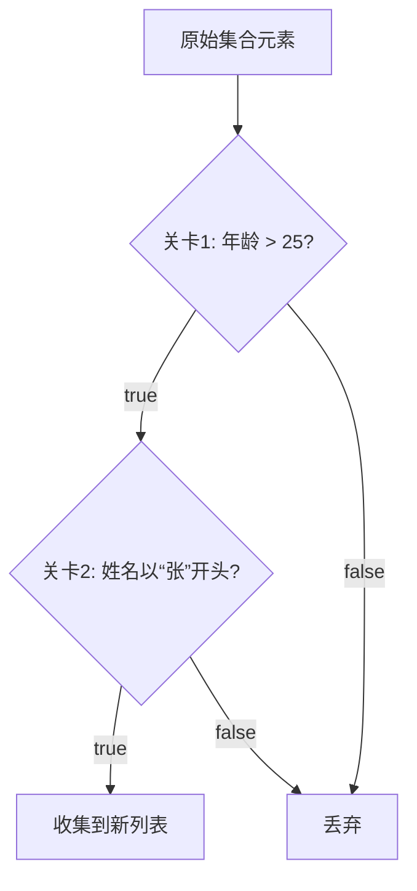

```java
List<Employee> result = new ArrayList<>();
for (Employee e : employees) {
    if (e.getAge() > 25) {
        if (e.getName().startsWith("张")) {
            result.add(e);
        }
    }
}
```

这段代码谁都能看懂，但如果你要做的是找出“年龄大于 25 且姓名以‘张’开头的员工”，**你其实只关心两个条件，却被迫写了一大堆控制流程。** 产品经理下个月再加个“排除兼职员工”的条件，你就得钻进循环体里继续塞 `if`——六个月后，没人能在 30 秒内说出这段循环里到底有几个筛选条件。

**Stream.filter 解决的本质问题就是：让筛选条件的表达和遍历执行解耦。** 你负责声明“我要什么”，Java 负责“怎么遍历”——这就是整篇文章要讲透的核心。

## 条件 vs 流程——为什么它们应该分开

传统 `for` 循环最大的问题不是代码量，而是**两个维度的逻辑拧在同一块代码里**：

- **遍历维度**：`for (int i = 0; i < list.size(); i++)`——你在管“怎么从集合里一个一个拿元素”
- **筛选维度**：`if (e.getAge() > 25)`——你在管“符合什么条件才留下”

当筛选条件只有一两个时，这不算问题。但当条件堆积到五六个、而且有些条件还带着业务含义（比如“判断一个订单是否是优质客户的大额订单”）时，`for` 循环里的 `if` 嵌套会迅速变成一堵墙——**谁在前面谁在后面不知道，谁会 `continue` 谁会 `break` 也不清楚。**

Stream.filter 的解法是：**你只写筛选规则本身，遍历交给 Stream（流，可理解为“集合上的流水线”）去管。** 每一条 `.filter()` 就是一个独立关卡，元素流过时判定 true 就放行、false 就丢弃——什么都不用你操心。

```java
List<Employee> result = employees.stream()           // 开启流水线
    .filter(e -> e.getAge() > 25)                    // 关卡1
    .filter(e -> e.getName().startsWith("张"))        // 关卡2
    .collect(Collectors.toList());                   // 触发执行，收集结果
```

**Stream 流水线过滤模型：**



读这段代码的人顺着 `filter` 读下来，一眼就知道筛选了几层、每层是什么条件。**函数式写法不要求你聪明，它要求你把意图写在明面上。**

## 如果你熟悉前端，这跟你已经会的东西一模一样

前端数组的 `filter` 方法遵循的是完全相同的设计直觉——你传入一个判定函数，声明“我要什么”，JS 引擎负责遍历数组并返回新数组：

```vue
<script setup>
import { ref, computed } from 'vue'

const orders = ref([
  { id: 1, status: 'PAID', amount: 150 },
  { id: 2, status: 'UNPAID', amount: 200 },
  { id: 3, status: 'PAID', amount: 80 },
])

// 和 Java 的 .filter().filter() 完全一样的链式声明
const paidBigOrders = computed(() =>
  orders.value
    .filter(o => o.status === 'PAID')
    .filter(o => o.amount > 100)
)
</script>
```

**Java 和前端 `filter` 的核心差异只有一点**：前端的 `filter` 是立即执行的——代码跑到那一行就会马上遍历数组返回新数组。而 Java 的 `filter` 是惰性的——定义 `.filter()` 的时候什么都不发生，它只是在流水线上“记下”这个规则，直到你调用 `.collect()` 或 `.forEach()` 这样的**终结操作**（触发流水线真正运行的方法），筛选才会执行。

> 🔍 精确说明：Java 之所以这样设计，是因为它可以做短路优化。比如 `stream.filter(条件1).filter(条件2).findFirst()`——只要找到第一个通过所有关卡的元素，流水线就停了，不会把整个集合全过滤一遍。前端普通的 `filter()` 没有这个能力，只是 Java 给你的额外礼物。

## 最真实的坑：忘了扣扳机

几乎每个初学 Stream 的人都会写出这样的代码：

```java
// ❌ 这样写什么都不会发生
employees.stream()
    .filter(e -> e.getAge() > 25)
    .filter(e -> e.getName().startsWith("张"));
// 你定义了流水线，但没有终结操作——Stream 是惰性的，不会执行
```

你盯着这段代码，打印出来发现结果是空的，然后怀疑自己逻辑写错了。**其实逻辑完全对，你就是忘了“开扳机”。** 必须加一个终结操作：

```java
// ✅ 加了 collect()，流水线才真正运转
List<Employee> result = employees.stream()
    .filter(e -> e.getAge() > 25)
    .filter(e -> e.getName().startsWith("张"))
    .collect(Collectors.toList());  // 这一行才是扳机
```

`collect` 是终结操作之一，它会把流水线中存活下来的元素收集到新的 `List` 里返回。还有 `.forEach()`（遍历每个元素执行操作）、`.count()`（计算剩余数量）、`.findFirst()`（取第一个）——**任何不带终结操作的 Stream 调用链，都是一把没扣扳机的枪。**

## 什么时候该用 filter，什么时候别用

不是所有场景都值得用 Stream。这里给一个简单直接的判断标准：

| 场景 | 建议 |
|------|------|
| 条件清晰的筛选，尤其是多个条件 | **用 filter 链**，比嵌套 `if` 清晰得多 |
| 筛选逻辑里要修改外部变量（比如计数器） | 不适合；Lambda 应该是无副作用的，老老实实写 `for` |
| 筛选逻辑可能会抛异常 | 传统 `for` 循环里 `try-catch` 更直观 |
| 数据量很大但只取前几个结果 | `filter + limit/findFirst` 有短路优势，**优先用** |
| 在筛选过程中需要删除原集合的元素 | **绝对不要**在 filter 里改原集合，Stream 设计上就不允许 |

**核心判断法则：如果你的筛选是一系列独立的条件判断，不依赖外部状态、不修改外部变量、也不需要抛受检异常——那 Stream.filter 就是为你设计的。** 否则，传统的 `for` 循环一点都不可耻。

---

filter 不改变原始集合，它只是在描述“你要什么”。每个 `.filter()` 调用就是一个独立关卡，一个元素通过所有关卡才被收集。**记住这个模型，你就不会再把筛选条件和遍历循环搅在一起了。**